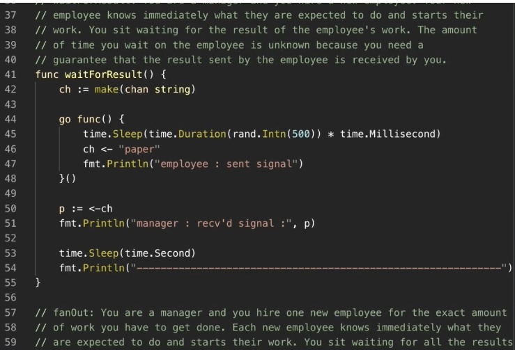

Transcript  抄本

00:00:00

(bright ambient music) (logo buzzing) - [Announcer] Arden Labs, specializing in high performance software consulting, training, staffing, and development. (screen whooshing) Module 10: Channels. You are now watching Lesson 10.2: Basic Patterns. (screen whooshing) - So, we're gonna look at a handful or more channel patterns, signaling patterns here,
（明亮的环境音乐）（标志嗡嗡声） - [播报员] Arden Labs，专注于高性能软件咨询、培训、人员配置和开发。（屏幕呼啸声） 第 10 模块：Channels。您现在正在观看第 10.2 课：基本模式。（屏幕呼啸声） - 所以，我们将查看几个或更多的通道模式、信号模式，

00:00:20

and these are great patterns, because if you can learn these patterns, then you can really learn a lot about how to think about signaling and apply this stuff to your code. The very first pattern, very base pattern we're gonna look at is called waitForResult. And the idea of wait for result is we're gonna launch another goroutine to do some work, and this goroutine already knows what work
这些都是很棒的模式，因为如果你能学会这些模式，就能真正学到很多关于如何思考信号传递并将这些东西应用到代码中的方法。我们要看的第一个、最基础的模式叫做 waitForResult。waitForResult 的想法是我们要启动另一个 goroutine 来做一些工作，并且这个 goroutine 已经知道要做什么工作。

00:00:40

they need to do, right? We're just gonna launch them, we're gonna ask the goroutine to do the work, we're going to wait for them to finish that work, and we're gonna wait for that result. So, let's take a look at that code. So, on line 41, you see the function, waitForResult, and then on line 42, what you see is the channel operation. Now, again, we're using that make call
他们需要做什么，对吧？我们只是要启动它们，要求 goroutine 去完成工作，我们会等待它们完成那项工作，并且等待那个结果。那么，让我们来看一下那段代码。所以，在第 41 行，你可以看到函数 waitForResult，然后在第 42 行，你看到的是通道操作。现在，再次说明，我们在使用那个 make 调用

00:01:00

to make that channel of type, string. Couple things here, you cannot use any sort of compact or literal construction for a channel, 'cause you can't initialize a channel with values. So, the only way to put a channel in that open state is with make. Now, you can see that we're using make(chan string).
把那个 channel 的类型改成 string。这里有几点需要注意，你不能用任何紧凑或字面量构造来创建一个 channel，因为你无法用值来初始化 channel。所以，使 channel 处于打开状态的唯一方法是用 make。现在，你可以看到我们在使用 make(chan string)。

00:01:22

So, what I really wanna look at is we can look at it as make is constructing an, is constructing a channel that's unbuffered. So, we can say here, we're constructing an unbuffered channel. I know that primarily because there's no value being set right now in the make call,
所以，我真正想看的，是我们可以把它看作 make 在构造一个未缓冲的通道。也就是说，我们在这里构造一个未缓冲通道。我之所以主要能确定这一点，是因为在 make 调用中目前没有设置任何缓冲值。

00:01:40

but again, I wanna get back to our signaling semantics. So, what I would rather say here is that we're making a channel with guarantees where we're gonna signal with string data. These are the things that, to me, are important. Those behaviors are semantics. Channel guarantees signaling with string data. Now, on line 44, you see me defining
但我还想回到我们的信号语义。所以，我更愿意这样描述：我们正在创建一个带有保证的通道，我们将用字符串数据进行信号传递。这些对我来说很重要。那些行为就是语义。通道保证用字符串数据传递信号。现在，在第 44 行，你可以看到我在定义

00:02:02

a literal function again. We're making the function call, and we're using the keyword, go. So, there's our path of execution, there's our new goroutine going on, and to simulate the idea that this goroutine knows what work they're gonna be performing, on line 45, we do a time.Sleep
又是一个字面函数。我们正在调用函数，并且使用了关键字 go。于是，这是我们的执行路径，这是我们新启动的 goroutine，为了模拟这个 goroutine 知道将要执行什么工作的想法，在第 45 行，我们调用了 time.Sleep

00:02:20

with a random number generator on the duration. I don't want you using (clears throat) time.Sleep in any production-level code. I'm using it here just to simulate the ideas of unknown latency. So, we have no idea how long this operation's gonna take. It's gonna be randomized, it's gonna be that sleep, right?
使用一个关于持续时间的随机数生成器。我不希望你在任何生产级代码中使用（清嗓子）time.Sleep。我在这里使用它只是为了模拟未知延迟的情形。所以，我们根本不知道这个操作会花多长时间。它会被随机化，会是那个 sleep，对吧？

00:02:40

So, we're waiting, maybe we're waiting on a system call, waiting on a database, we're waiting on something. In the meantime, while that goroutine is off doing its work, we, I always want us to put us in the manager position, so, we're always the one making the channel, we're always making the other goroutine, we're always gonna be either waiting or sending something to the other goroutine,
所以，我们在等待，也许在等待一个系统调用、等待数据库、在等待某些东西。与此同时，当那个 goroutine 在执行它的工作时，我总是希望我们把自己放在管理者的位置，所以，我们总是负责创建 channel，总是创建另一个 goroutine，我们总会要么在等待，要么向另一个 goroutine 发送某些东西，

00:03:00

but we're, in this case, waiting for that goroutine on line 50. So, 50 is showing you the unary receive operation on the channel. We get that channel variable. Remember, channels are a reference type, we're gonna use those value semantics to move it around, point your semantics on reading and writing, and we have the channel operation attached
但在这个例子中，我们在第 50 行等待那个 goroutine。所以，第 50 行展示了对 channel 的一元接收操作。我们拿到那个 channel 变量。记住，channel 是一种引用类型，我们会利用这些值语义来传递它，读写时使用指向语义，并且我们在 channel 的左侧附加了 channel 操作

00:03:21

to the left-hand side of the channel. We're now blocked in a receive, but remember, this is a channel that gives us guarantees, so, the send and receive have to come together, and the receiver happens before the send. So, here we are, we're blocked on 50, waiting. How long are we waiting? We do not know. That's part of the guarantee, it's an unknown latency.
现在我们在接收上被阻塞，但记住，这是一个给我们提供保证的 channel，所以，发送和接收必须配对发生，并且接收者发生在发送之前。于是，我们在第 50 行被阻塞，等待。我们会等待多长时间？我们不知道。这正是该保证的一部分，延迟未知。

00:03:40

So, eventually, this time.Sleep finishes, the work is done, and that goroutine wants to now send us that result. So now, line 46 comes together on the send. We could see the goroutine on line 46 performing the send, we're already here on the receive, the send and the receive come together,
所以，最终，这个 time.Sleep 结束，工作完成，那个 goroutine 现在想把结果发送给我们。于是现在，第 46 行在发送处配对。我们可以看到第 46 行的 goroutine 在执行发送，我们已经在接收处，发送和接收配对在一起，

00:04:00

and we pull that data out of the channel nanoseconds before that receive happens, nanoseconds. Line 50 happens before line 46, and then we'll see some print statements here. Now, this is the important part of this code. The only guarantee in this code is the signaling semantic that the receive happens in nanoseconds before the send.
并且我们在接收发生前几纳秒就从通道中取出了数据，几纳秒。第 50 行发生在第 46 行之前，然后我们会在这里看到一些打印语句。现在，这是这段代码的重要部分。此代码中唯一的保证是信号语义：接收发生在发送的几纳秒之前。

00:04:22

Once that operation is done, remember, these goroutines are running in parallel, not just concurrently, but also in parallel. Each goroutine's gonna have their own thread, running on their own hardware thread. So, we have to remember that we don't really know what order the print statements are gonna come in. This is a big mistake a lot of people make
一旦该操作完成，记住，这些 goroutine 是并行运行的，不仅仅是并发，而且是并行的。每个 goroutine 都会有它们自己的线程，在各自的硬件线程上运行。所以，我们必须记住，我们并不知道打印语句会以什么顺序出现。这是很多人犯的一个大错误

00:04:41

when they're first learning multi-threaded software. They think, "Well, since the receive on line 50 happens before the send on line 46, we should see the print on line 51 happen before the print on line 47." That is not gonna happen. Remember, it's happening nanoseconds before. At that point, those two lines of code are free
当他们第一次学习多线程软件时，他们会认为：“既然第 50 行的接收发生在第 46 行的发送之前，我们应该看到第 51 行的打印发生在第 47 行的打印之前。” 那不会发生。记住，这些操作发生在纳秒级的时间差。在那一刻，这两行代码已经是独立的。

00:05:01

to execute concurrently or out of order. And to show you this, I'm gonna run this little function. So, I'm gonna come in here, and we're gonna build it. There it is, I'm gonna run it, and (clears throat) on the very first run, it looks like that I'm correct, that the receive happened before the send, right?
并发或无序执行。为证明这一点，我会运行这个小函数。现在我进来，构建它。就是它，我运行它，（清嗓子）在第一次运行时，看起来我说得对，接收发生在发送之前，对吧？

00:05:20

Like I'm telling you. But if I run this enough times, we should eventually see that the send happens before the receive, at least the output of it, right? We know that's not happening right now, literally, but at some point, there it is right there. We now saw that the send happened before the receive,
就像我跟你说的。但如果我多运行几次，我们最终应该会看到 send 在 receive 之前发生，至少从输出上看，对吧？我们知道现在字面上还没发生，但在某个时刻，就在那里了。我们现在看到了 send 在 receive 之前发生了，

00:05:40

and not that the send happened, right? The output of the send messages happened before the output of the receive. I had to run it a few times to get there, but that's the point, and this is why people get confused. They don't realize that the only guarantee is happening between line 46 and 50. So, this is the waitForResult pattern. We're gonna use this in patterns like fan-out patterns,
而不是发送发生了，对吧？发送的输出发生在接收的输出之前。我得运行几次才出现这种情况，但这就是重点，这也是人们容易混淆的原因。他们没有意识到唯一的保证只发生在第 46 行到第 50 行之间。所以，这就是 waitForResult 模式。我们会在像 fan-out 这样的模式中使用它，

00:06:02

where we're just gonna throw goroutines at a problem, goroutines are already gonna know the work they have to do, and we're gonna wait, so, great for these types of fan-out patterns, this waitForResult. (bright ambient music) (logo buzzing)
在这种情况下我们只是把 goroutine 扔到一个问题上，goroutine 已经知道它们要做的工作，然后我们会等待，所以这对这类分发（fan-out）模式非常适合，这个 waitForResult。（明亮的环境音乐）（标志嗡鸣）