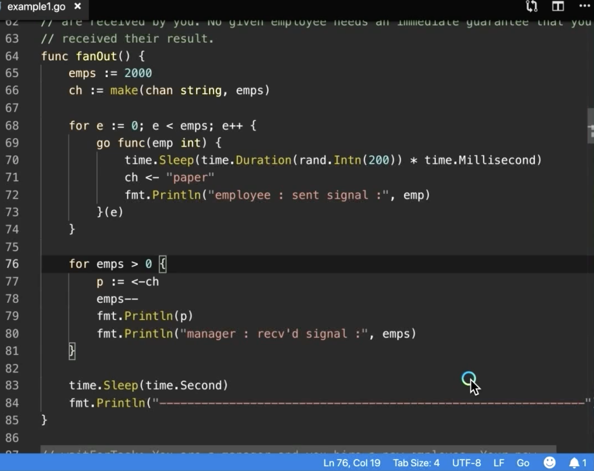

ranscript  转录本

00:00:00

(gentle music) - [Announcer] Arden Labs, specializing in high performance software consulting, training, staffing and development. Module 10: Channels. You are now watching lesson 10.3: Fan Out. - We just finished looking at wait for result, which is a base pattern as I said, for patterns like fan out.
（轻音乐）- 【播报】Arden Labs，专注于高性能软件咨询、培训、人员配置与开发。第 10 单元：通道。您现在正在观看第 10.3 课：Fan Out。- 我们刚刚看完了 wait for result，如我所说，那是 fan out 等模式的基础模式。

00:00:21

So let's take a look at a fan out pattern while that wait for result is still fresh in our minds. So we start there on line 64, there's our fanOut function, and on line 65, what we're gonna do is say that there are 2000 employees that we're gonna launch off to do some work. The idea of a fan out pattern is just that,
所以在 wait for result 的记忆还新鲜的时候，我们来看看 fan out 模式。我们从第 64 行开始，这是我们的 fanOut 函数，在第 65 行，我们要做的是说明我们将启动 2000 名员工去做一些工作。fan out 模式的思想就是

00:00:43

you have a bunch of work to do, a bunch of work. And so here's our Go routine, this is us, we're in some sort of path of execution. We realize that we have individual pieces of work we can do, we could do it ourselves, but we decide, no, we're gonna go off and launch a Go routine,
你有很多工作要做，大量工作。这里是我们的 goroutine，这是我们，处于某种执行路径中。我们意识到有一些独立的工作可以做，我们可以自己做，但我们决定，不，我们要去启动一个 goroutine，去做这些工作，

00:01:01

maybe for every piece of work that's there, and then here's our point of guarantee, we're gonna wait for all that work to come back, they're gonna signal back when they're done and then we get to move on. So that's the idea of the fan out pattern. And in this example here, we're gonna have 2000 pieces of work that we want to do.
也许针对那里每一项工作，然后这是我们的保证点，我们会等待所有那些工作返回，它们完成时会发信号回来，然后我们就可以继续。因此这就是 fan out 模式的想法。在这个示例中，我们要执行 2000 项工作。

00:01:21

So we've set up the employees variable to be 2000, and you can see the use of the buffer channel on line 66. So remember the buffer channel means that we're not gonna take the guarantee that a signal being sent has been received, we're moving the guarantee away from the signaling,
所以我们把 employees 变量设置为 2000，你可以在第 66 行看到缓冲通道的使用。记住缓冲通道意味着我们不会将“发送信号已被接收”作为保证，我们把保证从信号发送移开，

00:01:40

the actual signaling mechanics, to outside of it. So we've got our channel, it's buffered, we're not gonna have the guarantee, we're also gonna signal with string data. And we go off and we launch those 2000 Go routines on line 68. So there's our for loop, we have our literal function declaration,
实际的信号机制，暴露到它之外。所以我们有一个通道，是有缓冲的，我们不会有保证，我们也将用字符串数据来发出信号。然后我们在第 68 行启动那些 2000 个 goroutine。那就是我们的 for 循环，我们有我们的字面量函数声明，

00:02:01

we have our function call, and we use go. So now 2000 Go routines are going off and doing the work that they already know how to do. We don't really know how long it's going to take to get any of that work done, and we're simulating that again on line 70 with the time. So while those Go routines are out doing their work,
我们有一个函数调用，然后用 go 启动它。所以现在有 2000 个 goroutine 在并发执行它们已经知道如何做的工作。我们并不知道完成任何这些工作的时间长度，我们在第 70 行再次用 time 对其进行模拟。因此，当那些 goroutine 在外面执行它们的工作时，

00:02:21

again, we're gonna wait for all of the results, not just one, but all of the results to come back. So there we are on line 76. We start a loop saying when there is no more work to do, we'll be done. But while there is, we'll continue to loop, and then we block on line 77, in our channel received,
再次，我们要等待所有结果，不只是一个，而是所有结果都返回。所以我们在第 76 行。我们开始一个循环，说当没有更多工作要做时，我们就完成。但只要有工作，我们就继续循环，然后在第 77 行在我们的通道接收上阻塞，

00:02:42

just like before. So here we are, we're waiting for work to come in and suddenly, these Go routines finish their work and they start to signal, send us that work. Now, because we've got the buffered channel, the channel is set up so every single sender, every single Go routine,
就像之前一样。所以我们在这里，等待工作到来，突然这些 goroutine 完成它们的工作并开始发信号，发送给我们这些工作。现在，因为我们有缓冲通道，通道被设置为每个发送者、每个 goroutine，

00:03:01

doesn't block on their send at least as it relates to the receive. Remember, all we're doing is reducing latency between the send and the receive without the guarantee. But what if two or more Go routines want to execute line 71 at the same time? Then we have a synchronization problem again,
至少在与接收相关的方面不会在发送上阻塞。记住，我们所做的只是减少发送与接收之间的延迟，但并不保证顺序。但如果两个或更多的 goroutine 想要同时执行第 71 行呢？那我们又有同步问题了，

00:03:21

and the channel will perform the synchronization. So we still may see latency on the send side, but it's not due to the receive, it's due to the fact that multiple sends are happening at the same time. But once that send gets to complete, it doesn't need a receiver on the other end to finish,
通道将执行同步。所以我们在发送端仍可能看到延迟，但这不是由于接收端，而是因为多个发送同时发生的事实。但一旦那个发送完成，它就不需要另一端的接收者来完成，

00:03:40

the send happens before the receive. So there they are, there are Go routines on line 71, and they're performing their sends, they're putting data into the channel, they're signaling with their string data and we're over there with line 77. We receive it, we decrement that local variable, that local variable's kind of working like a wait group, isn't it?
发送发生在接收之前。就这样，第 71 行有 goroutine 在执行发送操作，它们把数据放入通道，用字符串数据进行信号传递；而我们在第 77 行接收它们，我们对那个局部变量做递减操作，那个局部变量有点像在充当一个 wait group，是不是？

00:04:00

It's giving us that local count on how many of these receives that we finished. And once we get to all 2000, then this code completes. So this is a typical fan out and the way you'd implement it. But what I need is for you to think about this for just a little bit. Fan out patterns are ridiculously dangerous
它给我们本地计数，表示我们完成了多少次接收。一旦达到全部 2000 次，这段代码就会完成。这是一个典型的 fan out 模式，也是你会实现它的方式。但我需要你稍微思考一下。Fan out 模式是极其危险的

00:04:23

because we could throw a lot of load on the system and at external systems at the same time. And you have to think about it at scale, imagine we had a web service and a web service that was running 50,000 Go routines at any given time. If we allowed those Go routines to perform fan out patterns,
因为我们可能会同时对系统和外部系统施加大量负载。你必须从规模化角度考虑，想象一下我们有一个 web 服务，在任何时刻运行着 50,000 个 goroutine。如果我们允许这些 goroutine 执行 fan out 模式，

00:04:43

even if it was just 20 Go routines on the fan out, 50,000 times another 20 Go routines, you could see how many Go routines could be in flight at any given time. So I love fan out patterns for CLI tools, for Cron jobs, maybe Lambda functions. But when it comes to services, long running services,
即便每次 fan out 只有 20 个 goroutine，50,000 次再乘以另外 20 个 goroutine，你就能看到在任意时刻会有多少 goroutine 在运行。因此我很喜欢在 CLI 工具、Cron 任务、也许是 Lambda 函数中使用 fan out 模式。但在服务端、长时间运行的服务、

00:05:02

web services, you gotta be very careful about these fan out patterns, they can put a lot of load on the system and they can do a lot of damage very quickly. (gentle music)
web 服务中，你必须非常小心这些 fan out 模式，它们会给系统带来大量负载，并且可能在非常短的时间内造成严重损害。(gentle music)