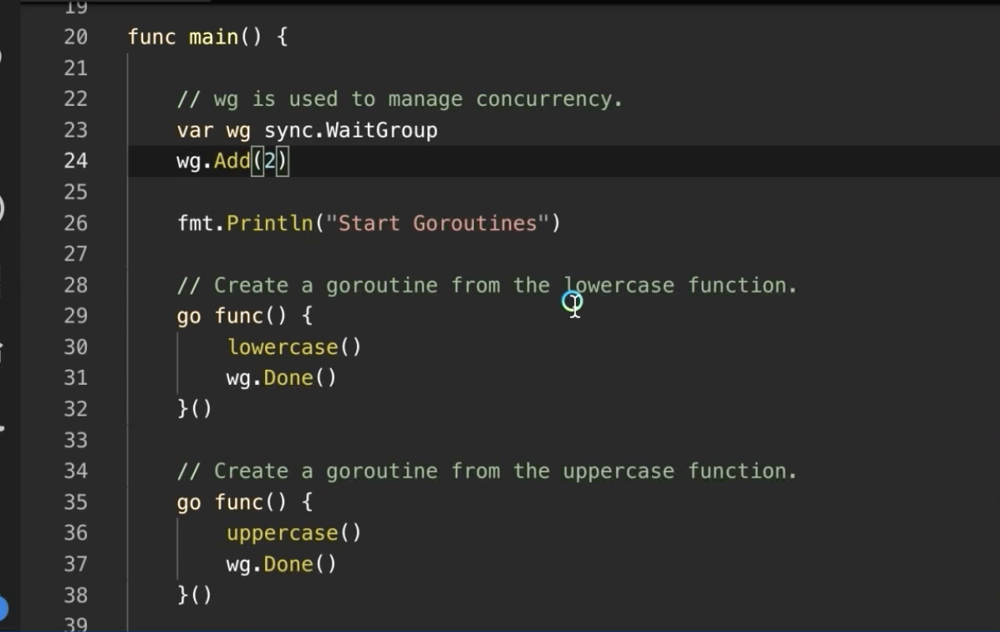

Transcript  抄本

00:00:00

(bright music) - [Announcer] Ardan Labs, specializing in high-performance software consulting, training, staffing, and development. Module eight, Goroutines. You are now watching lesson 8.3, "Creating Goroutines." - Now that we understand our mechanics around the operating system in the go scheduler,
（轻快音乐）-【旁白】Ardan Labs，专注于高性能软件咨询、培训、人员配置与开发。第八模块，Goroutines。您现在正在观看第 8.3 课，“创建 Goroutines”。- 既然我们已经理解了在 Go 调度器中围绕操作系统的机制，

00:00:20

it's time to start learning how to create goroutines, and I do wanna show you some basic orchestration workflows. Let's define what I mean by synchronization and orchestration too. Synchronization means that you are waiting in line, that goroutines are waiting in line to take a turn. There are times where the synchronization problem
现在是开始学习如何创建 goroutine 的时候了，我也想向你展示一些基本的编排（orchestration）工作流。先来定义我所说的同步（synchronization）和编排。同步意味着你在排队，goroutine 在排队等待轮到自己。有些时候你面临的同步问题就是在排队。

00:00:40

you have in front of you is waiting in line. Orchestration is when there's gonna be an interaction between two or more goroutines, and the best scenario I have for it is you go to the coffee shop to go buy coffee and you want to talk to that person behind the register, but you can't 'cause there's a bunch of people in front of you, so you've gotta wait your turn.
你面前的问题就是在排队。编排是指两个或更多 goroutine 之间会有交互，我能给出的最佳场景是你去咖啡店买咖啡，想和收银员交谈，但前面有一堆人，所以你必须等着。

00:01:00

That's a synchronization problem, right? There's some shared state, in this case, the person behind the register, she can only talk to one person at a time, so you're stuck in line. Then when you get to the front of the line, you now have an orchestration problem. Now you gotta talk, you gotta pass money, your order, the whole nine yards, that's an orchestration problem.
这就是一个同步问题，对吧？有一些共享的状态，在这个例子里是收银员，她一次只能和一个人交谈，所以你被卡在队伍里。当你走到队伍最前面时，现在就出现了编排问题。你得交谈、递钱、下订单，所有这些都是编排问题。

00:01:21

One of the worst things we can do is leverage the wrong principles, right, for the problem in front of us. In other words, you have an orchestration problem, but you use your synchronization primitives, or worst case, you have a synchronization problem. This is what occurs more often and you use your orchestration primitives, like channels are for orchestration,
我们最糟糕的做法之一就是针对当前问题采用错误的原则。换句话说，你面对的是一个编排（orchestration）问题，却使用了同步原语，或者更糟的是，你面临的是一个同步问题，却使用了编排原语。像把 channel 当作编排工具来使用，这种情况更常见。

00:01:40

timer constructions and mutexes are for synchronization, as a general rule. we're always looking to minimize the complexity at the end of the day. All right, so let's go and take a look at some code and I'm gonna be working with this code on my laptop because I need a multi-threaded environment for this stuff.
计时器构造和互斥锁一般用于同步。总的原则是我们始终希望将复杂性降到最低。好了，我们来看一些代码。我会在我的笔记本上运行这些代码，因为这些内容需要一个多线程环境。

00:02:00

So doing this on the playground isn't gonna help. You can see we're gonna be importing thumped runtime and sync throughout this. And what you could see inside the init function on line 14 is the call to go max prox, from the runtime package. What I'm doing here is downgrading the number of threads that are gonna be available to us to execute goroutines on.
所以在 playground 上这样做是没有用的。你可以看到我们会在整个过程中导入 runtime 和 sync。你可以在第 14 行的 init 函数中看到对 runtime 包中的 go max procs 的调用。这里我所做的是降低可用于执行 goroutine 的线程数。

00:02:21

In other words, I'm saying that this is gonna be a single threaded go program, one P, one M, to leverage one hardware thread on my machine. So we're going down to a single threaded go program. Now on line 23, in main, what you see is me constructing a wait group, setting it to its zero value.
换句话说，我的意思是这是一个单线程的 Go 程序，使用一个 P、一个 M，利用我机器上的一个硬件线程。所以我们正在把 Go 程序降到单线程。现在在第 23 行，main 中，你看到的是我在构造一个 wait group，并将其设置为零值。

00:02:40

Wait groups are usable in their zero value state. What a wait group is, it's a synchronous counting semaphore. It lets us maintain a count of, let's say the number of goroutines that exist at any given time, and as an API of add, done, and wait, and what you're seeing me do on line 24
Wait group 在其零值状态下即可使用。什么是 wait group：它是一个同步的计数信号量。它让我们维护一个计数，比如当前存在的 goroutine 数量，并通过 add、done 和 wait 这三个 API 操作进行管理，你在第 24 行看到我所做的就是这些。

00:03:00

is call the add method, adding two. Now I always want you to call add ones. I don't want you to be saying add one, add one, add one. That's a bad coat smell, we're not gonna do that. You should know how many goroutines you're gonna be creating before you create them. There's a basic rule of thumb that says that you can't create a goroutine
是调用 add 方法，增加两个。现在我始终希望你调用 add 一次。我不希望你不停地说 add one、add one、add one。那是糟糕的代码气味，我们不会那样做。你应该在创建 goroutine 之前就知道将要创建多少个。这里有一个基本经验法则：除非你知道它什么时候以及如何终止，否则不要创建 goroutine。

00:03:20

unless you know when and how it's going to terminate. And I might even ask you those types of questions, if it's not obvious to me that you know, or that the code is following that guideline. So we're gonna add two, which is telling us that we're gonna have two goroutines in flight very soon and we're gonna want them to track. Then we're gonna have an API, called done,
所以我们要 add 两次，这告诉我们很快会有两个 goroutine 在运行，我们希望跟踪它们。然后我们会有一个叫做 done 的 API，

00:03:43

which will decrement those numbers and then we're gonna have a wait that blocks and waits for all those goroutines to finish. That's that guarantee point. So as we talk about multi-threaded code, I'm always gonna be talking about where is that guarantee point, 'cause if there's no guarantee somewhere, then you end up with chaos.
它会递减那些计数，接着我们会有一个 wait 阻塞并等待所有这些 goroutine 完成。那就是保证点。因此，当我们讨论多线程代码时，我总会谈到那个保证点在哪里，因为如果某处没有保证点，就会导致混乱。

00:04:01

Okay, so we've got a wait group on line 23, we've got our ad on line 24. Now on lines 29 and 35, you see a couple of things happening here. You see that we're constructing, right, or declaring a literal function, a function with no name. We're also making the function call. You can see the use of the parentheses,
好，所以我们在第 23 行有一个 wait group，在第 24 行有我们的 ad。现在在第 29 行和第 35 行，你会看到这里发生了几件事。你会看到我们正在构造，或者声明一个字面量函数，一个没有名字的函数。我们也在调用这个函数。你可以看到括号的使用，

00:04:20

and then we've got the key word, go. So I'm declaring, calling, and launching this function as a separate path of execution, or goroutine. I now have a second goroutine in flight. After line 35 I have a third goroutine in flight. We now have three goroutines associated with this program. The main goroutine,
然后我们有关键字 go。所以我在声明、调用并以独立的执行路径（goroutine）启动这个函数。现在我有第二个正在运行的 goroutine。在第 35 行之后我又有第三个正在运行的 goroutine。现在这个程序有三个与之关联的 goroutine。主 goroutine，

00:04:41

created by the runtime that's executing this code, and then the two, the one on line 29 and 35, that we're constructing ourselves, there they are. Now the goroutine being constructed on line 29, that's calling a named function, called lowercase, and then calls done to decrement the wait group. The other goroutine on line 35, it's calling uppercase,
由正在执行此代码的运行时创建，然后还有两个是我们自己构造的，分别在第 29 行和第 35 行，就在那里。现在第 29 行构造的那个 goroutine 调用了一个具名函数，叫 lowercase，然后调用 done 来递减 wait group。另一个在第 35 行的 goroutine 则调用了 uppercase，

00:05:02

and then it decrements that wait group, and then on line 42, we're holding to a wait. And what the wait is gonna do, it's gonna block the main goroutine from causing the program to terminate. Basically when the main function returns, your program terminates and it terminates with extreme prejudice.
然后它会将该 wait group 递减，然后在第 42 行，我们调用了 wait。wait 会做的事情是阻止主 goroutine 导致程序终止。基本上当 main 函数返回时，程序会终止，而且会以极端的方式终止。

00:05:21

So any goroutines that were in flight that could be potentially executing instruction get terminated on the spot. Think of a kill nine happening at that point. So again, you don't want your program to just be terminating when you have goroutines in flight, you wanna make sure all those goroutines you've created have reported that they're done, that you know they're done,
因此，任何正在运行中可能正在执行指令的 goroutine 都会被当场终止。可以把那时想象成被发送了 kill -9。所以再次强调，你不希望在有 goroutine 正在运行时程序就这么终止，你要确保所有你创建的那些 goroutine 都已经报告它们完成了，你知道它们已经完成，

00:05:42

so we can have that clean startup, more importantly, that clean shutdown. Okay, so let's run this program. We've got two goroutines on our single threaded go program, one calling uppercase, one calling that lowercase. We're waiting for them to finish before we return. All right, so let's go ahead now,
这样我们就能有一个干净的启动，更重要的是，一个干净的关闭。好，现在我们运行这个程序。我们的单线程 Go 程序中有两个 goroutine，一个调用 uppercase，一个调用 lowercase。我们在返回之前等待它们完成。好了，现在让我们继续，

00:06:01

I'm gonna move over to my console window. I am in that folder with example one, and I'm gonna build it, and I'm gonna run it. And you really do see concurrency here. Remember, out of order execution, the goroutine that we created second, which was calling uppercase, actually ran first.
我要切换到控制台窗口。我在包含示例一的那个文件夹里，现在要构建并运行它。你真的可以在这里看到并发。记住，这是无序执行——我们第二个创建的 goroutine，也就是调用 uppercase 的那个，实际上是先运行的。

00:06:20

Now it didn't need a lot of time to complete its work so it got to finish its full time slice before the other goroutine finished as well. But notice you got start, waiting, the capital, the lowercase, and then the terminating. Now if I come back into the code here, again, you can see we did have out of order execution because this goroutine on line 35
它完成工作并不需要很长时间，所以在另一个 goroutine 完成之前它就把完整的时间片用完了。但注意，你看到的是 start、waiting、大写、小写，然后是 terminating。现在如果我回到代码里，你可以再次看到我们确实发生了无序执行，因为第 35 行的这个 goroutine

00:06:41

actually executed before the goroutine on line 29. And we have our guarantee point on line 42 because we're not gonna allow this program to terminate until both goroutines finish their work. But, and we need you to understand something, there's no predictability in this program. The biggest mistake you can make is think that since the output looks like this,
实际上在第 29 行的 goroutine 之前执行了。我们在第 42 行有一个保证点，因为我们不会允许这个程序在两个 goroutine 都完成它们的工作之前终止。但是，你需要明白一件事：这个程序是不可预测的。你能犯的最大错误就是认为既然输出看起来像这样，

00:07:02

this is what the output will look like every single time. And it might look like this for the next thousand runs, but we did not put any guarantees in the ordering. We just launched two goroutines, the order didn't matter. This is so important with concurrency, right? If order matters, you shouldn't be using concurrency,
每次输出都会是这样的。接下来的一千次运行可能都像这样，但我们并没有对执行顺序做任何保证。我们只是启动了两个 goroutine，顺序不重要。并发中这一点非常重要，对吧？如果顺序重要，你就不应该使用并发，

00:07:23

execute things in the sequence that they need to. But guarantees matter, and that's that wait. We need to guarantee that both functions complete. The order doesn't matter. Okay, let's do a few things here. Let's go over to line 42 and let's remove our guarantee.
按需要的顺序执行事情。但我们需要保证，关键是等待。我们需要保证两个函数都完成。顺序无所谓。好，我们在这里做几件事。到第 42 行，把我们的保证去掉。

00:07:43

Let's remove the call to wait. Now there is no guarantee if those goroutines are gonna run, when they're gonna run, how they're gonna run, if they're gonna run, we just remove the guarantee point. Watch what happens. Now let's build it. Let's clear it.
把对 wait 的调用移除。现在就没有任何保证这些 goroutine 是否会运行、何时运行、如何运行，或者是否会运行，我们只是去掉了保证点。看会发生什么。现在构建它。先清理一下。

00:08:00

You can see that we don't even see a single goroutine in flight anymore, and that's because they got terminated before they even had a chance to run. We walked away from the wait, so the main goroutine completely started and terminated this program. Again, it's not necessarily a guarantee this is how it's gonna behave every time we run it,
你可以看到我们甚至看不到任何正在运行的 goroutine，这是因为它们在有机会运行之前就被终止了。我们放弃了等待，所以主 goroutine 完全启动并终止了这个程序。再次说明，这并不一定保证每次运行都会这样表现，

00:08:20

and that's because there is a call to front print line, that is a system call. Technically there's an opportunity there for the scheduler to make a scheduling decision. Most likely, it's not taking it because we're so little into our time slice, that it lets the goroutine continue to run. But remember something that we cannot predict what the scheduler's going to do when all things are equal,
那是因为有一次对 fmt.Println 的调用，那是一次系统调用。从技术上讲，调度器在那儿有机会做出调度决定。很可能它不会抓住这个机会，因为我们才刚进入时间片，所以它让这个 goroutine 继续运行。但要记住，当所有条件相同时，我们无法预测调度器会怎么做，

00:08:42

and so we can't really predict what's going to happen here. And the worst thing is to try to predict. It's better to have those guarantees. Okay great, so we get rid of that. Well actually, I'm gonna keep that in for one second 'cause I wanna share with you another runtime call, called gosched.
所以我们真的无法预测这里会发生什么。最糟糕的就是试图去预测。最好是拥有那些保证。好，太棒了，所以我们把它去掉。嗯，实际上我会先保留它一秒钟，因为我想向你展示另一个 runtime 调用，叫做 gosched。

00:09:01

Now I really do not want to see you using this function call in code other than tests because what this does is it actually makes that call to yield. Remember the scheduler's making these calls during those safe points around these function transitions and channel operations and all that good stuff.
现在我真的不希望你在测试以外的代码中使用这个函数调用，因为它所做的就是让出（yield）。记住，调度器会在那些安全点上做出这些调用，诸如函数转换、通道操作以及所有那些相关操作的地方。

00:09:20

But go does give you the option to call yield yourself, but there's no guarantee that things will yield. There's no guarantee on order. And again, great for tests if you want to create a lot of extra chaos, not good to deal with orchestration and guarantees because there are none. But if I do build and run this program,
但 Go 确实提供了让你自己调用 yield 的选项，但并不能保证事情会让出执行权。没有顺序保证。同样，如果你想制造大量额外的混乱来做测试这是很棒的，但在编排和保证方面并不适用，因为根本没有保证。但如果我构建并运行这个程序，

00:09:42

what you will see here is that it looks like the program worked again. This is a total lie. This is why we have problems in multi-threaded software. We see this output, we think it works. Maybe it works like this on my machine all the time. We move it to our production environments
你会看到看起来程序又成功运行了。这完全是个谎言。这就是我们在多线程软件中遇到问题的原因。我们看到这个输出，就认为它有效。也许在我的机器上它一直这样运行。把它移到生产环境时

00:10:00

and everything's behaving differently. Why? There are no guarantees. So don't get tricked on things like this. Don't get tricked on perceived behavior. It's gonna cause you lots of problems. All right, what happens if I forget to call done? Now we're not gonna be decrementing that wait group, right? Let's see what happens when I forget to call done.
一切表现就不同了。为什么？因为没有保证。所以不要被这种东西欺骗。不要被表面行为所迷惑。这会给你带来很多问题。好，现在如果我忘了调用 done 会怎样？现在我们就不会对那个 wait group 做递减了，对吧？让我们看看当我忘了调用 done 时会发生什么。

00:10:21

Let's build it, I don't know why I can't type today. There we go, and boom, what happens? We now have a deadlock situation. There it is, you see the deadlock message right there, and what's happening here is that both goroutines got to run, but only one decremented that wait group from two to one.
我们来运行它，我今天不知道为什么打不了字。好了，嘭，发生了什么？我们现在有了死锁情况。看到了吧，你可以看到那条死锁信息，发生的情况是两个 goroutine 都开始运行了，但只有一个把那个 wait group 从 2 减到了 1。

00:10:41

The decrementing going from one to zero doesn't happen. And the run time's able to predict, not predict but identify really, that on line 42, we're never gonna be able to move on. Line 42 is that call to wait. So we now have some deadlock detection.
从 1 减到 0 的那次递减并没有发生。运行时能够识别到（不是预测），在第 42 行我们永远无法继续。第 42 行就是对 wait 的调用。所以我们现在有了一些死锁检测。

00:11:00

Now this is very rudimentary deadlock detection. Essentially every single goroutine has to be stuck in a waiting state with no opportunity for it to move on. Then the go scheduler can identify that we have this deadlock. So if you've got goroutines in timer loops, which I highly don't recommend, I really try to avoid timer loops,
现在这只是非常初级的死锁检测。实质上每个 goroutine 都必须被卡在等待状态且没有机会继续运行，调度器才能识别出我们有这个死锁。所以如果你的 goroutine 在计时器循环里（我强烈不推荐），我真的尽量避免使用计时器循环，

00:11:22

especially in long running go applications, you're walking away from this deadlock detection, even though it's simple, you don't wanna lose it. Okay great. A really interesting problem that occurs a lot is you make a mistake with the add. So let's say that I'm gonna set add only to one.
尤其是在长期运行的 Go 应用中，这样你就会错过这种死锁检测，尽管它很简单，你也不想失去它。好，非常有趣且常见的问题是你在 add 上犯了错误。比如说我把 add 只设为 1。

00:11:41

What is this program gonna do? Again, it's really not predictable what it's gonna do 'cause we've got concurrency of out order execution going on, but let's build it. Let's build it, and we'll run it. And what you could see, at least on my machine right now, is that first goroutine, or the second one that we created,
这个程序会做什么？再说一次，它的行为真的无法预测，因为我们有并发和乱序执行，但我们还是来构建它。构建完后运行。至少在我现在的机器上，你可以看到，首先运行的 goroutine，或者说是我们创建的第二个，

00:12:02

the uppercase, got to run, decremented the wait group to zero, and think about what the scheduler did. Instead of giving the other goroutine that's had no time, a chance to run, it went back to the main goroutine that was running and allowed it to finish the program, okay? So again, nothing's predictable.
那个执行大写转换的，先运行了，把 wait group 的计数减到了零，想想调度器做了什么。它没有把机会给另一个还没得到执行时间的 goroutine，而是回到了正在运行的 main goroutine，允许它结束程序，明白吗？所以再次强调，什么都不确定。

00:12:21

You can't even say, "Well this goroutine has had less time, this one, so maybe that's gonna run." It's really, really important that, essentially, you think that every goroutine that's in a runnable state is running at the same time. If you don't do these things, you're gonna make really bad engineering decisions 'cause you're not gonna place those guarantees in the code.
你甚至不能说，“嗯这个 goroutine 得到的时间更少，那个可能会运行。”本质上非常非常重要的一点是，你要认为处于可运行状态的每个 goroutine 都是同时在运行的。如果你不这样做，你会做出很糟糕的工程决策，因为你不会在代码中放置那些保证。

00:12:40

And right now we have no guarantees again 'cause I made a mistake with the wait group. Now there's something that I love about wait groups here that I think a lot of go developers kind of miss. I meet a lot of go developers who think why are you using a wait group here? You should be using a channel. And I'm always gonna go back to this idea of complexity.
现在我们又没有任何保证了，因为我在使用 wait group 时犯了一个错误。关于 wait group 有一点我很喜欢，但我觉得很多 Go 开发者会忽视。我遇到很多 Go 开发者会问，为什么在这里用 wait group？你应该用 channel。对此我总是回到这个复杂性的观点。

00:13:01

Wait groups are a lot simpler than channels, and since I don't need any data back from these goroutines, I just need to track them, the wait group really is the right orchestration primitive here. So don't walk away from orchestration or synchronization parameters 'cause you think they're too basic or too simple. We're looking for that here in the code,
wait group 比 channel 简单得多，并且因为我不需要从这些 goroutine 中返回任何数据，我只需要追踪它们，wait group 真正是这里合适的编排原语。所以不要因为你认为编排或同步原语太基础或太简单就放弃使用。在我们的代码里这正是我们想要的，

00:13:21

and I love wait groups and I use wait groups all the time. And one thing you should try to do, and why I love literal functions, is if you can keep your add and you're done in the same line of sight, like I've done here, it's gonna reduce a large number of bugs. You can't always do this, but when you can, I want you to do that,
我很喜欢 wait group，而且我一直在使用它们。有一件事你应该尽量做到，也是我喜欢字面函数的原因：如果你能把 Add 和 Done 保持在同一可见范围内，就像我在这里做的那样，它会减少大量的错误。你不总是能做到，但能做到的时候，我希望你去做。

00:13:40

keep that add and done in the same line of sight. Use these literal functions for goroutines when you can. We now have the ability, go vet has the ability to find closure bugs, which sometimes people don't want to do. I work with these literal functions because of closure bugs. You know, I trust that go vet's gonna find those and you'll be a better developer over time,
让 add 和 done 保持在相同的视线范围内。尽可能在 goroutine 中使用这些字面函数（literal functions）。现在我们有了这个能力，go vet 有能力查找闭包错误，尽管有时人们并不想这么做。我在用这些字面函数是因为闭包错误。你知道的，我相信 go vet 会找到这些问题，随着时间推移你也会成为一个更好的开发者，

00:14:02

not creating those closure bugs, but this is really gonna help simplify code instead of just going right towards name functions and passing things around. That's my opinion and I've been doing it for a long time. So keeping that add and done in the same line of sight is huge. And we've got some basic orchestration here.
不会去制造那些闭包错误，但这确实会比直接去定义命名函数并到处传递参数更能简化代码。这是我的观点，我已经这样做很长时间了。所以让 add 和 done 保持在同一视线范围内非常重要。我们这里有一些基本的编排。

00:14:20

Now let's go with a little bit more complexity here. One of the things that I wanna show you is the idea of the time slice. So let me move over to example two here. Let me move over to example two, and what we're gonna do now is look at this program. And the idea of this program is to show you
现在让我们看一点更复杂的东西。我想向你展示的其中一个概念是时间片（time slice）。所以让我切换到示例二。让我切换到示例二，现在我们要做的是看这个程序。这个程序的目的在于向你展示...

00:14:41

that go will time slice goroutines that have a little bit more work to do than what we've just seen. So this, again, is gonna be a single threaded go program and we're gonna our wait group to help with our orchestration. We're gonna create those two goroutines again, on line 33 and on 39. In this case though, these goroutines do a little bit more work, all right?
Go 会对那些比我们刚才看到的需要多做一点工作的 goroutine 进行时间片轮转。因此，这仍然是一个单线程的 Go 程序，我们将用 wait group 来辅助编排。在第 33 行和第 39 行我们会再次创建这两个 goroutine。但在这种情况下，这些 goroutine 会做稍微多一点的工作。

00:15:02

They're gonna be printing hashes. So we're gonna be doing about these 50,000 hashes, we're gonna be printing 50,000 of 'em. We're gonna have opportunities, really on line 66, to do some context switching when we make that call, after a certain amount of time slice has been leveraged.
它们会打印散列值。所以我们将要处理大约这 50,000 个散列，我们会打印出 50,000 个散列。在第 66 行调用时，在某个时间片被耗尽之后，我们确实会有机会发生一些上下文切换。

00:15:21

So the idea is how many times are we gonna see a context switch between the A goroutine that we're creating on line 33 and the B goroutine that we're creating on line 39? And one clear way to be able to do that is we're gonna use our cut and our grep commands and unique to do all of that.
所以关键问题是，我们会在第 33 行创建的 A goroutine 与第 39 行创建的 B goroutine 之间看到多少次上下文切换？一种明确的方式是使用 cut、grep 和 unique 来完成这一切。

00:15:40

So we're in example two, I'm gonna build this program, and what I'm gonna say is let's run example two, let's pipe that output, we're gonna cut that, and we're gonna grep on A and B, and we'll just see the unique transition. So we could see right now that when I ran these hash prints that we had one, two, three, four, five, six, seven, eight,
现在我们在示例二中，我要构建这个程序，然后我会运行示例二，把输出通过管道传递，使用 cut，接着用 grep 筛选 A 和 B，然后查看唯一的切换。现在可以看到，当我运行这些散列打印时，我们有一、二、三、四、五、六、七、八，

00:16:02

we had eight context switches when we ran this program. I don't know if we'll get the same number. Look at what happened on this run, one, two, three, four, five, six, seven, eight, 10, about 11 context switches that time I ran it. And every time I run this, we'll probably see a different number of context switches,
我们运行这个程序时有八次上下文切换。我不知道是否会得到相同的次数。看看这次运行发生了什么，1、2、3、4、5、6、7、8、10，大约 11 次上下文切换。这次运行时我得到了这些次数。每次运行时，我们很可能会看到不同的上下文切换次数，

00:16:22

right, and that's the idea that you can't really predict what the output is gonna be because the scheduler truly does look and feel preemptive, even though it is a cooperating scheduler, and we're calling yield, we're still based on events that are occurring, maybe application level events, like those system call,
对，这就是你无法真正预测输出的原因，因为调度器看起来和感觉上确实是抢占式的，尽管它是协作式调度器，我们在调用 yield，但仍然基于正在发生的事件，可能是应用层事件，比如那些系统调用，

00:16:41

but it's still based on events. So it is very, very unpredictable and we've gotta keep that in our head. All right, let's look at one more program here. And what I wanna do is really go back to the original program that we started with, but make a couple of changes.
但它仍然是基于事件的。因此它非常、非常不可预测，我们必须记住这一点。好，让我们再看一个程序。我想回到我们最初开始的原始程序，但做一些改动。

00:17:00

And the big change that I wanna make is right here in a net. What we're gonna do now is run these goroutines in parallel, two goroutines, executing their instructions at the same time on two different hardware threads. So we're gonna move from a single threaded to a multi-threaded go program. And it's gonna be that same pattern. We're gonna have a wait group, we're gonna add two,
我想做的一个重大改动就在 net 这里。我们现在要做的是并行运行这些 goroutine，两个 goroutine 在两个不同的硬件线程上同时执行它们的指令。所以我们要把程序从单线程变成多线程 Go 程序。模式还是一样。我们会有一个 wait group，我们会 Add 两个，

00:17:21

we're gonna keep our add and done in the same line in sight by using our literal functions. I got rid of the name function so we can see all of the code for displaying letters in lowercase. We call done, got rid of the uppercase function, we could see the code for displaying uppercase letters, and we wait on line 59.
我们会通过使用字面量函数把 Add 和 Done 保持在同一行以便一目了然。我去掉了 name 函数，这样我们可以看到用于显示小写字母的所有代码。我们在其中调用 done，去掉了 uppercase 函数，这样我们可以看到用于显示大写字母的代码，然后我们在第 59 行等待。

00:17:41

So really the same program as the original one, but we're gonna run these goroutines in parallel, two goroutines on two operating system threads, running on two separate hardware threads. Now if I do this, we'll build it, and we'll run it. What we'll see here is a mixing of output.
所以实际上和原来的程序是一样的，但我们要并行运行这些 goroutine，两个 goroutine 在两个操作系统线程上运行，分别在两个独立的硬件线程上运行。现在如果我这样做，编译并运行它。我们将看到的是输出的交错混合。

00:18:02

And again, you're not gonna be able to predict what this output is going to look like because not only now, we don't really have a go level randomness here. We really now have hardware level randomness, right? We've got two threads, executing these system calls, and between the OS and the hardware,
而且你依然无法预测这些输出会是什么样子，因为现在不仅仅是 Go 层面的随机性，我们实际上有了硬件层面的随机性，对吧？我们有两个线程执行这些系统调用，在操作系统和硬件之间，

00:18:20

we're having this mixed output now, and now we're seeing this running in parallel. So that wait group is our first kind of view around orchestration. I love wait groups for orchestration. They're helping us create that guarantee point, in this case on line 59, and that guarantee point says,
我们现在看到的是混合输出，并且现在我们看到它们并行运行。所以那个 wait group 是我们关于编排的第一个视角。我非常喜欢用 wait group 来做编排。它们帮我们在这里创建了一个保证点，在这个例子中是第 59 行，而那个保证点表明，

00:18:41

is that we're not gonna move on from line 59 until these two goroutines complete their work, and they're gonna report to us, they're gonna complete that work by calling done. And you saw what happens when we lose those guarantees, we have this randomness, and another big takeaway is that you cannot look at perceived behavior
我们不会在第 59 行之后继续，直到这两个 goroutine 完成它们的工作，它们会向我们报告，它们会通过调用 done 来完成那项工作。你已经看到当我们失去这些保证时会发生什么，我们会看到这种随机性，另一个重要的结论是你不能仅凭表面行为来判断。

00:19:00

as a guarantee, right? And this is where multi-threaded software and concurrency gets very complicated, especially when we're dealing with concurrency and parallelism, right? So these are our base kind of mechanics for creating goroutines. The next thing we really have to learn now is to handle the chaos. We've gotta focus on things, or on this idea of data races
作为一种保证，对吧？而这正是多线程软件和并发变得非常复杂的地方，尤其是当我们在处理并发和并行时，对吧？所以这些就是我们创建 goroutine 的基本机制。接下来我们真正需要学习的是如何处理混乱。我们必须关注一些事情，或者说关注“数据竞争”这个概念。

00:19:23

'cause data races are the nastiest bugs that you will ever have to deal with as a multi-threaded software developer. (bright music)
因为数据竞争是多线程软件开发中你将遇到的最棘手的错误。（欢快的音乐）