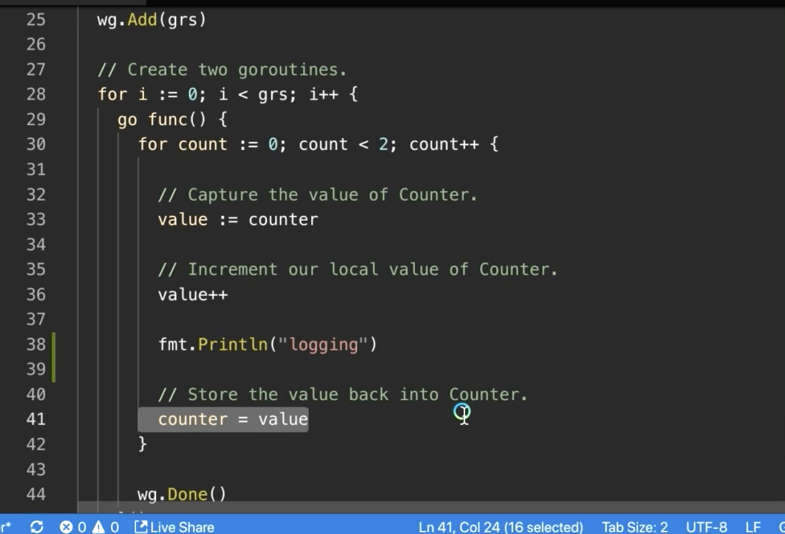

Transcript  转录本

00:00:00

(light music) - [Narrator] Arden Labs, specializing in high performance software consulting, training, staffing, and development. (graphic swoosh) Welcome to Module 9, Data Races. You are now watching Lesson 9.1, Managing Data Races. (graphic swoosh) - I just finished showing you how to create Goroutines and I've shown you a little bit about orchestration,
（轻音乐）-【旁白】Arden Labs，专注于高性能软件咨询、培训、招聘和开发。（图形挥动）欢迎来到第 9 模块，数据竞争。您现在正在观看第 9.1 课，管理数据竞争。（图形挥动）- 我刚刚向您演示了如何创建 Goroutine，并且稍微展示了一些关于编排的内容，

00:00:22

but here's the real problem with multi-threaded software. You've got to manage and control all those different paths of execution that you're about to set forth in the while. And the real problem is data races. Now a data race occurs when you have at least two Goroutines
但多线程软件的真正问题在这里。你必须管理和控制所有那些不同的执行路径，这些路径将在一段时间内被启动。真正的问题是数据竞争（data race）。现在，数据竞争发生在你至少有两个 Goroutines

00:00:40

where one is doing a read and the other is doing a write. At least a write. You have to have a write going on. And they're trying to read and or write or two writes at the same memory location at the same time. If you try to do that, it becomes a problem, because there's no predictability in what's going to happen. The hardware, your compiler, your language,
其中一个在读，另一个在写。至少要有一个写。必须有写操作在进行。它们试图同时在同一内存位置进行读和/或写，或两个写。如果你尝试那样做，就会成为问题，因为无法预测会发生什么。硬件、你的编译器、你的语言，

00:01:02

nobody can tell you what the end result is going to be. So we cannot allow two Goroutines to access the same shared memory at the same location if at least one of those operations are gonna be a write. And that means that we now have to synchronize. Remember we talked about what synchronization is.
都无法告诉你最终结果会是什么。所以我们不能允许两个 Goroutines 访问同一共享内存的同一位置，如果其中至少有一个操作是写。这就意味着我们现在必须进行同步。记住我们讨论过什么是同步。

00:01:20

It means that Goroutines have to get in line and take a turn. And some of the nastiest bugs that I've ever had to deal with have been data races, because they look so random when they're occurring. So what I wanna do is give you a very basic data race right now so you can get a sense of what a data race looks like. I'll show you some ways to fix these data races
这意味着 Goroutine 必须排队并轮流执行。我遇到过的一些最棘手的错误就是数据竞争，因为它们发生时看起来非常随机。所以我现在要给你演示一个非常基础的数据竞争，让你感受一下数据竞争是什么样子。我会展示一些使用同步原语修复这些数据竞争的方法，

00:01:41

with synchronization primitives, and then we'll look at some more advanced stuff, and then how we can detect them, and go a lot easier than we have been able to in the past with other languages. So let's go to some code here. In this program on line 16, what we have is our shared state
然后我们会看一些更高级的内容，以及如何检测它们，而且比我们过去在其他语言中要容易得多。现在我们来看一些代码。在这个程序的第 16 行，我们有共享状态，

00:02:01

and this shared state is just an integer. So we're going to allocate this eight bytes of memory. We're gonna call it counter. There it is. And it's gonna be that shared state for the program. Then on line 21, we're gonna define a constant of two. So we're gonna have two Goroutines in this program,
这个共享状态只是一个整数。所以我们要分配这 8 字节的内存。我们把它叫做 counter。就是它。它将作为程序的共享状态。然后在第 21 行，我们要定义一个值为 2 的常量。所以这个程序中我们将有两个 Goroutine，

00:02:20

each trying to access this shared state. Now on line 24, we have our WaitGroup set to a zero value. We add two for the number of Goroutines, we saw that pattern already, and then we get into a loop. Now in the loop what we do is create those two Goroutines that I've already placed on the board,
每个都试图访问这个共享状态。现在在第 24 行，我们的 WaitGroup 被设置为零值。我们为 Goroutine 的数量增加了两个，这个模式我们已经见过，然后进入循环。现在在循环中我们所做的是创建那两个我已经写在白板上的 Goroutine，

00:02:41

and these two Goroutines, what they're gonna be doing, is each taking a turn incrementing the shared state. In fact, they're gonna do it twice. So since we're starting at zero, once both of these Goroutines finish their operation, the value should end up as four. We could see that code right there between lines 33, 36, and 39.
这两个 Goroutine 将要做的是轮流递增共享状态。事实上，它们会各做两次。因此因为我们从零开始，一旦这两个 Goroutine 都完成它们的操作，值最终应该是四。我们可以在第 33、36 和 39 行之间看到那段代码。

00:03:02

Those are our read, modify, write operations for this task. So what we can do is look on line 36, I'm sorry, line 33. We see that we're gonna do a read. Then on line 36 we do that modify, and then on line 39 we do that write back to there,
那些是我们为这个任务执行的读、修改、写操作。所以我们可以看第 36 行，不好意思，是第 33 行。我们看到我们将执行一次读取。然后在第 36 行我们执行修改，然后在第 39 行我们将结果写回，

00:03:23

and we're gonna be doing this four times. So let's go ahead right now and build this program. So I've saved it. I'm gonna come in here and do a go build. And we're gonna run it. And sure enough, as we talked about, every time I run this program, we get the value of four.
我们将这样做四次。所以现在我们去构建这个程序。我已经保存好了。我要在这里运行 go build。然后我们运行它。正如我们所说，每次运行这个程序，我们都会得到值四。

00:03:41

Now here's the interesting thing, right? This program is working, it's running, we're happy with it, we put it in production, and everything is good for the next six to eight months. And then you know what happens, right? We go ahead and we hire a new developer,
现在有趣的地方来了，对吧？这个程序能跑，正在运行，我们很满意，把它投产，一切在接下来的六到八个月里都很好。然后你知道会发生什么，对吧？我们去招聘了一个新开发者，

00:04:00

and we ask this developer that they're gonna be maintaining this code moving forward and they need to get an idea to learn how it works. And so what that developer does is what we would all be doing, and we start using some logging techniques like fmt.Println, right? And we start adding logging all over the program.
并且我们告诉这个开发者他们将来要维护这段代码，他们需要了解它是如何工作的。于是那个开发者做的事情就是我们所有人都会做的——开始使用一些日志技术，比如 fmt.Println，对吧？然后我们开始在程序各处加入日志。

00:04:20

We're not using our debugger, we're using logging to figure out how this program works and we start tracing it. We spend a couple of days doing this logging like this. And once we feel comfortable that we know the program, maybe we even go in and make a couple of changes. And then what do we forget to do after we've made those changes? We forget to pull all the logging out,
我们没有使用调试器，而是通过日志来弄清这个程序的运行方式，然后开始追踪。我们花了几天时间这样记录日志。一旦我们觉得对程序足够熟悉，也许还会进去做几处改动。那在做完这些改动之后我们常常忘了做什么？我们忘了把所有的日志都删掉，

00:04:40

and in this case, we left the logging that I now added on line 38 in the code. Watch what happens when I save and build this program now, forgetting to remove the logging on line 38. So we build this program, we go ahead and we're gonna put it in production.
在这种情况下，我们保留了我现在在代码第 38 行添加的日志。看当我保存并构建这个程序而忘记删除第 38 行的日志时会发生什么。所以我们构建这个程序，继续把它投入生产。

00:05:00

The logging is happening and now every time we run this program, we see a value of two, phew, look at that. All I did was add some logging in between those operations and now I have a different result. What is happening here? We have a classic data race.
日志正在输出，现在每次运行这个程序，我们都看到值为二，呼，看吧。我所做的只是在人操作之间添加了一些日志，现在结果不一样了。发生了什么？我们遇到了经典的数据竞争。

00:05:21

There was no guarantees in the code before. We were getting lucky and now we're no longer getting lucky. Let's go back and look at the code and then come back to the board. So what's happening now? What's happening now is we did that read on 33, we did the modification, but, but, before we do the write, now what happens is
之前代码中没有任何保证。我们之前是碰巧跑对了，现在不再碰巧了。回去看一下代码，然后再回到白板。那么现在发生了什么？现在发生的是我们在第 33 行进行了读取，做了修改，但是，在我们写入之前，现在发生的是

00:05:43

that print statement is allowing the scheduler to make a context switch. Now, when we make that context switch, this Goroutine comes in, does its read, does its modify, print statement hits again and boom, context switch.
那个打印语句允许调度器进行上下文切换。现在，当我们进行那个上下文切换时，这个 Goroutine 进来了，做它的读取，做它的修改，打印语句再触发，然后砰，又一次上下文切换。

00:06:00

We come back here, we do our write, then we do our read, we do our modify, context switch. And this time, this Goroutine has no idea that the value that it has is dirty. This is the problem with the data race. And honestly, this is also a problem with our value semantics.
我们回到这里，做我们的写入，然后我们做读取，做修改，又一次上下文切换。并且这一次，这个 Goroutine 完全不知道它持有的值已经是脏的。这就是数据竞争的问题。说实话，这也是我们值语义的问题。

00:06:20

This is when the efficiency of pointers kind of kicks in. Because we have no concept that the value is dirty, when we come back, we go ahead and we write our value again, we do our read, our modify, context switch. We come in and do the two.
这就是指针效率开始显现的时候。因为我们没有脏值的概念，当我们回来时，我们就直接把值写回去，进行读取、修改、上下文切换。然后我们再进来执行那两个操作。

00:06:40

You could see, you could see now where that data race came in. These context switches are causing the values on this side of our multi-threaded Goroutine program to now be dirty, dirty, dirty, dirty, dirty. We don't have any ability to know that they're dirty, nasty data race.
你现在可以看到数据竞争是如何产生的。这些上下文切换导致我们多线程 Goroutine 程序这边的值现在变得肮脏、肮脏、肮脏、肮脏、肮脏。我们没有任何办法知道它们是脏的、糟糕的数据竞争。

00:07:00

So what we need to do is have each Goroutine, take a turn. So these three operations are atomic. They were atomic before we put the print statement in. But now that we've added the print statement, we're seeing that it's not running atomically. Technically, they really weren't an atomic set of instructions.
所以我们需要让每个 Goroutine 轮流执行。这样这三个操作就是原子的。在我们加入打印语句之前它们是原子的。但现在我们加入了打印语句，就看到它们不再以原子方式运行。从技术上讲，它们并不是真正的一组原子指令。

00:07:21

We were just getting lucky. Now these are nasty, nasty things to find and one of the nice things about Go is that it does have a data race detector. Let's try it out. So we're gonna come back to our console window here. I'm gonna clear this out. And we're gonna build the program again,
我们只是碰巧没有碰到问题。现在这些问题很难找，而 Go 的一个优点是它确实有数据竞争检测器。让我们试一试。我们回到控制台窗口。我把它清空。然后我们再次构建程序，

00:07:40

but this time I'm gonna use the race switch. Now what that's gonna do is build a new binary, but with the race detection, we still have to run the binary to see if there's a race. Couple of things about this, however, one, if the data race detector finds a race, you have one. Don't argue with it. It's there.
但这次我要使用 race 开关。这样会构建一个带有竞态检测的新二进制文件，不过我们仍然需要运行该二进制文件来查看是否存在竞态。不过有几件事要注意，第一，如果数据竞争检测器发现了竞态，那就说明你确实有竞态。不要跟它争论。它就在那里。

00:08:01

If it doesn't find a race, it doesn't mean you don't have one, it just means that you haven't found it yet. You probably, or maybe you need to run the program a little bit more. Now I normally use the race detector with my tests. I tend not to build binaries with the race detector. Some companies do,
如果它没有发现数据竞争，并不意味着你没有数据竞争，只是意味着你还没找到它。你可能需要多运行几次程序。通常我在测试时使用 race 检测器，但我一般不会用它来构建二进制文件。有些公司会这么做，

00:08:20

and they'll put it out there in their farm. And I've heard that a binary with the race detector could run about 20, 25% slower. But I tend to do it with the go test tool. My recommendation, however, if you're gonna use it with the test tool and you're gonna run these tests on the Mac to probably set the CPU value
并把带有 race 检测器的二进制部署到他们的集群。我听说带有 race 检测器的二进制运行速度可能会慢大约 20% 到 25%。但我倾向于在 go test 工具中使用它。不过我的建议是，如果你打算在测试工具中使用它并在 Mac 上运行这些测试，可能需要设置 CPU 值。

00:08:41

to like three times the number of hardware threads just to create a little bit more chaos, it will help find data races. Okay. So I've already built it. Now if I run it, you can see fairly quickly, the data race message pops up. And what's nice about the data race message is
把 goroutine 数量增加到大约硬件线程数量的三倍，稍微制造一些混乱，这有助于发现数据竞争。好。我已经构建好了。现在如果我运行它，你可以很快看到数据竞争的提示弹出。关于数据竞争提示，有一点很不错的是

00:09:00

that it tells us the write and the other read and or write. There it is, tells us that there was on line 41 and 33. And we can see that those Goroutines were created on line 29. So if we look at 41 and 33 back in the code, there it is, there's that read and there's that write,
它告诉我们有写操作，另一个是读或写。看，就是那里，告诉我们发生在第 41 行和第 33 行。我们还能看到那些 Goroutine 是在第 29 行被创建的。所以如果回到代码看第 41 行和第 33 行，就在那里，那个读操作和那个写操作，

00:09:20

and there it is, the data race is there. Now if the race detector finds a race and it's not obvious to you how it happened, you probably have lost some control over the code. It's probably gotten a little bit more complex. Don't just try to patch that. You may have to think about a little bit of a re-architecture. Okay, so what's the real problem here?
就是那里，数据竞争就在那里。现在如果竞争检测器发现了竞争，但你不清楚它是如何发生的，那很可能是你对代码的控制丧失了。代码可能变得有点复杂。不要只是尝试修修补补。你可能需要考虑对架构稍作重构。好，那么真正的问题是什么？

00:09:40

The problem is that this code is not atomic. The race detector found it as well. It realized that we have the ability to have shared access to the same memory location where one of those Goroutines is doing a write. And it didn't even show itself to us until we put that print statement in there. I mean, look, the reality is
问题在于这段代码不是原子性的。竞争检测器也发现了这一点。它意识到我们有可能共享访问同一内存位置，而其中一个 Goroutine 正在进行写操作。直到我们在那放了打印语句，这个问题甚至都没显现出来。我的意思是，现实情况是

00:10:00

if I take the print statement out, we're still going to have the data race. So now the question is, well, how do we fix this? How do we make sure that in this point, these four lines of code let's say, are running atomically? Well, we really have two options when it comes to synchronization. We have the ability to use the atomic instructions and we have the ability to use mutexes.
如果我把 print 语句去掉，我们仍然会有数据竞争。那么现在问题是，我们该如何修复这个问题？我们如何确保在这一点上，比如说这四行代码是作为原子操作运行的？在同步方面我们实际上有两个选项。我们可以使用原子指令，也可以使用互斥锁（mutex）。

00:10:21

Now atomic instructions are the fastest way to do synchronization, and that's because they're at the hardware level. So the hardware is gonna help us with synchronization. The problem is is that at the hardware level, we can only synchronize a word or half a word of memory at a time. So that's gonna limit our ability to use that.
现在原子指令是实现同步最快的方法，因为它们在硬件层面。因此硬件会帮助我们进行同步。问题是，在硬件层面我们一次只能同步一个字（word）或半个字（half a word）的内存。因此这会限制我们使用它的能力。

00:10:42

Luckily right now we're dealing with an integer. And so since we're dealing with an integer that's a word or half a word of memory, depending upon our architecture, we can use the atomic instructions in this case to create that synchronization. So atomic instructions are great for counters, which is exactly what we have. So let's go ahead and try to use those atomic instructions.
幸运的是目前我们处理的是一个整数。由于我们处理的是一个整数，而整数在不同架构下就是一个字或半字大小的内存，因此在这种情况下我们可以使用原子指令来创建同步。所以原子指令非常适合计数器，这正是我们现在所拥有的。那我们就试着使用这些原子指令。

00:11:03

So let's just comment all this code out for a second, there it is. And remembering that our shared state is this counter variable, what we can do is come in here and say atomic. Now look at this API that we get from the atomic instruction.
所以我们先把这些代码全部注释掉，像这样。记住我们的共享状态就是这个 counter 变量，我们可以在这里写 atomic。现在看看我们从 atomic 指令获得的这个 API。

00:11:20

We have the ability to do adds atomically, which is what we need right now. You have the ability to do a compare and swap, all atomically. Compare the value in the shared state with something else. If it's true, then swap that out. We have the ability to do loads, which are reads, and stores, which are writes. And then just basic swaps regardless of the condition. Very common atomic API.
我们可以进行原子性的加操作，这正是我们现在需要的。你也可以执行原子性的比较并交换（compare and swap）。将共享状态中的值与其他值比较；如果相等，就把它交换掉。我们可以进行加载（load），也就是读取；以及存储（store），也就是写入。还有不考虑条件的基本交换（swap）。这是非常常见的原子 API。

00:11:42

So what we're gonna do is the add 32. Now notice how this API requires you to be very precise about the precision. So if I take the address of count and pass it in and say, one, I am gonna get a compiler error, because count right now is not a precision based integer.
所以我们要做的是执行 add 32。现在注意这个 API 要求你对精度非常明确。因此如果我对 count 取地址并传入，然后写 1，会得到编译错误，因为 count 现在不是基于特定精度的整数。

00:12:01

It's based on just int, right? And that is saying use the most efficient integer for the architecture that we're running on. So here's one of those cases where we've gotta be very explicit about our precision, 32-bit integers regardless of the architecture. And now that gives us the ability on line 33 to be able to do this.
它只是基于 int，对吧？这表示使用与我们运行架构最有效的整数类型。所以这是需要我们对精度非常明确的情况之一——无论架构如何都使用 32 位整数。现在这就让我们在第 33 行能够这么做。

00:12:20

And now we have no more data race, we'll run this. But the sharing is occurring at the address. So if you call any atomic instruction with that address, regardless of if it's add, load, store, then those Goroutines will fall in line and synchronize. If you're using different addresses, then you have no worry, there's no extra latency on that synchronization.
现在我们就没有数据竞争了，运行它。但共享发生在地址层面。因此如果你对该地址调用任何原子指令，无论是 add、load 还是 store，那些 Goroutine 都会排队并同步。如果你使用不同的地址，就不需要担心，这种同步不会带来额外的延迟。

00:12:43

Okay, great. So if I run this program now, if I build it even with the race detector, what we'll see is, one, there's no race and now we get four. So just one line of code is fixing all of that, because this is a counter.
好的，太棒了。那么如果我现在运行这个程序，即使包含竞态检测器来构建它，我们看到的情况是：第一，没有竞态条件，现在我们得到的是 4。仅仅一行代码就解决了所有问题，因为这是个计数器。

00:13:01

But let's say that we did, for some reason, want all of these instructions to be synchronized. Let's just, for whatever reason, we want all of them, we're no longer capable of using that atomic instruction anymore. Now what we have to do is use a mutex. And a mutex gives us the ability to take multiple lines
但假设出于某种原因，我们确实想让所有这些指令同步执行。无论出于什么原因，我们要让它们全部同步执行，且不再能使用那个原子指令。现在我们必须使用互斥锁（mutex）。互斥锁让我们能够将多行

00:13:23

of code and to make the execution of those lines atomic. So let's go ahead and look on the board, and see how a mutex actually works. Now one of the things about a mutex that I like to imagine is that it creates a room of code.
代码作为原子操作来执行。所以我们来看看黑板，看看互斥锁实际上是如何工作的。关于互斥锁，我喜欢想象它创建了一个代码的房间。

00:13:43

So imagine we have some block of code like the four lines of code right now that we wanna run atomically. And what the mutex does is it allows you to create a room. And suddenly, what will happen is Goroutines will come to the front of the room here, right? Come to the door, and will want to be let in.
所以想象我们有一段代码，比如现在这四行代码，我们希望它们作为原子操作运行。互斥锁所做的就是允许你创建一个房间。突然间，Goroutine 会来到房间门口，对吧？来到门前，并希望被允许进入。

00:14:03

But it's the job of the scheduler to make sure that only one Goroutine gets in the room executing that code at any given time. And then when that Goroutine is out, another Goroutine can come in. Now a couple things about mutexes here. For a Goroutine to ask or request access to the room,
但调度器的工作是确保在任意时刻只有一个 Goroutine 进入房间执行那段代码。当那个 Goroutine 退出后，另一个 Goroutine 就可以进来。这里关于互斥锁有几点要说。一个 Goroutine 要求或请求进入房间时，

00:14:22

they're gonna call a function called lock. And when they leave they're gonna call unlock. And this is gonna be really important, this lock and unlock request. Remember if a Goroutine that gets the lock doesn't call unlock, now we're going to have real problems up here, 'cause we're gonna deadlock all these Goroutines,
他们会调用一个叫 lock 的函数。离开时会调用 unlock。这个 lock 和 unlock 的调用非常重要。记住，如果一个获取锁的 Goroutine 没有调用 unlock，那么这里就会出现真正的问题，因为我们会让所有这些 Goroutine 死锁，

00:14:41

they'll never be allowed in. Another thing you have to understand about mutexes is that they're not a queue. So this isn't first Goroutine here. First Goroutine in, not at all. They will use a fair scheduling algorithm, but even if this is the first Goroutine that shows up at the door, and this is the fifth,
它们永远无法进入。关于互斥锁你还必须明白的一点是：它们不是一个队列。所以这并不是先到先得的 Goroutine。根本不是。它们会使用一种公平的调度算法，但即便这是第一个到门口的 Goroutine，而这是第五个，

00:15:01

the fifth Goroutine could potentially come in. So we don't think of mutexes as queue, all right? But it is fair, in that the first Goroutine here shouldn't necessarily be the very last one that gets in. And remember something, that the amount of time it takes to execute
第五个 Goroutine 可能随后进入。所以我们不会把互斥锁当作队列，好吗？但这也是公平的，这里第一个 Goroutine 不一定会是最后一个进入的那个。还要记住，执行所需的时间长短会影响到这一点。

00:15:20

through this code window, right? Through this room, is latencies up here. And remember one of the biggest killers of performance is latency costs. And this would be adding to the internal latency costs that we talked about earlier in this video. Okay, so what we wanna do is create a room where only one Goroutine can come in
通过这个代码窗口，对吧？通过这个房间，延迟在这里上升。记住，性能的最大杀手之一是延迟成本。而这会增加我们在本视频前面讨论过的内部延迟成本。好了，所以我们想创建一个只允许一个 Goroutine 进入的房间

00:15:41

and execute those four lines of code. We have to remember that the longer this takes, the longer these Goroutines are waiting, this would be considered like back pressure, internal back pressure on the app. And then we've gotta a call that unlock. So how can we do all of this and fix this code? Well let's first go ahead and declare our mutex,
并执行那四行代码。我们必须记住，这个过程耗时越久，这些 Goroutine 就要等待越久，这可以被视为对应用的内部反压。然后我们还有一个调用来解锁。那么我们如何完成这一切并修复这段代码呢？首先让我们声明我们的 mutex，

00:16:02

and that mutex does come from the sync package as well. And what's nice is that a mutex is usable in its zero value state, just like the WaitGroup. And remember something right now, if you add a WaitGroup or a mutex to a struct, that struct is no longer able
并且该 mutex 也是来自 sync 包。好的一点是 mutex 和 WaitGroup 一样，在其零值状态下就可以使用。现在记住一件事，如果你将 WaitGroup 或 mutex 添加到一个 struct 中，那么该 struct 将不再能够

00:16:20

to be leveraging those value semantic. You just can't make a copy of it anymore, okay? Different copies of a mutex would be technically different mutexes. Okay, brilliant. So I've got the mutex on line 27. Now what is it that I wanna do? Now what I wanna do is ask for the lock. And one of the things I like doing with mutex is,
去利用那些值语义。你就不能再复制它了，好吗？不同的 mutex 副本从技术上来说就是不同的 mutex。好，太好了。所以我在第 27 行有一个 mutex。现在我想做什么？现在我想请求锁。我对 mutex 喜欢做的事情之一是，

00:16:40

that I wish more developers did, is I create this artificial code block. And you could see that by using the artificial code block, we kind of visualize the room of code in the code itself. We can visualize that room that I drew on the board. So now what we see is the code between lines 34 and 45.
我希望更多开发者也这么做，就是我创建这个人为的代码块。你可以看到，通过使用这个人为代码块，我们在代码本身中把我在白板上画的“房间”可视化了。所以现在我们看到的是第 34 到 45 行之间的代码。

00:17:05

That's what's being synchronized between this lock and the unlock. So now only one Goroutine at a time gets to execute those four lines of code. We're gonna guarantee the synchronization. So now that I've done that, let's come back here, let's build it again with the race detector.
这就是在这个 Lock 和 Unlock 之间被同步的内容。所以现在一次只有一个 Goroutine 可以执行那四行代码。我们要保证这种同步。既然我已经这么做了，我们回到这里，用 race detector 再次构建。

00:17:22

And if I run it, we're also gonna now get the answer of four, unlike we did before when we didn't have the mutex, we're now synchronizing these four lines of code. But you gotta remember something about a mutex again. I'm gonna continue to stress this. The mutex creates back pressure up here,
如果我运行它，我们现在也会得到四这个答案，不像之前没有 mutex 时的情况，我们现在同步了这四行代码。但你得再次记住有关 mutex 的一点。我会继续强调这一点。mutex 会在这里产生反压，

00:17:40

it creates latency. So the longer this takes, the longer these Goroutines are waiting, the worse our throughput's gonna be over time. So anytime we're looking at a mutex, we've got to make sure that we're doing the bare minimum. We are doing the minimum but the bare minimum. When we come back and look at this code, we should recognize
它会产生延迟。所以这件事花得越久，这些 Goroutine 等待的时间就越长，随着时间推移我们的吞吐量就会越差。因此每当我们考虑使用 mutex 时，必须确保我们只做最必要的事情——做最少但确实是最必要的。当我们回过头再看这段代码时，我们应该能认出这一点

00:18:01

that line 41 is not necessary. It shouldn't be inside the mutex. This is adding microseconds, right? Maybe tens of microseconds of extra latency inside the mutex, which is going to cause extra milliseconds, you know,
那第 41 行不是必要的。不应该放在互斥锁内部。这是在增加微秒级延迟，对吧？可能是在互斥锁内部增加几十微秒的额外延迟，这会导致额外的毫秒级延迟，你知道的，

00:18:20

or microseconds of latency here over time. Really, really bad. So ideally we wanna get that log statement out of the mutex there. We wanna make sure we're doing the bare minimum though. I see a lot of developers trying to minimize the amount of time they're inside that mutex and then they lose synchronization. So something you gotta be very, very careful about there.
或者随着时间推移这里会出现微秒级的延迟。真的，非常糟糕。所以理想情况下我们希望把那个日志语句从互斥锁里移出来。不过我们要确保只做最低限度的操作。我见过很多开发者试图尽量缩短在互斥锁内的时间，然后却丢失了同步。因此在这点上你必须非常非常小心。

00:18:42

And I've seen, and I've done it myself, security bugs inside of mutexes where we're making certain types of calls that could take milliseconds of time inside the mutex and we're slowing everything down. You know, back pressure is really death when it comes to these mutexes. So gotta make sure we're doing the right things
我也见过，也自己干过，在互斥锁内部出现的安全漏洞：我们在互斥锁里进行某些可能耗费数毫秒的调用，从而拖慢了所有操作。你知道，回压在这些互斥锁面前真的是致命的。所以必须确保我们在里面做的是正确的事。

00:19:00

in the bare minimum. So there's our mutex. Now, Go also has a read/write mutex. And the read/write mutex is nice, because what it does is it allows you to have multiple readers at the same time. Remember reading is free, reading is not our problem, it's the mutation of memory, that's our problem.
在最基本的情况下。于是这就是我们的 mutex。现在，Go 还有一种读/写 mutex。读/写 mutex 很好，因为它允许你同时有多个读者。记住，读取是“免费”的，读取本身不是问题，问题在于内存的变更（mutation），那才是我们需要关注的。

00:19:23

Remember the data race doesn't occur until there's at least one Goroutine performing a write. So you might decide one day, let's use a map as a cache, right? We're gonna cache things in process and we'll use a map. While there are Goroutines that wanna read the cache,
记住，数据竞争要等到至少有一个 Goroutine 执行写操作才会发生。所以你可能某天决定，用 map 作为缓存，对吧？我们要在进程内缓存东西，会用到 map。当有 Goroutine 想读取缓存时，

00:19:41

they can all read at the same time, that's not the problem. But if suddenly, if somebody, one Goroutine wants to add a value to that cache through the map, then we've gotta stop all the reads. So here's a case where, and I've done this before too many times, there's a read lock with a write unlock. And you'll start to do this sometimes
它们可以同时读取，这不是问题。但如果突然间，有一个 Goroutine 想通过 map 向缓存中添加一个值，那么我们就必须停止所有读取。所以这里有一种情况，我也做过太多次，就是用的是读锁配合写解锁。你有时会开始这样做。

00:20:02

when you're doing a copy and paste, and you're moving really fast, so be careful of that. We don't need the read/write mutex for this piece of code, because we need synchronization happening all the time here. All right, so these are our primitives here for the work that we're doing. We're gonna use those atomic instructions
当你在进行复制粘贴并且动作非常快时，要小心。对于这段代码我们不需要读/写互斥锁，因为这里需要一直进行同步。好吧，这些就是我们在此工作中使用的原语。我们将使用那些原子指令

00:20:21

when we're dealing with a word or half a word of data. We're gonna use these mutexes when we're trying to synchronize multiple lines of code even across multiple functions, right? We can use that mutex in multiple places, but now we're talking about multiple lines of code. And another thing you gotta remember, there is no one line of code that is atomic.
当我们处理的是一个字或半个字的数据时会有差别。我们在尝试在多行代码之间甚至跨多个函数进行同步时会使用这些互斥锁，对吧？我们可以在多个地方使用同一个互斥锁，但现在我们谈的是多行代码。还有一件事你要记住，没有哪一行代码是原子的。

00:20:41

I mean value++ is a great example of this. Value++ is a read, modify, write operation in and of itself. There's three lines of assembly code behind that, that is not atomic. You know, at the hardware level, any one of those three lines of code could have that preemptive context switch at any given time.
我的意思是 value++ 就是一个很好的例子。value++ 本身是一个读取、修改、写入的操作。它背后有三行汇编代码，那并不是原子的。你知道，在硬件层面上，这三行代码中的任何一行在任何时刻都可能发生那种抢占式的上下文切换。

00:21:00

Plus you have to remember, that if you don't tell the compiler, there needs to be synchronization, it can take special liberties underneath when generating the code, which can all produce these really random types of data races. So remember there is no one line of code that is synchronous in and of itself in Go. We're gonna need those atomic instructions,
另外你要记住，如果你不告诉编译器需要同步，它在生成代码时可能会在底层采取特殊的自由度，这些都会产生各种非常随机的数据竞争。所以要记住，在 Go 中没有哪一行代码本身就是同步的。我们需要那些原子指令，

00:21:20

those mutexes, those read/write mutexes. Your job is to make sure that there is the synchronization when it's needed. You still gotta add some guarantees in the code when you're doing this concurrency or out of order execution, that's gonna be your job. And this is a core tool set for that. Now this is synchronization.
那些互斥锁，那些读写互斥锁。你的工作是确保在需要的时候有同步。当你在做并发或乱序执行时，你仍然必须在代码中加入一些保证，那将是你的职责。而这是一套核心工具。现在这是同步。

00:21:40

The next thing to talk about really is going to be orchestration. And now what we want to talk about is what is the mechanism when we need two Goroutines, two or more Goroutines to talk to each other. Don't wanna be using atomic instructions for that, don't wanna be using mutexes for that type of stuff.
接下来要讨论的实际上是编排。现在我们要讨论的是，当需要两个 Goroutine，或两个以上的 Goroutine 相互通信时，使用的机制是什么。不要用原子指令去做，不要用互斥锁去做那类事情。

00:22:00

It's very complicated. It's why Go gave us the channel to do orchestration, and that's the next thing that we need to talk about. (light music)
这非常复杂。这就是为什么 Go 给了我们 channel 来做编排，而这就是我们接下来需要讨论的内容。 (轻音乐)