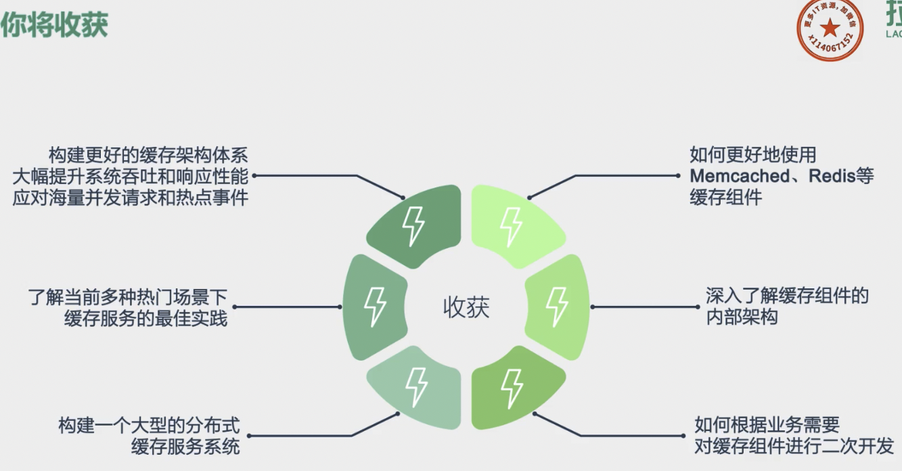

1
00:00:01,000 --> 00:00:03,500
你好,我是你的缓存老师,陈波

2
00:00:03,500 --> 00:00:06,000
欢迎进入第一课室,缓存的原理

3
00:00:06,000 --> 00:00:09,400
这期课主要讲缓存的基本思想

4
00:00:09,400 --> 00:00:10,500
缓存的优点

5
00:00:10,500 --> 00:00:11,500
缓存的代价

6
00:00:11,500 --> 00:00:12,500
三个部分

7
00:00:12,500 --> 00:00:15,500
先来看一下缓存的定义

8
00:00:15,500 --> 00:00:19,500
缓存最初的含义是指用于加速CPU数据交换的RAM

9
00:00:19,500 --> 00:00:21,500
即随机存取存储器

10
00:00:21,500 --> 00:00:26,000
通常这种存储器使用昂贵但快速的静态RAM

11
00:00:26,000 --> 00:00:27,500
即Static RAM技术

12
00:00:27,500 --> 00:00:29,500
用于对DRAM进行加速

13
00:00:29,500 --> 00:00:31,500
这是一个狭义缓存的定义

14
00:00:31,500 --> 00:00:34,500
而广义缓存的定义则更宽泛

15
00:00:34,500 --> 00:00:38,000
是指任何可以用于数据高速交换的存储介质

16
00:00:38,000 --> 00:00:40,500
可以是硬件也可以是软件

17
00:00:40,500 --> 00:00:46,000
缓存存在的意义就是通过开辟一个新的数据交换缓存区

18
00:00:46,000 --> 00:00:49,500
来解决原始数据获取代价太大的问题

19
00:00:49,500 --> 00:00:51,500
让数据得到更快的访问

20
00:00:51,500 --> 00:00:54,000
本课主要聚焦于广义缓存

21
00:00:54,000 --> 00:00:59,000
特别是互联网产品大量使用的各种缓存组件和技术

22
00:00:59,000 --> 00:01:02,500
缓存构建的基本思想是利用时间局限性原理

23
00:01:02,500 --> 00:01:06,500
通过空间换时间来达到加速数据获取的目的

24
00:01:06,500 --> 00:01:09,500
同时由于缓存空间的成本较高

25
00:01:09,500 --> 00:01:11,500
在实际设计架构中

26
00:01:11,500 --> 00:01:15,000
还要考虑访问延迟和成本的权衡问题

27
00:01:15,000 --> 00:01:17,500
这里面有三个关键点

28
00:01:17,500 --> 00:01:20,000
一是时间局限性原理

29
00:01:20,000 --> 00:01:24,500
即被获取过一次的数据在未来还会被多次引用

30
00:01:24,500 --> 00:01:27,500
比如一条微博被一个人感兴趣并阅读后

31
00:01:27,500 --> 00:01:30,000
它大概率还会被更多人阅读

32
00:01:30,000 --> 00:01:32,000
当然如果变成热门微博后

33
00:01:32,000 --> 00:01:36,000
会被数以百万千万级更多的用户查看

34
00:01:36,000 --> 00:01:38,500
二是以空间换时间

35
00:01:38,500 --> 00:01:40,500
因为原始数据获取太慢

36
00:01:40,500 --> 00:01:44,500
所以我们开辟一块高速独立空间提供高效访问

37
00:01:44,500 --> 00:01:47,500
来达到数据获取加速的目的

38
00:01:47,500 --> 00:01:49,000
三是性能成本Tradeoff

39
00:01:49,000 --> 00:01:52,000
构建系统时希望系统的访问性能越高越好

40
00:01:52,000 --> 00:01:53,500
访问延迟越低越好

41
00:01:53,500 --> 00:01:56,000
但维持相同规模的存储及访问

42
00:01:56,000 --> 00:01:58,000
性能越高延迟越小

43
00:01:58,000 --> 00:01:59,000
成本也会越高

44
00:01:59,000 --> 00:02:01,000
所以在系统架构设计时

45
00:02:01,000 --> 00:02:05,000
你需要在系统性能和开发运行成本之间做取舍

46
00:02:05,000 --> 00:02:06,500
比如左边这张图

47
00:02:06,500 --> 00:02:08,000
相同成本的容量

48
00:02:08,000 --> 00:02:11,500
SAT硬盘容量会比内存大10到30倍以上

49
00:02:11,500 --> 00:02:15,000
但读写延迟却高50到100倍

50
00:02:15,000 --> 00:02:17,500
通过前面的介绍我们已经知道

51
00:02:17,500 --> 00:02:21,500
缓存存储原始数据可以大幅提升访问性能

52
00:02:21,500 --> 00:02:23,000
不过在实际业务场景中

53
00:02:23,000 --> 00:02:27,000
缓存中存储的往往是需要频繁访问的中间数据

54
00:02:27,000 --> 00:02:28,500
甚至是最终结果

55
00:02:28,500 --> 00:02:31,500
这些数据相比DB中的原始数据小很多

56
00:02:31,500 --> 00:02:33,000
这样就减少网络流量

57
00:02:33,000 --> 00:02:35,000
降低网络拥堵

58
00:02:35,000 --> 00:02:40,000
而且缓存的读写承载能力一般比DB大10到100倍以上

59
00:02:40,000 --> 00:02:43,000
同时又减少了原始数据的解析和计算

60
00:02:43,000 --> 00:02:45,000
调用方和存储服务的负载

61
00:02:45,000 --> 00:02:47,000
也可以大幅降低

62
00:02:47,000 --> 00:02:48,000
缓存的读写性能很高

63
00:02:48,000 --> 00:02:49,000
越是快

64
00:02:49,000 --> 00:02:52,500
在数据访问存在性能瓶颈和遇到突发流量

65
00:02:52,500 --> 00:02:54,000
系统读写压力增大时

66
00:02:54,000 --> 00:02:56,000
可以快速部署上线

67
00:02:56,000 --> 00:02:58,000
同时在流量稳定后

68
00:02:58,000 --> 00:02:59,000
也可以随时下线

69
00:02:59,000 --> 00:03:02,000
双方系统的扩展性大大增强

70
00:03:02,000 --> 00:03:05,000
然而不幸的是任何事情都有两面性

71
00:03:05,000 --> 00:03:06,000
缓存也不例外

72
00:03:06,000 --> 00:03:09,000
我们在享受缓存带来一系列好处的同时

73
00:03:09,000 --> 00:03:11,000
也注定需要付出一定的代价

74
00:03:11,000 --> 00:03:15,000
首先服务系统引入缓存会增加系统的复杂度

75
00:03:15,000 --> 00:03:16,000
其次

76
00:03:16,000 --> 00:03:19,000
由于缓存相比原始DB存储的成本更高

77
00:03:19,000 --> 00:03:22,000
所以系统部署及运行的费用也会更高

78
00:03:22,000 --> 00:03:23,000
最后

79
00:03:23,000 --> 00:03:26,000
由于一份数据同时存在缓存和DB中

80
00:03:26,000 --> 00:03:29,000
甚至缓存内部也会有多个数据副本

81
00:03:29,000 --> 00:03:31,000
多份数据就会存在一致性问题

82
00:03:31,000 --> 00:03:35,000
同时缓存体系本身也会存在可用性问题和分区的问题

83
00:03:35,000 --> 00:03:39,000
这就需要我们加强对缓存原理、缓存组件

84
00:03:39,000 --> 00:03:42,000
以及优秀缓存体系实践的理解

85
00:03:42,000 --> 00:03:43,000
在系统架构之初

86
00:03:43,000 --> 00:03:45,000
就对缓存进行良好设计

87
00:03:45,000 --> 00:03:47,000
降低缓存引入的副作用

88
00:03:47,000 --> 00:03:51,500
让缓存体系成为服务系统高效稳定运行的强力基石

89
00:03:51,500 --> 00:03:52,500
一般来讲

90
00:03:52,500 --> 00:03:55,500
服务系统的全量原始数据存储在DB中

91
00:03:55,500 --> 00:03:57,500
如MySQL HBase等

92
00:03:57,500 --> 00:04:01,000
所有数据的读写都可以通过DB操作来获取

93
00:04:01,000 --> 00:04:03,000
但DB读写性能低延迟高

94
00:04:03,000 --> 00:04:04,500
如MySQL单词例

95
00:04:04,500 --> 00:04:06,500
读写QPS通常只有千级别

96
00:04:06,500 --> 00:04:09,500
我们线上最高能到3000~6000级别左右

97
00:04:09,500 --> 00:04:12,000
读写平均号时在10~100毫秒级别

98
00:04:12,000 --> 00:04:15,500
如果一个用户请求需要查20个不同的数据来聚合

99
00:04:15,500 --> 00:04:18,500
仅DB请求就需要数百毫秒甚至数秒

100
00:04:18,500 --> 00:04:21,500
而开启的读写性能正好可以弥补DB的不足

101
00:04:21,500 --> 00:04:23,500
如MIME开启的读写QPS

102
00:04:23,500 --> 00:04:25,500
可以达到10~100万级别

103
00:04:25,500 --> 00:04:27,500
读写平均号时在1毫秒以下

104
00:04:27,500 --> 00:04:29,500
结合并发访问技术

105
00:04:29,500 --> 00:04:33,500
单个请求即便查成千上百条记录也可以轻松应对

106
00:04:33,500 --> 00:04:37,500
但开启容量小只能存储部分访问频繁的热数据

107
00:04:37,500 --> 00:04:40,500
同时同一份数据可能同时存在

108
00:04:40,500 --> 00:04:42,500
开启个DB如果处理不当

109
00:04:42,500 --> 00:04:44,500
就会出现数据不一致的问题

110
00:04:44,500 --> 00:04:47,000
所以服务系统在处理业务请求时

111
00:04:47,000 --> 00:04:51,000
需要对缓存的读写方式进行适当设计

112
00:04:51,000 --> 00:04:52,500
既保证数据高效返回

113
00:04:52,500 --> 00:04:55,500
又要尽量避免数据不一致等各种问题

114
00:04:55,500 --> 00:04:57,500
OK 这节课就讲到这里

115
00:04:57,500 --> 00:05:00,000
下一课时我会分享幻灯

