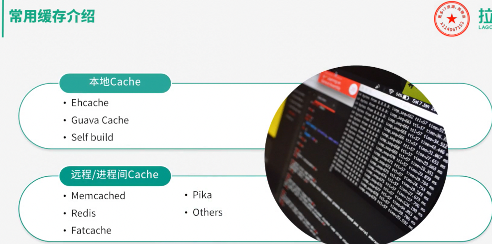
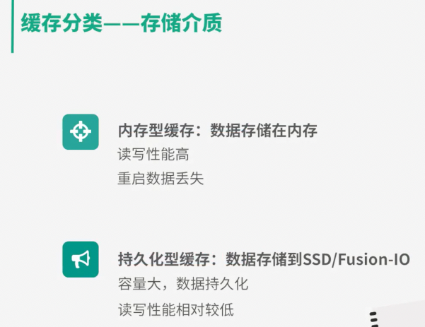

- cache aside 旁路缓存
- read/write through 读写穿透缓存
- write behind/write-back caching  异步缓存写入
- write-around

好的，我们来详细比较几种核心的缓存模式（Cache Patterns）。理解它们的工作原理、优缺点和适用场景对于构建高性能、高可扩展的系统至关重要。

最常见的缓存模式主要有以下几种：

1.  **旁路缓存 (Cache-Aside)**
2.  **读穿透 (Read-Through)**
3.  **写穿透 (Write-Through)**
4.  **写回 (Write-Back / Write-Behind)**
5.  **绕写 (Write-Around)**

下面我们将逐一进行详细解释和比较。

-----

### 1\. 旁路缓存 (Cache-Aside)

这是最常用、最经典的缓存模式。应用程序的业务代码直接负责维护缓存和数据库。

**工作流程:**

  * **读取 (Read):**

    1.  应用先从缓存中读取数据。
    2.  如果缓存命中 (Cache Hit)，则直接返回数据。
    3.  如果缓存未命中 (Cache Miss)，则应用从数据库中读取数据。
    4.  读取成功后，应用将数据放入缓存。
    5.  返回数据给调用方。

  * **写入 (Write):**

    1.  应用直接更新数据库。
    2.  **然后**，让缓存中的对应数据失效 (Invalidate)。注意：是“失效”而不是“更新”，这可以避免脏数据问题。

**优点:**

  * **实现简单灵活**：控制逻辑完全在应用程序中，开发人员可以精细控制缓存的内容和时机。
  * **解耦性强**：缓存服务和数据库是两个独立的组件，缓存挂掉不影响应用直接读写数据库（只是性能下降）。
  * **适用性广**：适用于绝大多数**读多写少**的场景。

**缺点:**

  * **代码逻辑稍显复杂**：应用代码需要同时处理缓存和数据库的逻辑，增加了代码的维护成本。
  * **首次读取延迟高**：对于冷数据（第一次被访问），必然会发生一次缓存未命中，导致访问延迟较高。
  * **可能存在数据不一致**：在“读+写”的并发场景下，或者在“更新数据库”和“删除缓存”两个操作之间，可能会出现短暂的数据不一致。例如，一个请求更新了数据库，但还未删除缓存时，另一个请求读到了缓存中的旧数据。

**适用场景:**

  * 绝大多数互联网应用的通用读密集型场景。
  * 可以容忍轻微数据不一致性的场景。

-----

### 2\. 读穿透 (Read-Through)

这种模式将缓存未命中时的加载逻辑封装在缓存服务内部，应用程序代码更简洁。

**工作流程:**

  * **读取 (Read):**

    1.  应用直接向缓存请求数据。
    2.  如果缓存命中，直接返回数据。
    3.  如果缓存未命中，**由缓存服务自己**负责从数据库加载数据。
    4.  缓存服务加载到数据后，会先存入缓存，然后再返回给应用。

  * **写入 (Write):**

      * Read-Through 通常和 Write-Through 或 Write-Back 配合使用，自身不规定写入策略。

**优点:**

  * **应用代码简化**：应用程序无需关心数据如何从数据库加载到缓存，只需与缓存交互即可。
  * **自带懒加载 (Lazy Loading)**：只有在数据被请求时才会被加载到缓存中。

**缺点:**

  * **实现相对复杂**：需要缓存服务（如 Redis + Lua 脚本，或一些实现了该模式的缓存框架）支持与数据库的交互逻辑。
  * **首次读取延迟高**：和 Cache-Aside 一样，冷数据的首次访问会触发数据库加载，延迟较高。

**适用场景:**

  * 希望简化应用层代码，将数据加载逻辑统一管理的场景。
  * 符合懒加载逻辑的读密集型应用。

-----

### 3\. 写穿透 (Write-Through)

这种模式确保写入操作的原子性，数据总是先写入缓存，再由缓存写入数据库，两者都成功后才返回。

**工作流程:**

  * **读取 (Read):**

      * 通常与 Read-Through 配合使用。应用从缓存读，缓存未命中则由缓存从数据库加载。

  * **写入 (Write):**

    1.  应用将数据写入缓存。
    2.  **缓存服务**立即将该数据同步写入数据库。
    3.  等待缓存和数据库都写入成功后，才向应用返回成功响应。

**优点:**

  * **数据一致性强**：由于写操作是同步的，缓存和数据库的数据始终保持一致。
  * **操作简单**：应用只需与缓存交互，无需关心数据库的写入。
  * **可靠性高**：数据不会因为缓存服务宕机而丢失（因为已经持久化到数据库）。

**缺点:**

  * **写入延迟高**：每次写入都需要同时操作缓存和数据库，性能瓶颈在于后端数据库，整体写入性能较低。

**适用场景:**

  * 对数据一致性要求非常高的场景，如银行交易、库存管理等。
  * 写入操作不频繁，但读取非常频繁的场景。

-----

### 4\. 写回 (Write-Back / Write-Behind)

这是为了极致提升写入性能而设计的模式。数据只写入缓存就立刻返回，由缓存服务异步地、批量地将数据刷回数据库。

**工作流程:**

  * **读取 (Read):**

      * 通常与 Read-Through 配合。

  * **写入 (Write):**

    1.  应用将数据写入缓存，并立即获得成功响应。
    2.  **缓存服务**将这条写入操作放入一个队列中。
    3.  在未来的某个时间点（例如，积攒了一定数量或经过一定时间后），缓存服务将队列中的数据批量异步地写入数据库。

**优点:**

  * **写入性能极高**：写操作只涉及内存，速度飞快，应用无需等待数据库IO。
  * **降低数据库负载**：可以将多次小的写入合并为一次大的批量写入，极大减轻了数据库的压力。

**缺点:**

  * **数据丢失风险高**：如果缓存服务在数据刷回数据库之前宕机，内存中的这部分“脏数据”将会永久丢失。
  * **数据一致性弱**：在数据被刷回数据库之前，数据库和缓存中的数据是长期不一致的。
  * **实现复杂**：需要处理异步写入、失败重试、数据合并等复杂逻辑。

**适用场景:**

  * 写操作极其频繁，且对高性能、高吞吐量要求极高的场景。
  * 可以容忍少量数据在极端情况下丢失的场景，例如社交媒体的点赞数、文章的阅读数、日志记录等。

-----

### 5\. 绕写 (Write-Around)

这种模式在写入时，直接绕过缓存，只写数据库。

**工作流程:**

  * **读取 (Read):**

      * 与 Cache-Aside 相同。先读缓存，未命中则读数据库，然后回填缓存。

  * **写入 (Write):**

    1.  应用直接将数据写入数据库，不操作缓存。

**优点:**

  * **避免缓存污染**：对于那些只写一次但很少被读取的数据（如日志、批量导入的数据），可以避免它们占用宝贵的缓存空间。
  * **实现简单**：写入逻辑非常直接。

**缺点:**

  * **读写不一致**：刚写入的数据，如果立即被读取，会发生缓存未命中，必须从数据库加载，导致读延迟较高。

**适用场景:**

  * 写入后短期内不会被立即读取数据的场景。
  * 批量数据导入或数据分析类的应用。

-----

### 总结对比

| 模式 (Pattern) | 数据一致性 | 读取性能 | 写入性能 | 实现复杂度 | 数据丢失风险 | 适用场景 |
| :--- | :---: | :---: | :---: | :---: | :---: | :--- |
| **旁路缓存 (Cache-Aside)** | 最终一致 (较低) | 好 | 好 | 中等 | 低 | 通用，读多写少的Web应用 |
| **读穿透 (Read-Through)** | - (依赖写入策略) | 好 | - (依赖写入策略) | 较高 (缓存层) | - | 希望简化应用层代码的读密集场景 |
| **写穿透 (Write-Through)** | 强一致 | 好 | 差 | 较高 (缓存层) | 极低 | 对一致性要求极高的关键业务 (金融、库存) |
| **写回 (Write-Back)** | 最终一致 (较弱) | 好 | 极好 | 高 | 高 | 写密集型，允许少量数据丢失的场景 (点赞、计数) |
| **绕写 (Write-Around)** | 最终一致 (较弱) | 一般 | 好 | 低 | 低 | 批量写入、数据很少被再次读取的场景 (日志) |

### 如何选择？

  * **通用场景/不确定如何选**：从 **Cache-Aside (旁路缓存)** 开始，它最灵活，适用性最广。
  * **对数据一致性要求苛刻**：选择 **Write-Through (写穿透)**。
  * **写入量巨大，需要极致的写入性能**：选择 **Write-Back (写回)**，但要能接受数据丢失的风险。
  * **希望简化应用层逻辑**：可以考虑使用支持 **Read-Through/Write-Through** 的缓存框架或服务。
  * **写入的数据很少被读取**：使用 **Write-Around (绕写)** 来避免缓存污染。- 

写: 更新db,删除cache, db驱动cache update
业务端处理所有访问细节, 大幅降低数据不一致概率,缓存数据更新比较复杂的业务; 使用一个trigger组件,实时读取db changes来更新缓存
业务端需要同时维护cache和update,过于繁琐,于是就有了read-write through

存储服务负责cache层所有处理,系统隔离性好

1
00:00:00,000 --> 00:00:03,000
你好,我是你的缓存老师,陈波

2
00:00:03,000 --> 00:00:04,500
欢迎进入第二课室

3
00:00:04,500 --> 00:00:06,500
缓存的读写模式及分类

4
00:00:06,500 --> 00:00:11,500
这一课室,我们主要学习缓存的读写模式及缓存的分类

5
00:00:11,500 --> 00:00:14,500
业务应用系统读写缓存有三种方式

6
00:00:14,500 --> 00:00:16,500
分别cache aSIDE,旁路缓存

7
00:00:16,500 --> 00:00:18,500
Read/Write Through,读写穿透

8
00:00:18,500 --> 00:00:20,500
和Write Behind the Caching,异步缓存写入

9
00:00:20,500 --> 00:00:22,500
cache aSIDE模式中

10
00:00:22,500 --> 00:00:25,500
业务应用方对于写请求是在更新DB后

11
00:00:25,500 --> 00:00:28,500
直接将Key从cache中删除

12
00:00:28,500 --> 00:00:31,500
然后由DB驱动缓存数据的更新

13
00:00:31,500 --> 00:00:34,500
对读是先读Cache,如果cache没有,则读DB

14
00:00:34,500 --> 00:00:38,500
同时将DB中读取的数据回写回Cache再返回

15
00:00:38,500 --> 00:00:39,500
这种模式的特点是

16
00:00:39,500 --> 00:00:42,500
业务端处理所有数据访问细节

17
00:00:42,500 --> 00:00:44,500
并利用Lazy计算的思想

18
00:00:44,500 --> 00:00:47,500
更新DB时直接删除Cache

19
00:00:47,500 --> 00:00:49,500
最后通过DB数据驱动更新

20
00:00:49,500 --> 00:00:52,500
以确保数据以DB结果为准

21
00:00:52,500 --> 00:00:56,500
可以大幅降低Cache和DB中数据不一致的概率

22
00:00:56,500 --> 00:00:58,500
如果没有专门的存储服务

23
00:00:58,500 --> 00:01:01,500
同时对数据的一致性要求比较高的业务

24
00:01:01,500 --> 00:01:04,500
或者缓存数据更新比较复杂的业务

25
00:01:04,500 --> 00:01:06,500
都比较适合使用cache aSIDE模式

26
00:01:06,500 --> 00:01:08,500
如微博发展初期

27
00:01:08,500 --> 00:01:09,500
不少业务采用这种模式

28
00:01:09,500 --> 00:01:13,500
这些缓存数据通过多个原始数据进行计算后设置

29
00:01:13,500 --> 00:01:16,500
在部分数据变更后直接删除缓存

30
00:01:16,500 --> 00:01:18,500
同时使用一个trigger组件

31
00:01:18,500 --> 00:01:20,500
实时读取DB的变更日志

32
00:01:20,500 --> 00:01:22,500
然后重新计算并更新缓存

33
00:01:22,500 --> 00:01:24,500
如果读缓存的时候

34
00:01:24,500 --> 00:01:26,500
trigger还没有写入缓存数据

35
00:01:26,500 --> 00:01:29,500
则由调用方自行到DB加载计算

36
00:01:29,500 --> 00:01:31,500
对于cache aSIDE模式

37
00:01:31,500 --> 00:01:33,500
业务应用需要同时维护

38
00:01:33,500 --> 00:01:36,500
Cache和DB两个数据存储方过于繁琐

39
00:01:36,500 --> 00:01:39,500
于是就有了read-write-through模式

40
00:01:39,500 --> 00:01:40,500
在这种模式下

41
00:01:40,500 --> 00:01:43,500
业务应用只关注一个存储服务即可

42
00:01:43,500 --> 00:01:45,500
业务方的读写Cache和DB的操作

43
00:01:45,500 --> 00:01:47,500
都由存储服务代理

44
00:01:47,500 --> 00:01:50,500
存储服务收到业务应用的写请求时

45
00:01:50,500 --> 00:01:51,500
会首先查Cache

46
00:01:51,500 --> 00:01:53,500
如果数据在Cache中不存在

47
00:01:53,500 --> 00:01:54,500
则只更新DB

48
00:01:54,500 --> 00:01:56,500
如果数据在Cache中存在

49
00:01:56,500 --> 00:01:58,500
则先更新Cache

50
00:01:58,500 --> 00:02:00,500
然后再更新DB

51
00:02:00,500 --> 00:02:02,500
而存储服务收到读请求时

52
00:02:02,500 --> 00:02:03,500
如果命中Cache

53
00:02:03,500 --> 00:02:04,500
则直接返回

54
00:02:04,500 --> 00:02:06,500
否则先从DB中加载

55
00:02:06,500 --> 00:02:08,500
回中Cache后返回响应

56
00:02:08,500 --> 00:02:09,500
这种模式的特点是

57
00:02:09,500 --> 00:02:12,500
存储服务封装了所有数据处理细节

58
00:02:12,500 --> 00:02:15,500
业务应用端代码只关注业务处理逻辑

59
00:02:15,500 --> 00:02:16,500
系统的隔离性更加

60
00:02:16,500 --> 00:02:18,500
另外进行些操作时

61
00:02:18,500 --> 00:02:19,500
如果Cache中没有数据

62
00:02:19,500 --> 00:02:20,500
则不更新

63
00:02:20,500 --> 00:02:21,500
有数据才更新

64
00:02:21,500 --> 00:02:22,500
内存效率更高

65
00:02:22,500 --> 00:02:24,500
微博Feed的Outbox Vector

66
00:02:24,500 --> 00:02:26,500
及用户最新微博列表

67
00:02:26,500 --> 00:02:27,500
就采用这种模式

68
00:02:27,500 --> 00:02:29,500
一些粉丝数较少

69
00:02:29,500 --> 00:02:31,500
且不活跃的用户发表微博后

70
00:02:31,500 --> 00:02:34,500
Vector服务首先会查询Vector Cache

71
00:02:34,500 --> 00:02:37,500
如果Cache中没有该用户的Outbox记录

72
00:02:37,500 --> 00:02:39,500
则不写用户的Cache数据

73
00:02:39,500 --> 00:02:41,500
直接更新DB就直接返回

74
00:02:41,500 --> 00:02:42,500
如果Cache中存在

75
00:02:42,500 --> 00:02:45,500
则会通过Cache指令进行更新

76
00:02:45,500 --> 00:02:47,500
write behind caching模式

77
00:02:47,500 --> 00:02:48,500
与read-write through模式类似

78
00:02:48,500 --> 00:02:50,500
也由数据存储服务来管理

79
00:02:50,500 --> 00:02:52,500
开启个DB的读写

80
00:02:52,500 --> 00:02:53,500
不同点是

81
00:02:53,500 --> 00:02:54,500
数据更新时

82
00:02:54,500 --> 00:02:57,500
read write thorugh是同步更新cache+DB

83
00:02:57,500 --> 00:03:00,500
而read behind caching则是只更新缓冲

84
00:03:00,500 --> 00:03:01,500
不直接更新DB

85
00:03:01,500 --> 00:03:05,500
而是改用异步批量的方式来更新DB

86
00:03:05,500 --> 00:03:06,500
该模式的特点是

87
00:03:06,500 --> 00:03:08,500
数据存储的写性能非常高

88
00:03:08,500 --> 00:03:09,500
非常适合一些

89
00:03:09,500 --> 00:03:11,500
变更特别频繁的业务

90
00:03:11,500 --> 00:03:13,500
特别是可以合并写请求的业务

91
00:03:13,500 --> 00:03:15,500
比如针对一些技术业务

92
00:03:15,500 --> 00:03:17,500
一条Feed被点赞一万次

93
00:03:17,500 --> 00:03:19,500
如果更新一万次DB代价很大

94
00:03:19,500 --> 00:03:22,500
而合并成一条请求直接加一万

95
00:03:22,500 --> 00:03:24,500
则是一个非常轻量的操作

96
00:03:24,500 --> 00:03:26,500
但这种模型有一个显著特点

97
00:03:26,500 --> 00:03:28,500
即数据的一致性变差

98
00:03:28,500 --> 00:03:29,500
甚至在一些极端场景下

99
00:03:29,500 --> 00:03:31,500
可能会丢数据

100
00:03:31,500 --> 00:03:32,500
比如系统crash

101
00:03:32,500 --> 00:03:33,500
机械当机

102
00:03:33,500 --> 00:03:35,500
如果数据还没有保存到DB

103
00:03:35,500 --> 00:03:36,500
则会存在丢失的风险

104
00:03:36,500 --> 00:03:38,500
所以这种读写模式

105
00:03:38,500 --> 00:03:40,500
非常适合变更频率特别高

106
00:03:40,500 --> 00:03:42,500
但对一致性要求不太高的业务

107
00:03:42,500 --> 00:03:43,500
这样写操作

108
00:03:43,500 --> 00:03:45,500
可以异步批量写入DB

109
00:03:45,500 --> 00:03:46,500
减少DB压力

110
00:03:46,500 --> 00:03:47,500
讲到这里

111
00:03:47,500 --> 00:03:49,500
缓存的三种读写模式讲完了

112
00:03:49,500 --> 00:03:50,500
你可以看到

113
00:03:50,500 --> 00:03:51,500
三种模式各有优劣

114
00:03:51,500 --> 00:03:53,500
不存在最佳方案

115
00:03:53,500 --> 00:03:54,500
实际上我们也不可能

116
00:03:54,500 --> 00:03:56,500
设计出一个最佳完美模式出来

117
00:03:56,500 --> 00:03:59,500
如同前面讲到的空间换时间

118
00:03:59,500 --> 00:04:01,500
访问延迟换成本一样

119
00:04:01,500 --> 00:04:02,500
高性能和强一致性

120
00:04:02,500 --> 00:04:04,500
从来都是冲突的

121
00:04:04,500 --> 00:04:05,500
系统设计从来就是trade off

122
00:04:05,500 --> 00:04:07,500
随处需要tradeoff

123
00:04:07,500 --> 00:04:09,500
这个思想会贯穿整个课程

124
00:04:09,500 --> 00:04:11,500
这也许是我们学习这个课程的

125
00:04:11,500 --> 00:04:12,500
另外一个收获

126
00:04:12,500 --> 00:04:13,500
即如何根据业务场景

127
00:04:13,500 --> 00:04:14,500
更好地做tradeoff

128
00:04:14,500 --> 00:04:16,500
从而设计出更好的服务系统

129
00:04:16,500 --> 00:04:18,500
前面介绍了缓存的基本思想

130
00:04:18,500 --> 00:04:21,500
优势 代价 以及读写模式

131
00:04:21,500 --> 00:04:22,500
接下来我们一起看一下

132
00:04:22,500 --> 00:04:24,500
互联网企业常用的缓存

133
00:04:24,500 --> 00:04:25,500
有哪些分类

134
00:04:25,500 --> 00:04:27,500
按宿主层次分类的话

135
00:04:27,500 --> 00:04:29,500
缓存一般可以分为

136
00:04:29,500 --> 00:04:31,500
本地cache 进程间cache

137
00:04:31,500 --> 00:04:32,500
和远程cache

138
00:04:32,500 --> 00:04:33,500
本地cache是指

139
00:04:33,500 --> 00:04:35,500
业务进程类的缓存

140
00:04:35,500 --> 00:04:37,500
这类缓存由于在

141
00:04:37,500 --> 00:04:38,500
业务系统进程类

142
00:04:38,500 --> 00:04:40,500
所以读写性能超高

143
00:04:40,500 --> 00:04:42,500
而且没有任何网络开销

144
00:04:42,500 --> 00:04:43,500
但不足是会随着

145
00:04:43,500 --> 00:04:45,500
业务系统存起来丢失

146
00:04:45,500 --> 00:04:46,500
进程间cache

147
00:04:46,500 --> 00:04:48,500
是本机独立运行的缓存

148
00:04:48,500 --> 00:04:50,500
这类缓存读写性能较高

149
00:04:50,500 --> 00:04:51,500
不会随着业务系统

150
00:04:51,500 --> 00:04:53,500
存起丢失数据

151
00:04:53,500 --> 00:04:55,500
而且可以大幅减少网络开销

152
00:04:55,500 --> 00:04:57,500
但不足是业务系统和缓存

153
00:04:57,500 --> 00:04:58,500
都在相同宿主机

154
00:04:58,500 --> 00:04:59,500
因为复杂

155
00:04:59,500 --> 00:05:00,500
且存在资源竞争

156
00:05:00,500 --> 00:05:02,500
远程cache是指

157
00:05:02,500 --> 00:05:04,500
跨机器部署的缓存

158
00:05:04,500 --> 00:05:06,500
这类缓存因为独立设备部署

159
00:05:06,500 --> 00:05:07,500
容量大且易扩展

160
00:05:07,500 --> 00:05:09,500
在互联网企业应用最广泛

161
00:05:09,500 --> 00:05:12,500
不过远程缓存需要跨机访问

162
00:05:12,500 --> 00:05:13,500
在高读写压力下

163
00:05:13,500 --> 00:05:15,500
带宽容易成为瓶颈

164
00:05:15,500 --> 00:05:17,500
本地cache的缓存组件有

165
00:05:17,500 --> 00:05:19,500
EHcache,GrowerCache

166
00:05:19,500 --> 00:05:20,500
开发者自己也可以用

167
00:05:20,500 --> 00:05:21,500
MapSet等

168
00:05:21,500 --> 00:05:22,500
轻松构建一个

169
00:05:22,500 --> 00:05:24,500
自己专用的本地cache

170
00:05:24,500 --> 00:05:26,500
进程间cache和远程cache的

171
00:05:26,500 --> 00:05:27,500
缓存组件相同

172
00:05:27,500 --> 00:05:29,500
只是部署位置差异罢了

173
00:05:29,500 --> 00:05:30,500
这类缓存组件有

174
00:05:30,500 --> 00:05:33,500
Memcache,Radius,Pica等

175
00:05:33,500 --> 00:05:35,500
还有一种常见的分类方式

176
00:05:35,500 --> 00:05:37,500
是按存储机制来分类

177
00:05:37,500 --> 00:05:38,500
这样可以分为

178
00:05:38,500 --> 00:05:40,500
内存型缓存和持久化型缓存

179
00:05:40,500 --> 00:05:42,500
内存型缓存将数据存在内存

180
00:05:42,500 --> 00:05:43,500
读写性能很高

181
00:05:43,500 --> 00:05:46,500
但缓存系统存起和Crush后

182
00:05:46,500 --> 00:05:48,500
内存数据会丢失

183
00:05:48,500 --> 00:05:49,500
持久化型缓存将数据

184
00:05:49,500 --> 00:05:51,500
存储到SSD硬盘中

185
00:05:51,500 --> 00:05:52,500
相同成本下

186
00:05:52,500 --> 00:05:54,500
这种缓存的容量会比

187
00:05:54,500 --> 00:05:56,500
内存型缓存大一个数量级以上

188
00:05:56,500 --> 00:05:58,500
而且数据会持久化落地

189
00:05:58,500 --> 00:05:59,500
存起不丢失

190
00:05:59,500 --> 00:06:01,500
但读写性能相对低

191
00:06:01,500 --> 00:06:03,500
一到两个数量级

192
00:06:03,500 --> 00:06:05,500
Memcache是典型的内存型缓存

193
00:06:05,500 --> 00:06:07,500
而Pica以及其他基于

194
00:06:07,500 --> 00:06:09,500
RoxDB开发的缓存组件

195
00:06:09,500 --> 00:06:11,500
则属于持久化型缓存

196
00:06:11,500 --> 00:06:13,500
至此缓存原理相关的知识点就讲完了

197
00:06:13,500 --> 00:06:15,500
接下来会讲到

198
00:06:15,500 --> 00:06:17,500
如何引入缓存并进行设计架构

199
00:06:17,500 --> 00:06:19,500
以及缓存在设计架构中的一些

200
00:06:19,500 --> 00:06:21,500
关键考量点

201
00:06:21,500 --> 00:06:23,500
OK 这节课就讲到这里

202
00:06:23,500 --> 00:06:25,500
下一课时我会分享缓存的

203
00:06:25,500 --> 00:06:27,500
引入及架构设计

