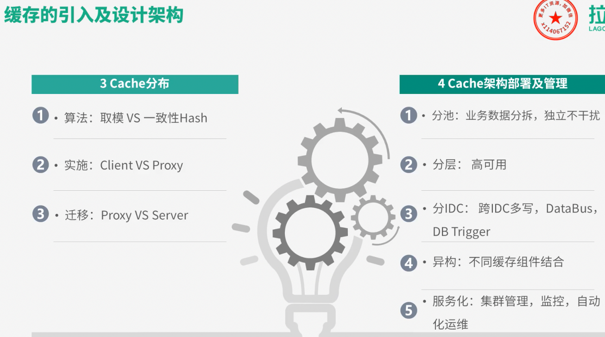
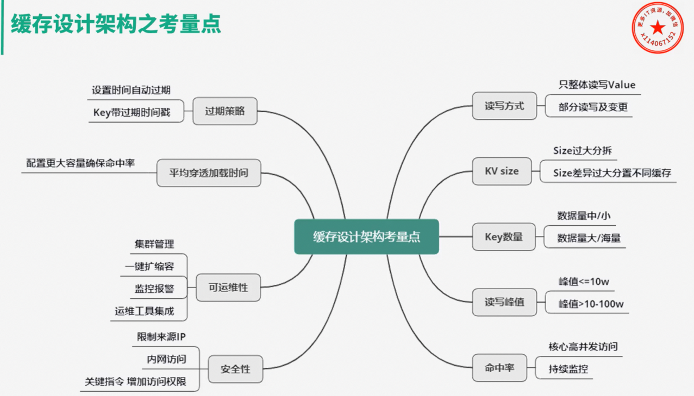
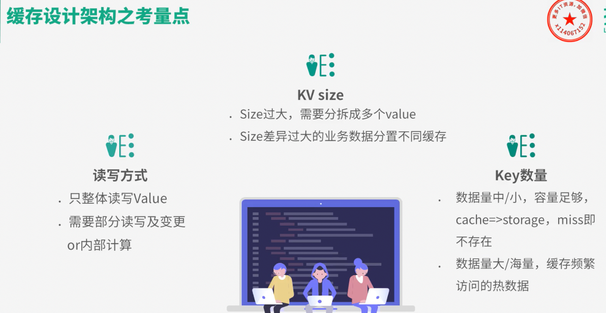
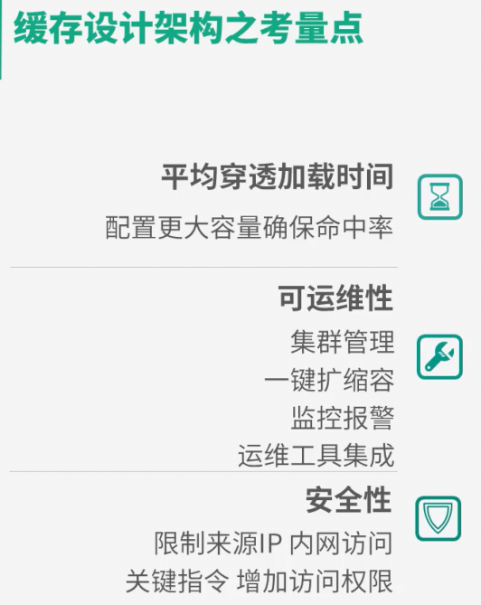

00:00:00,000 --> 00:00:04,000
你好,我是你的缓存老师,陈波

2
00:00:04,000 --> 00:00:07,500
欢迎进入第三课室,缓存的引入及架构设计

3
00:00:07,500 --> 00:00:11,700
在设计架构缓存时,你首先要选定缓存组件

4
00:00:11,700 --> 00:00:16,500
比如要用 local-cache 还是用 Redis、Memcache、Pica 等开源缓存组件

5
00:00:16,500 --> 00:00:19,000
如果业务缓存需求比较特殊

6
00:00:19,000 --> 00:00:22,000
你还要考虑是直接定制开发一个新的缓存组件

7
00:00:22,000 --> 00:00:25,500
还是对开源组件进行二次开发来满足业务需要

8
00:00:25,500 --> 00:00:27,000
确定好缓存组件后

9
00:00:27,000 --> 00:00:30,500
你还要根据业务防误的特点进行数据结构的设计

10
00:00:30,500 --> 00:00:33,000
对于直接简单KV读写的业务

11
00:00:33,000 --> 00:00:37,500
你可以将这些业务数据封装为String、JSON、Protobuf等格式

12
00:00:37,500 --> 00:00:41,000
序列化成字节序列,然后直接写入缓存中

13
00:00:41,000 --> 00:00:45,500
读取时,先从缓存组件获取数据的字节序列

14
00:00:45,500 --> 00:00:47,500
再进行反序列化操作即可

15
00:00:47,500 --> 00:00:51,500
对于只需存取部分字段和需要在缓存端进行计算的业务

16
00:00:51,500 --> 00:00:56,500
你可以把数据设计为Hashi、Set、List、Geo等结构

17
00:00:56,500 --> 00:00:59,500
存储到支持复杂基克数据类型的缓存中

18
00:00:59,500 --> 00:01:01,500
如Rallies、Picard等

19
00:01:01,500 --> 00:01:04,500
确定的缓存组件设计好了缓存数据结构

20
00:01:04,500 --> 00:01:07,000
接下来就要设计缓存的分布

21
00:01:07,000 --> 00:01:09,500
可以从三个维度来进行缓存分布设计

22
00:01:09,500 --> 00:01:12,000
首先要选择分布式算法

23
00:01:12,000 --> 00:01:14,500
是采用mod还是一次性Hashi进行分布

24
00:01:14,500 --> 00:01:16,500
mod分布方案简单

25
00:01:16,500 --> 00:01:18,500
每个K只会在确定的缓存节点

26
00:01:18,500 --> 00:01:21,000
一次性Hash分布的方案相对复杂

27
00:01:21,000 --> 00:01:23,500
一个K对应的缓存节点不确定

28
00:01:23,500 --> 00:01:26,500
但一致性Hash分布可以在部分缓存节点异常时

29
00:01:26,500 --> 00:01:28,500
将失效节点的数据访问

30
00:01:28,500 --> 00:01:31,000
均衡分散到其他正常存活的节点

31
00:01:31,000 --> 00:01:34,000
从而可以更好地保证缓存系统的稳定性

32
00:01:34,000 --> 00:01:37,000
其次,分布读写访问如何进行实施

33
00:01:37,000 --> 00:01:41,000
是由缓存Client直接进行Hash分布定位读写

34
00:01:41,000 --> 00:01:44,000
还是由Proxy代理来进行读写路由

35
00:01:44,000 --> 00:01:46,000
Client直接读写,读写性能最佳

36
00:01:46,000 --> 00:01:48,000
但需要Client感知分布策略

37
00:01:48,000 --> 00:01:51,000
但在缓存部署发生在线变化时

38
00:01:51,000 --> 00:01:53,000
也要及时通知所有缓存Client

39
00:01:53,000 --> 00:01:54,000
避免读写异常

40
00:01:54,000 --> 00:01:56,000
另外Client实现也会比较复杂

41
00:01:56,000 --> 00:01:58,000
而通过Proxy路由

42
00:01:58,000 --> 00:02:00,000
Client只需直接访问Proxy

43
00:02:00,000 --> 00:02:02,500
分布逻辑和部署变更都由Proxy来处理

44
00:02:02,500 --> 00:02:04,500
对业务应用开发最友好

45
00:02:04,500 --> 00:02:06,000
但业务访问多一跳

46
00:02:06,000 --> 00:02:08,000
访问性能会有一定的损失

47
00:02:08,000 --> 00:02:10,000
最后,缓存系统在运行过程中

48
00:02:10,000 --> 00:02:12,500
如果缓存的数据量增长过快

49
00:02:12,500 --> 00:02:14,500
会导致大量缓存数据被剔除

50
00:02:14,500 --> 00:02:16,000
缓存命中率下降

51
00:02:16,000 --> 00:02:19,000
缓存数据访问性能会随之降低

52
00:02:19,000 --> 00:02:22,000
这样就需要将数据从缓存节点

53
00:02:22,000 --> 00:02:23,000
进行动态拆分

54
00:02:23,000 --> 00:02:26,000
把部分数据水平迁移到其他缓存节点

55
00:02:26,000 --> 00:02:28,000
这个迁移过程需要考虑

56
00:02:28,000 --> 00:02:29,000
是由Proxy进行迁移

57
00:02:29,000 --> 00:02:32,000
还是由缓存Server自身进行迁移

58
00:02:32,000 --> 00:02:34,000
甚至根本就不支持迁移

59
00:02:34,000 --> 00:02:36,000
对Memcached一般不支持迁移

60
00:02:36,000 --> 00:02:39,000
对Redis设计版是依靠缓存Server进行迁移

61
00:02:39,000 --> 00:02:41,000
而Codis在通过Admin Proxy

62
00:02:41,000 --> 00:02:44,000
配合后端缓存组件进行迁移

63
00:02:44,000 --> 00:02:46,000
设计完缓存分布策略后

64
00:02:46,000 --> 00:02:49,000
接下来要考虑缓存架构部署及应用管理了

65
00:02:49,000 --> 00:02:52,000
架构部署主要考虑对缓存分池

66
00:02:52,000 --> 00:02:53,000
分层

67
00:02:53,000 --> 00:02:54,000
分IDC

68
00:02:54,000 --> 0:02:56,000
以及是否需要进行异构处理

69
00:02:56,000 --> 00:02:58,000
核心的高并发访问的不同数据

70
00:02:58,000 --> 00:03:01,000
需要分别分拆到独立的缓存池中

71
00:03:01,000 --> 00:03:02,000
进行分别访问

72
00:03:02,000 --> 00:03:03,000
避免相互影响

73
00:03:03,000 --> 00:03:04,000
访问量较小

74
00:03:04,000 --> 00:03:06,000
非核心的业务数据则可以混存

75
00:03:06,000 --> 00:03:07,000
对于海量数据

76
00:03:07,000 --> 00:03:10,000
访问量超过10到100万级的业务数据

77
00:03:10,000 --> 00:03:12,000
则要考虑分层访问

78
00:03:12,000 --> 00:03:15,000
并且要适当的时候采用分池分摊访问量

79
00:03:15,000 --> 00:03:17,000
避免缓存过载

80
00:03:17,000 --> 00:03:20,000
如果业务系统需要多IDC部署

81
00:03:20,000 --> 00:03:21,000
甚至异地多活

82
00:03:21,000 --> 00:03:24,000
则需要对缓存体系进行多IDC部署

83
00:03:24,000 --> 00:03:27,000
要考虑如何跨IDC对缓存数据进行更新

84
00:03:27,000 --> 00:03:29,000
可以直接采用跨IDC读写

85
00:03:29,000 --> 00:03:32,000
也可以采用Data bus配合对列机

86
00:03:32,000 --> 00:03:34,000
进行不同IDC的消息同步

87
00:03:34,000 --> 00:03:37,000
然后由消息处理机进行缓存更新

88
00:03:37,000 --> 00:03:41,000
还可以由各个IDC的DB Trigger进行缓存更新

89
00:03:41,000 --> 00:03:42,000
在某些极端场景下

90
00:03:42,000 --> 00:03:45,000
还需要把多种缓存组件进行组合使用

91
00:03:45,000 --> 00:03:48,000
通过缓存异构达到最佳读写性能

92
00:03:48,000 --> 00:03:50,000
最后站在系统层面

93
00:03:50,000 --> 00:03:51,000
要想更好的管理缓存

94
00:03:51,000 --> 00:03:53,000
你还要考虑缓存的服务化

95
00:03:53,000 --> 00:03:56,000
考虑缓存体系如何更好的进行集群管理

96
00:03:56,000 --> 00:03:58,000
运维监控等

97
00:03:58,000 --> 00:04:00,000
在缓存设计架构过程中

98
00:04:00,000 --> 00:04:01,000
有一些非常重要的考量点

99
00:04:01,000 --> 00:04:03,000
只有分析清楚了这些考量点

100
00:04:03,000 --> 00:04:06,000
才能设计架构出更佳的缓存体系

101
00:04:06,000 --> 00:04:08,000
首先是key-value的读写方式

102
00:04:08,000 --> 00:04:09,000
是全体整体读写

103
00:04:09,000 --> 00:04:12,000
还是部分读写变更

104
00:04:12,000 --> 00:04:14,000
是否需要内部计算

105
00:04:14,000 --> 00:04:15,000
比如用户关注数

106
00:04:15,000 --> 00:04:18,000
很多用户的关注有几百甚至几千到几万

107
00:04:18,000 --> 00:04:22,000
因此在判断用户是否关注了另外一个用户时

108
00:04:22,000 --> 00:04:25,000
不要拿取该用户的全部关注列表

109
00:04:25,000 --> 00:04:28,000
而直接在关注列表缓存上进行检查判断

110
00:04:28,000 --> 00:04:32,000
然后返回true false和01的方式更为高效

111
00:04:32,000 --> 00:04:34,000
这样对于关注列表业务

112
00:04:34,000 --> 00:04:36,000
Redis是一个比memcached更优的选择

113
00:04:36,000 --> 00:04:39,000
然后是不同业务数据缓存KV的size

114
00:04:39,000 --> 00:04:41,000
如果单个业务的KVsize过大

115
00:04:41,000 --> 00:04:43,000
需要分拆成多个KV来缓存

116
00:04:43,000 --> 00:04:47,000
同时不同缓存数据的KVsize如果差异过大

117
00:04:47,000 --> 00:04:48,000
也不能缓存在一起

118
00:04:48,000 --> 00:04:50,000
避免缓存效率的低下和相互影响

119
00:04:50,000 --> 00:04:53,000
K的数量也是一个重要的考量因素

120
00:04:53,000 --> 00:04:54,000
如果K数量不大

121
00:04:54,000 --> 00:04:56,000
可以在缓存中存下全量数据

122
00:04:56,000 --> 00:04:58,000
把缓存当db存储来用

123
00:04:58,000 --> 00:05:00,000
如果缓存读取miss

124
00:05:00,000 --> 00:05:01,000
则表明数据不存在

125
00:05:01,000 --> 00:05:03,000
根本不需要去db查询

126
00:05:03,000 --> 00:05:04,000
如果数据量巨大

127
00:05:04,000 --> 00:05:07,000
则在缓存中尽可能保留频繁访问的热数据

128
00:05:07,000 --> 00:05:10,000
对于冷数据直接访问db即可

129
00:05:10,000 --> 00:05:12,000
另外对缓存数据的读写峰值

130
00:05:12,000 --> 00:05:14,000
如果小于10万级别

131
00:05:14,000 --> 00:05:16,000
简单地分拆到独立缓存池即可

132
00:05:16,000 --> 00:05:18,000
而一旦数据读写峰值超过10万

133
00:05:18,000 --> 00:05:20,000
甚至到百万级的QPS

134
00:05:20,000 --> 00:05:23,000
则需要对缓存进行分层处理

135
00:05:23,000 --> 00:05:25,000
同时可以使用local-cache

136
00:05:25,000 --> 00:05:26,000
配合远程Cache

137
00:05:26,000 --> 00:05:28,000
甚至远程缓存内部

138
00:05:28,000 --> 00:05:31,000
继续进行分层底下分池进行处理

139
00:05:31,000 --> 00:05:32,000
微博业务中

140
00:05:32,000 --> 00:05:34,000
大多数核心业务的Memcache的访问

141
00:05:34,000 --> 00:05:35,000
都采用这种处理方式

142
00:05:35,000 --> 00:05:36,000
缓存的命中率

143
00:05:36,000 --> 00:05:39,000
对整个服务体系的性能影响甚大

144
00:05:39,000 --> 00:05:41,000
对核心高频发访问的业务

145
00:05:41,000 --> 00:05:43,000
需要预留足够的容量

146
00:05:43,000 --> 00:05:44,000
确保核心业务缓存

147
00:05:44,000 --> 00:05:45,000
维持较高的命中率

148
00:05:45,000 --> 00:05:47,000
比如微博的FeedVectorCache

149
00:05:47,000 --> 00:05:51,000
常年的命中率高达99.5%以上

150
00:05:51,000 --> 00:05:53,000
为了持续保证缓存的命中率

151
00:05:53,000 --> 00:05:55,000
缓存体系需要持续监控

152
00:05:55,000 --> 00:05:58,000
及时进行故障处理和故障转移

153
00:05:58,000 --> 00:05:59,000
同时在部分缓存节点异常

154
00:05:59,000 --> 00:06:01,000
命中率下降值

155
00:06:01,000 --> 00:06:02,000
自动故障转移方案

156
00:06:02,000 --> 00:06:03,000
需要考虑采用

157
00:06:03,000 --> 00:06:05,000
一致性哈希分布的访问漂移策略

158
00:06:05,000 --> 00:06:08,000
还是采用数据多层备份策略

159
00:06:08,000 --> 00:06:09,000
缓存的过期策略

160
00:06:09,000 --> 00:06:11,000
可以设置较短的过期时间

161
00:06:11,000 --> 00:06:12,000
让他们可以自动过期

162
00:06:12000 --> 00:06:14,000
也可以让K带上时间戳

163
00:06:14,000 --> 00:06:16,000
同时设置较长的过期时间

164
00:06:16,000 --> 00:06:17,000
比如很多业务系统内部

165
00:06:17,000 --> 00:06:19,000
有一些K是这样子的

166
00:06:19,000 --> 00:06:21,000
K_20190801

167
00:06:21,000 --> 00:06:22,000
过了这个时间

168
00:06:22,000 --> 00:06:24,000
就可以把这个K删掉了

169
00:06:24,000 --> 00:06:26,000
平均缓存穿透加载时间

170
00:06:26,000 --> 00:06:28,000
在某些业务场景下也是很重要的

171
00:06:28,000 --> 00:06:30,000
对于一些缓存穿透后

172
00:06:30,000 --> 00:06:32,000
平均加载时间耗时特别长

173
00:06:32,000 --> 00:06:34,000
或者需要复杂计算的

174
00:06:34,000 --> 00:06:36,000
而且访问量还比较大的业务数据

175
00:06:36,000 --> 00:06:38,000
要配置更多容量

176
00:06:38,000 --> 00:06:39,000
维持更高的访问率

177
00:06:39,000 --> 00:06:41,000
从而减少穿透DB的概率

178
00:06:41,000 --> 00:06:43,000
来确保整个系统的访问性能

179
00:06:43,000 --> 00:06:45,000
对于缓存的可用为性考虑

180
00:06:45,000 --> 00:06:47,000
则需要考虑缓存体系的集群管理

181
00:06:47,000 --> 00:06:49,000
如何进行一键扩缩容

182
00:06:49,000 --> 00:06:52,000
如何进行缓存组件的升级和变更

183
00:06:52,000 --> 00:06:54,000
如何快速发现并应对问题

184
00:06:54,000 --> 00:06:56,000
如何持续监控报警

185
00:06:56,000 --> 00:06:58,000
最好有一个完善的运维平台

186
00:06:58,000 --> 00:07:00,000
将各种运维工具进行集成

187
00:07:00,000 --> 00:07:02,000
对于缓存的安全性考虑

188
00:07:02,000 --> 00:07:03,000
一方面可以限制来源IP

189
00:07:03,000 --> 00:07:04,000
只允许内网访问

190
00:07:04,000 --> 00:07:06,000
同时对于一些关键性指令

191
00:07:06,000 --> 00:07:07,000
需要增加访问权限

192
00:07:07,000 --> 00:07:09,000
避免被攻击和误操作后

193
00:07:09,000 --> 00:07:11,000
导致重大后果

194
00:07:11,000 --> 00:07:12,000
好了

195
00:07:12,000 --> 00:07:14,000
第一课时的内容到这里就全部结束了

196
00:07:14,000 --> 00:07:16,000
我们一起来做一个简单的回顾

197
00:07:16,000 --> 00:07:18,000
首先这一课时

198
00:07:18,000 --> 00:07:20,000
你先了解了缓存的基本思想

199
00:07:20,000 --> 00:07:22,000
缓存使用的优势及代价

200
00:07:22,000 --> 00:07:24,000
然后又学习了缓存的三种读写模式

201
00:07:24,000 --> 00:07:26,000
和两种常见分类

202
00:07:26,000 --> 00:07:28,000
接下来学到了在系统研发中

203
00:07:28,000 --> 00:07:29,000
如何引入缓存

204
00:07:29,000 --> 00:07:30,000
如何按照四步走

205
00:07:30,000 --> 00:07:33,000
对缓存进行设计架构和管理

206
00:07:33,000 --> 00:07:36,000
最后还熟悉了缓存设计架构中的考量点

207
00:07:36,000 --> 00:07:38,000
这样你在缓存设计架构时

208
00:07:38,000 --> 00:07:40,000
对号入座即可

209
00:07:40,000 --> 00:07:41,000
OK

210
00:07:41,000 --> 00:07:42,000
这期课就讲到这里

211
00:07:42,000 --> 00:07:43,000
下一课时

212
00:07:43,000 --> 00:07:45,000
我会分享缓存访问相关的经典问题
