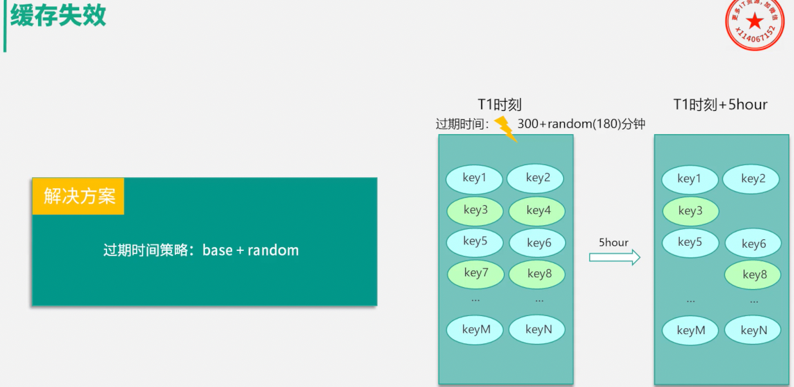

缓存穿透 (Cache Penetration)
缓存击穿 (Cache Breakdown / Hotspot Invalidation)
缓存雪崩 (Cache Avalanche)

Of course. Here are precise, professional English explanations for these three critical caching concepts, suitable for a technical interview or design discussion.

---

### 1. Cache Penetration

**What It Is:**
Cache penetration occurs when an application repeatedly queries for data that **does not exist** in either the cache or the underlying database. Because the data is absent, every single request bypasses the cache and hits the database directly.

**The Core Problem:**
This is typically caused by one of two things:
1.  **Malicious Attacks:** An attacker intentionally sends a high volume of requests for random or invalid keys (e.g., negative-numbered IDs) to overwhelm the database.
2.  **Application Bugs:** A flaw in the code generates requests for non-existent data.

**The Impact:**
The cache becomes useless for these queries, and the database is forced to handle a flood of pointless requests, leading to high CPU usage and potential service degradation.

**Common Solutions:**
*   **Cache Null Values:** The most common solution. When a database query returns no result for a given key, store a special "null" marker for that key in the cache with a short TTL (Time-To-Live). Subsequent requests for the same non-existent key will hit the cache's null value and return immediately, protecting the database.
*   **Bloom Filter:** A more advanced, space-efficient solution. A Bloom filter is a probabilistic data structure that can quickly test whether an element is a member of a set. All existing keys are loaded into a Bloom filter. Before querying the cache or database, the application first checks the Bloom filter. If the filter says the key "definitely does not exist," the request is rejected immediately.

---

### 2. Cache Breakdown (or Hotspot Invalidation)

**What It Is:**
Cache breakdown happens when a single, **extremely popular key (a "hotspot")** expires from the cache. At that exact moment, a massive number of concurrent requests for that specific key (a "thundering herd") all miss the cache and hit the database simultaneously to rebuild the same data.

**The Core Problem:**
A single hotkey acts as a bottleneck. The simultaneous database queries to refresh this one item create a sudden, intense load spike.

**The Impact:**
The database can be overwhelmed by the sudden spike in requests for a single piece of data, potentially causing a crash or severe performance degradation for the entire application.

**Common Solutions:**
*   **Mutex Lock (or Distributed Lock):** A classic solution to prevent the "thundering herd." When a cache miss occurs for a hotkey, only the first request acquires a lock to query the database and rebuild the cache. All other concurrent requests for that same key either wait for the lock to be released (and then find the data in the cache) or return a temporary response. This serializes the database queries for the hotkey.
*   **Logical Expiration:** Instead of setting a physical TTL, store a logical expiration timestamp within the cache value itself. The key never technically expires. When an application reads the key, it checks the timestamp.
    *   If not expired, it returns the data.
    *   If expired, it returns the **stale (old) data** to the user immediately while a background thread is triggered to refresh the data from the database. This prioritizes high availability over strict data consistency for a brief period.

---

### 3. Cache Avalanche

**What It Is:**
A cache avalanche is a large-scale failure scenario where the cache becomes ineffective, causing a massive wave of traffic to "avalanche" onto the database. It occurs in one of two ways:
1.  **Mass Key Expiration:** A large number of keys expire at the exact same time, causing a flood of simultaneous cache misses.
2.  **Cache Service Failure:** The entire cache service (e.g., the Redis cluster) becomes unavailable due to a crash, network outage, or hardware failure.

**The Core Problem:**
*   **Cause 1:** Often due to setting a fixed TTL for many keys loaded at the same time (e.g., on application startup).
*   **Cause 2:** Lack of a high-availability architecture for the caching layer.

**The Impact:**
This is the most catastrophic of the three. The database is suddenly exposed to the full load of the application, which it is not designed to handle. This almost certainly leads to a database crash and a total system outage (a "cascading failure").

**Common Solutions:**
*   **For Mass Expiration - Randomized Expiration (TTL Jitter):** Instead of setting a fixed TTL (e.g., 60 minutes), add a small, random value (a "jitter") to the expiration time (e.g., 60 minutes + a random 1-5 minutes). This staggers the expiration times and prevents a massive, simultaneous invalidation.
*   **For Service Failure - High Availability & System Defenses:**
    *   **High-Availability Cache Cluster:** Deploy the cache as a cluster with failover capabilities (e.g., Redis Sentinel or Redis Cluster) so that if one node fails, another can take over automatically.
    *   **Rate Limiting and Circuit Breakers:** Implement safeguards at the application layer. If the application detects that the cache is down, it can "trip a circuit breaker" to either serve degraded (but acceptable) responses or limit the rate of requests allowed to pass through to the database, protecting it from being overwhelmed.

好的，这是分布式系统和高并发面试中几乎必考的三个问题。它们都表现为“数据库压力剧增”，但根本原因和应对方式完全不同。

为了让你彻底搞懂，我们先用一个生动的比喻，再进行技术拆解。

### 一个比喻：你去图书馆借书

*   **你**：应用程序 (Application)
*   **图书馆前台接待员**：缓存 (Cache / Redis)
*   **图书馆深处的书库**：数据库 (Database / MySQL)

接待员反应快、记得住热门书的位置（**缓存速度快**），但他的桌子很小，只能放少量热门书（**缓存容量有限**）。书库里有所有的书，但进去找书很慢（**数据库性能较低**）。

---

### 一、缓存穿透 (Cache Penetration)

**发生了什么？**
你反复去问接待员借一本**压根不存在的书**（比如《如何学会时间旅行》）。

1.  接待员在桌上找不到（**缓存未命中**）。
2.  他只好每次都跑去巨大的书库里地毯式搜索一遍（**查询数据库**）。
3.  书库里也根本没有这本书（**数据库也未命中**）。
4.  他只好空手回来告诉你“没有”。
5.  下一个同样要借这本不存在的书的人来了，接待员重复一遍上面的白费功夫的过程。

**技术定义**：
查询一个**数据库和缓存中都绝对不存在**的数据。导致每次请求都会“穿透”缓存，直接打到数据库上，但数据库也查不到结果。

**根本原因**：
*   **恶意攻击**：攻击者用大量不存在的ID（如负数ID、超大ID）来请求你的系统。
*   **代码Bug**：代码逻辑错误，查询了无效的参数。

**后果**：
缓存完全失去了保护后端数据库的作用，数据库的压力因大量无效查询而剧增，可能导致服务变慢甚至宕机。

**解决方案**：
1.  **缓存空值 (Cache Null Values)**：最常用。当数据库确认某个数据不存在时，仍然在缓存里为这个key存一个特殊的“空值”（比如`"null"`），并设置一个较短的过期时间（如60秒）。这样后续对这个key的查询会直接命中缓存里的“空值”，而不会再去查数据库。
2.  **布隆过滤器 (Bloom Filter)**：更优雅。将所有**可能存在**的数据哈希到一个足够大的位图中。一次查询过来，先到布隆过滤器里检查这个key是否存在。如果过滤器说“不存在”，那就一定不存在，直接返回即可，连缓存都不用查。这是最高效的前置拦截方案。

---

### 二、缓存击穿 (Cache Breakdown / Hotspot Invalidation)

**发生了什么？**
图书馆正在举行《哈利波特》读书会，这本书成了**超级热点**。接待员把这本书放在桌上供大家快速翻阅。

1.  这本书的借阅期到了（**缓存过期了**）。
2.  就在接待员把它还回书库的**那一瞬间**，读书会的**100个人同时**冲到前台说：“我要借《哈利波特》！”
3.  接待员发现桌上没有了，这100个请求全部“击穿”了缓存，涌向了数据库。

**技术定义**：
某一个**极度热门的key (Hot Key)** 在缓存中失效（过期）的瞬间，海量的并发请求同时涌入，直接打到数据库上，导致数据库压力瞬间飙升。

**根本原因**：
*   单个热点数据承载了巨大的并发量。
*   这个热点数据恰好过期了。

**后果**：
数据库因为单个数据的查询压力过大而崩溃，进而导致整个系统故障。它像是在堤坝上凿了一个小孔，高压水流瞬间冲垮堤坝。

**解决方案**：
1.  **互斥锁/分布式锁 (Mutex Lock)**：最经典。当缓存未命中时，不是所有请求都去查数据库。而是先尝试获取一个锁，只有第一个获取到锁的线程/进程去查询数据库，然后将结果写回缓存，最后释放锁。其他线程/进程在获取锁失败后，可以稍等片刻再重试（此时可能已经能从缓存中获取数据了）。
2.  **热点数据永不过期 (Logical Expiration)**：更主动。对于热点数据，物理上不设置过期时间。而是在value中存一个逻辑上的过期时间戳。当查询时，如果发现逻辑上过期了，由一个**单独的后台线程**去更新数据，而不是让用户请求去更新。在数据更新完成前，所有请求继续返回旧的（但可用的）数据。

---

### 三、缓存雪崩 (Cache Avalanche)

**发生了什么？**
有两种情况：

*   **情况A**：接待员为了图省事，把**所有热门书的归还时间都设置在了下午5点整**。到了5:01，一大批人同时来借不同的热门书，发现桌上全没了，于是这批人全都涌进了书库。
*   **情况B**：接待员突然生病**请假回家了**（**缓存服务宕机了**）。所有来借书的人都发现前台没人，只好自己直接去书库里找。

**技术定义**：
*   **情况A**：在某个时间点，**大量不同key**的缓存在**同一时刻集体失效**。
*   **情况B**：**缓存服务本身（如Redis集群）整体发生故障**，无法提供服务。

**根本原因**：
*   **情况A**：给大量key设置了完全相同的过期时间，比如在系统启动时一次性加载。
*   **情况B**：Redis服务器宕机、断电或网络中断。

**后果**：
海量的请求无法被缓存处理，像雪崩一样，在极短时间内全部涌向数据库，导致数据库被压垮。这是灾难性的。

**解决方案**：
*   **针对情况A (集体失效)**：
    *   **随机化过期时间**：在基础过期时间上增加一个随机值。例如，不要都设置为`expire(key, 3600)`，而是设置为`expire(key, 3600 + random(0, 600))`。这样就把过期时间点打散了。
*   **针对情况B (服务宕机)**：
    *   **构建高可用缓存集群**：使用Redis Sentinel（哨兵）或Redis Cluster，确保一个节点宕机后，能自动切换到备用节点，保证缓存服务不中断。
    *   **服务降级与限流**：在应用程序中设置“保险丝”。当检测到缓存不可用时，可以临时切换到“降级模式”，比如返回一个预设的默认值、或者直接拒绝部分非核心请求（限流），保护最后的数据库不被冲垮。

### 总结图表

| 问题 | 特征 | 根本原因 | 解决方案 |
| :--- | :--- | :--- | :--- |
| **缓存穿透** | 查询**不存在**的数据 | 恶意攻击、代码Bug | 缓存空值、布隆过滤器 |
| **缓存击穿** | **单个热点**数据过期 | 热点key失效 + 高并发 | 互斥锁、逻辑过期 |
| **缓存雪崩** | **大量**数据同时过期 / **缓存服务**宕机 | 集中过期、缓存挂了 | 随机过期时间、高可用集群、降级限流 |

当然有！除了经典“三巨头”之外，在设计和运维大规模缓存系统时，高级工程师和架构师还会关注以下几个同样致命、但更隐蔽的问题。这些问题往往与数据一致性、系统生命周期和架构设计直接相关。

---

### 四、缓存数据不一致 (Cache-DB Inconsistency)

这个问题是所有缓存模式的“阿喀琉斯之踵”，也是面试中最能体现候选人深度和经验的地方。

**发生了什么？**
你继续用图书馆的比喻：

接待员（缓存）的记录本上写着“《百年孤独》在A区”，但书库管理员（数据库）刚刚把它移到了B区，并且**更新书库总目录（DB）成功了**，但**通知接待员更新他个人记录本（Cache）的这个步骤失败了**（比如对讲机没电了）。

现在，接待员的记录是错的，并且他自己完全不知道。

**技术定义**：
由于网络分区、服务宕机、代码Bug等原因，导致对数据的更新操作，**只在数据库或缓存两者之一成功了**，从而使缓存中的数据与数据库中的数据不一致。应用可能会从缓存中读取到过时（Stale）的数据。

**根本原因**（以“先更新DB，再删除Cache”这个最常见的模式为例）：
*   **删除缓存失败**：更新数据库成功后，应用在尝试删除缓存key时，缓存服务不可用或网络超时。
*   **复杂读写并发**：
    1.  线程A**更新**了数据库。
    2.  线程B**读取**数据，此时缓存**恰好失效**，线程B去数据库读到了**旧数据**（因为A的事务可能还没提交，或就是时序问题）。
    3.  线程B将这个**旧数据**写入了缓存。
    4.  线程A**删除**了缓存（它删除了B刚写入的旧数据，或者B是在A删除后才写入的）。
    最终结果是，缓存里可能长期存在一个旧值。

**后果**：
对用户展示了错误或过时的数据，可能导致业务逻辑错误、交易失败、名誉受损等严重问题。这个问题非常隐蔽，难以排查。

**解决方案**：
这是一个分布式系统难题，没有银弹，只有一系列带有利弊权衡的模式。

1.  **缓存失效重试机制**：如果删除缓存失败，将这个失败的key放入一个消息队列（如RabbitMQ, Kafka）中，由一个专门的消费者服务来不断重试删除，直到成功为止。这是保证最终一致性的常用方案。
2.  **订阅数据库变更日志 (Canal/Debezium)**：**这是目前业界最推崇的高阶方案**。应用代码**只负责更新数据库**，完全不碰缓存。然后部署一个单独的服务（如Canal）去“订阅”数据库的二进制日志（binlog）。当监听到数据发生变更时，由这个服务来精确地、异步地更新或删除对应的缓存。
    *   **优点**：应用和缓存逻辑完全解耦，可靠性极高，从根本上消除了应用层操作缓存可能带来的不一致。

---

### 五、缓存预热 (Cache Warming / Pre-heating)

**发生了什么？**
图书馆每天早上9点开门。刚开门时，接待员的桌子是空的（冷缓存）。前100个读者冲进来，都要借阅最热门的10本书。结果这100个请求全部涌向了书库，造成了开门瞬间的“拥堵”。

聪明的做法是，在8:50开门前，就提前把这10本热门书从书库拿到前台桌上。

**技术定义**：
系统启动或服务重启后，缓存中是空的（称为“冷启动”）。此时大量的用户请求会直接打到数据库，可能导致数据库在启动初期就被压垮。**缓存预热**是指在系统启动后、对外提供服务前，预先将一部分热点数据加载到缓存中的过程。

**根本原因**：
*   系统发布、部署、重启。
*   缓存服务扩容或节点重启。

**后果**：
*   启动瞬间数据库压力过大，甚至宕机。
*   初始用户体验极差，请求延迟很高。

**解决方案**：
1.  **启动脚本/任务**：在应用启动流程中加入一个步骤，运行一个脚本来主动加载热点数据。
2.  **数据来源**：
    *   **静态配置**：根据业务经验，将一部分铁打的热点数据（如配置信息、首页商品）直接写入脚本。
    *   **动态分析**：通过分析前一天的访问日志（如Nginx Log）或监控数据，找出Top N的访问key，在启动时加载它们。
3.  **平滑预热**：对于非常大的数据集，可以只预热最顶尖的热点数据，或者在启动后，通过一个后台任务慢慢地将数据加载到缓存中。

---

### 六、无底洞问题 (The "Black Hole" Problem)

这是一个在分布式缓存（如 Memcached/Redis 集群）中可能出现的问题。

**发生了什么？**
图书馆有三个接待员（3个缓存节点），分工合作。你每次来借书，都按书名的首字母分配给固定的接待员。

突然，负责A-M区接待员（节点1）请假了。现在，所有来借A-M区书籍的请求，按规则应该找他，但他人不在。系统也没有一个好的应急机制，于是这些请求全部“扑空”，直接涌向了书库。而N-Z区的请求则完全正常。

**技术定义**：
在使用分布式缓存集群时（特别是基于客户端哈希的），如果某个缓存节点宕机，根据哈希算法，原本应该路由到这个节点的所有请求都会**缓存失效**，从而将压力瞬间转移到数据库。即使你马上新增一个节点来替换，由于哈希环的变化，仍然会导致大量缓存失效。

**根本原因**：
*   缓存集群节点宕机。
*   集群扩缩容时，哈希算法变化导致大量key重新映射（rehash），造成缓存大规模失效。

**后果**：
类似于缓存雪崩，但只影响集群中的一部分数据，可能导致局部业务不可用或数据库局部压力过大。

**解决方案**：
1.  **高可用与自动切换**：使用带有主从复制和故障自动切换功能的缓存集群，如Redis Sentinel或Redis Cluster。一个节点宕机后，它的从节点能快速顶上。
2.  **一致性哈希算法 (Consistent Hashing)**：在扩缩容时，使用一致性哈希算法可以保证只有极少数的key映射关系会改变，而不是像普通取模哈希那样导致全局洗牌。这能极大地减少扩缩容时对数据库的冲击。

### 总结图表

| 问题 | 特征 | 根本原因 | 解决方案 |
| :--- | :--- | :--- | :--- |
| **数据不一致** | 缓存与DB数据不同 | 更新操作非原子性，删除缓存失败 | 消息队列重试、**订阅binlog异步更新** |
| **缓存预热** | 系统冷启动时，DB压力大 | 服务重启后缓存为空 | 启动脚本主动加载热点数据 |
| **无底洞问题** | 集群中部分节点失效/变更 | 缓存节点宕机或扩缩容 | 高可用集群（主从切换）、一致性哈希 |

1
00:00:00,000 --> 00:00:03,320
你好,我是你的缓存课老师,陈波

2
00:00:03,320 --> 00:00:05,320
欢迎进入第四课室

3
00:00:05,320 --> 00:00:07,320
缓存访问相关的经典问题

4
00:00:07,320 --> 00:00:09,320
通过前面的学习

5
00:00:09,320 --> 00:00:13,820
相信你已经掌握了缓存的原理引入以及架构设计

6
00:00:13,820 --> 00:00:16,820
知道了缓存在使用以及设计架构中

7
00:00:16,820 --> 00:00:18,820
有很多套路和关键考量点

8
00:00:18,820 --> 00:00:23,820
实际上在缓存系统的设计架构中还有很多坑

9
00:00:23,820 --> 00:00:24,820
很多的明确按键

10
00:00:24,820 --> 00:00:27,820
设计不当会导致很多严重的后果

11
00:00:27,820 --> 00:00:30,820
如果设计不当轻则起流变慢

12
00:00:30,820 --> 00:00:32,820
性能降低,重则数据不一致

13
00:00:32,820 --> 00:00:34,820
系统的可用性降低

14
00:00:34,820 --> 00:00:36,820
甚至会导致缓存雪崩

15
00:00:36,820 --> 00:00:39,820
整个系统无法对外提供服务

16
00:00:39,820 --> 00:00:45,820
接下来,我将对缓存的七大经典问题进行问题描述、原因分析

17
00:00:45,820 --> 00:00:50,820
并给出日常研发中可能会出现该问题的业务场景

18
00:00:50,820 --> 00:00:53,820
最后给出这些经典问题的解决方案

19
00:00:53,820 --> 00:00:55,820
本课时首先学习缓存失效

20
00:00:55,820 --> 00:00:58,820
缓存穿透与缓存雪崩

21
00:00:58,820 --> 00:01:01,820
缓存的第一个经典问题是缓存失效

22
00:01:01,820 --> 00:01:05,820
上一课时讲到,服务系统查数据首先会查缓存

23
00:01:05,820 --> 00:01:08,820
如果缓存数据不存在,就进一步查db

24
00:01:08,820 --> 00:01:12,820
最后查到数据,回重回缓存并返回

25
00:01:12,820 --> 00:01:15,820
缓存的性能比db高50-100倍以上

26
00:01:15,820 --> 00:01:19,820
所以我们希望数据查询尽可能命中缓存

27
00:01:19,820 --> 00:01:22,820
这样系统负荷最小,性能最佳

28
00:01:22,820 --> 00:01:25,820
缓存里的数据存储,基本上都是以k为缩影

29
00:01:25,820 --> 00:01:27,820
进行存储或获取的

30
00:01:27,820 --> 00:01:30,820
业务访问时,如果大量的k同时过期

31
00:01:30,820 --> 00:01:33,820
很多缓存数据访问都会miss

32
00:01:33,820 --> 00:01:36,820
进而穿透到db,db的压力就会明显上升

33
00:01:36,820 --> 00:01:40,820
由于db的性能较差,只有缓存的1-2%以下

34
00:01:40,820 --> 00:01:43,820
这样请求的漫查率就会明显上升

35
00:01:43,820 --> 00:01:46,820
这就是缓存失效的问题

36
00:01:46,820 --> 00:01:49,820
导致缓存失效,特别是很多k一起失效

37
00:01:49,820 --> 00:01:52,820
和我们日常写缓存的过期时间息息相关

38
00:01:52,820 --> 00:01:56,820
在设计缓存时,我们一般会根据业务的访问特点

39
00:01:56,820 --> 00:01:59,820
给每种业务数据预置一个过期时间

40
00:01:59,820 --> 00:02:02,820
在写缓存时,把这个过期时间带上

41
00:02:02,820 --> 00:02:06,820
让缓存数据在这个固定的过期时间后淘汰

42
00:02:06,820 --> 00:02:09,820
一般情况下,因为缓存数据是逐步写入的

43
00:02:09,820 --> 00:02:12,820
所以也是逐步过期被淘汰

44
00:02:12,820 --> 00:02:16,820
但在某些场景,一大批数据会被系统主动和被动的

45
00:02:16,820 --> 00:02:19,820
从DB批量加载,然后写入缓存

46
00:02:19,820 --> 00:02:23,820
这些数据写入缓存时,由于使用相同的过期时间

47
00:02:23,820 --> 00:02:27,820
在经历这个过期时间后,这批数据就会一起到期

48
00:02:27,820 --> 00:02:29,820
从而被缓存淘汰

49
00:02:29,820 --> 00:02:33,820
此时,对这批数据的所有请求都会出现缓存失效

50
00:02:33,820 --> 00:02:35,820
从而穿透到DB

51
00:02:35,820 --> 00:02:39,820
DB由于查询量太大,就容易出现压力大增,请求变慢

52
00:02:39,820 --> 00:02:43,820
很多业务场景稍不注意,就会出现大量的缓存失效

53
00:02:43,820 --> 00:02:47,820
进而导致系统DB压力大,请求变慢的情况

54
00:02:47,820 --> 00:02:49,820
比如同一批车票、飞机票

55
00:02:49,820 --> 00:02:53,820
当可以售卖时,系统会一次性加载到缓存

56
00:02:53,820 --> 00:02:58,820
如果缓存写入时,过期时间按预先设置的固定过期值

57
00:02:58,820 --> 00:03:04,820
那过期时间到达之后,系统就会因缓存失效出现变慢的问题

58
00:03:04,820 --> 00:03:06,820
类似的业务场景还有很多

59
00:03:06,820 --> 00:03:10,820
比如微博业务,会有后台离线系统,持续计算热门微博

60
00:03:10,820 --> 00:03:15,820
每当计算结束时,会将这批热门微博批量写入对应的缓存

61
00:03:15,820 --> 00:03:20,820
还比如,很多业务,在部署新IDC和新业务上线时

62
00:03:20,820 --> 00:03:25,820
会进行缓存预热,也会一次性加载大批量热数据

63
00:03:25,820 --> 00:03:27,820
对于批量缓存失效的问题

64
00:03:27,820 --> 00:03:32,820
原因既然是预置的固定过期时间,那解决方案也从这里入手

65
00:03:32,820 --> 00:03:35,820
设计缓存的过期时间时,使用公式

66
00:03:35,820 --> 00:03:39,820
过期时间=base时间+随机时间

67
00:03:39,820 --> 00:03:43,820
相同业务数据写缓存时,在基础的过期时间之上

68
00:03:43,820 --> 00:03:45,820
再加一个随机的过期时间

69
00:03:45,820 --> 00:03:48,820
让数据在未来一段时间内慢慢过期

70
00:03:48,820 --> 00:03:52,820
避免顺势全部过期,对DB构成过大压力

71
00:03:52,820 --> 00:03:54,820
第二个经典问题是缓存穿透

72
00:03:54,820 --> 00:03:56,820
缓存穿透是一个很有意思的问题

73
00:03:56,820 --> 00:04:01,820
因为缓存穿透发生的概率很低,所以一般很难被发现

74
00:04:01,820 --> 00:04:04,820
但是,一旦你发现了,而且量还不小

75
00:04:04,820 --> 00:04:07,820
你可能立即就会经历一个忙碌的夜晚

76
00:04:07,820 --> 00:04:11,820
因为对于正常访问,访问的数据即便不存在缓存

77
00:04:11,820 --> 00:04:14,820
也可以通过DB加载回众到缓存

78
00:04:14,820 --> 00:04:19,820
而缓存穿透则意味着有特殊访客在查询一个不存在的K

79
00:04:19,820 --> 00:04:22,820
导致每次查询都会穿透到DB

80
00:04:22,820 --> 00:04:26,820
如果这个特殊访客再控制一批肉机机器

81
00:04:26,820 --> 00:04:28,820
持续访问系统里不存在的K

82
00:04:28,820 --> 00:04:32,820
就会对DB产生很大的压力,而影响正常服务

83
00:04:32,820 --> 00:04:35,820
缓存穿透存在的原因

84
00:04:35,820 --> 00:04:39,820
就是因为我们在系统设计时,更多考虑的是正常访问路径

85
00:04:39,820 --> 00:04:44,820
对于特殊访问路径,异常访问路径,考虑相对欠缺

86
00:04:44,820 --> 00:04:48,820
缓存访问设计的正常路径是先访问K

87
00:04:48,820 --> 00:04:52,820
KB伺服查DB,DB查询到结果,回众返回

88
00:04:52,820 --> 00:04:55,820
这对于正常K的访问是没有问题的

89
00:04:55,820 --> 00:04:59,820
但是,如果用户访问一个不存在的K

90
00:04:59,820 --> 00:05:02,820
查DB返回空,寄一个Nil

91
00:05:02,820 --> 00:05:04,820
那就不会把这个空写回K

92
00:05:04,820 --> 00:05:08,820
那以后不管查询多少次,这个不存在的K

93
00:05:08,820 --> 00:05:11,820
都会遇到开启MISC的情况,都会查询DB

94
00:05:11,820 --> 00:05:15,820
整个系统就会退化成一个前端+DB的系统

95
00:05:15,820 --> 00:05:19,820
由于DB的通途只有开启的1%到2%以下

96
00:05:19,820 --> 00:05:23,820
如果有特殊访客大量访问这些不存在的K

97
00:05:23,820 --> 00:05:28,820
就会导致系统的性能严重退化,影响正常用户的访问

98
00:05:28,820 --> 00:05:31,820
缓存穿透的业务场景很多

99
00:05:31,820 --> 00:05:34,820
比如通过不存在的UID访问用户

100
00:05:34,820 --> 00:05:37,820
通过不存在的车厂ID查看购票信息

101
00:05:37,820 --> 00:05:41,820
用户输入错误,偶尔几个这种请求问题不大

102
00:05:41,820 --> 00:05:44,820
但是如果大量这种请求,就会对系统影响非常大

103
00:05:44,820 --> 00:05:46,820
那如何解决这个问题呢?

104
00:05:46,820 --> 00:05:48,820
其实也有应对之策

105
00:05:48,820 --> 00:05:51,820
第一种方案就是,查询这些不存在的数据时

106
00:05:51,820 --> 00:05:54,820
第一次查DB,虽然没有查到结果返回Nil

107
00:05:54,820 --> 00:05:57,820
仍然记录这个K到缓存

108
00:05:57,820 --> 00:06:00,820
只是这个K对应的VALUE是一个特殊设置的值

109
00:06:00,820 --> 00:06:03,820
第二种方案是,构建一个Bloomfilter

110
00:06:03,820 --> 00:06:06,820
缓存过滤器,记录全量数据

111
00:06:06,820 --> 00:06:09,820
这样访问数据时,可以直接通过Bloomfilter

112
00:06:09,820 --> 00:06:12,820
判断这个K是否存在

113
00:06:12,820 --> 00:06:16,820
如果不存在,则直接返回,根本无需查缓存和DB

114
00:06:16,820 --> 00:06:19,820
不过这两种方案在设计时

115
00:06:19,820 --> 00:06:21,820
仍然有一些要注意的坑

116
00:06:21,820 --> 00:06:25,820
对于方案一,如果特殊访客持续访问大量不存在的K

117
00:06:25,820 --> 00:06:28,820
这些K即便只存一个简单的默认值

118
00:06:28,820 --> 00:06:31,820
也会占用大量的缓存空间

119
00:06:31,820 --> 00:06:33,820
导致正常K的命中率下降

120
00:06:33,820 --> 00:06:35,820
所以进一步的改进措施

121
00:06:35,820 --> 00:06:38,820
就是对这些不存在的K只存较短的时间

122
00:06:38,820 --> 00:06:40,820
让它们尽快过期

123
00:06:40,820 --> 00:06:43,820
或者将这些不存在的K存在一个独立的公共缓存

124
00:06:43,820 --> 00:06:47,820
从缓存查找时,先查找正常的缓存组件

125
00:06:47,820 --> 00:06:50,820
如果MISS,再查一下公共非法K的缓存

126
00:06:50,820 --> 00:06:53,820
如果后者命中,再直接返回

127
00:06:53,820 --> 00:06:54,820
否则穿透DB

128
00:06:54,820 --> 00:06:58,820
如果查出来是空,则回中到非法K缓存

129
00:06:58,820 --> 00:07:00,820
否则回中到正常缓存

130
00:07:00,820 --> 00:07:04,820
对方案二,Bloomfilter要缓存全量K

131
00:07:04,820 --> 00:07:07,820
这就要求全量K的数量不大

132
00:07:07,820 --> 00:07:09,820
11条记录以内最佳

133
00:07:09,820 --> 00:07:13,820
因为11条记录大概要占1.2G的内存

134
00:07:13,820 --> 00:07:16,820
也可以用Bloomfilter缓存非法K

135
00:07:16,820 --> 00:07:19,820
每次发现一个K是不存在的非法K

136
00:07:19,820 --> 00:07:21,820
就要记录到Bloomfilter中

137
00:07:21,820 --> 00:07:25,820
这种记录方式会导致Bloomfilter存储的K持续高速增长

138
00:07:25,820 --> 00:07:29,820
为了避免记录K太多而导致误判率增大

139
00:07:29,820 --> 00:07:31,820
需要定期清零处理

140
00:07:31,820 --> 00:07:35,820
Bloomfilter是一个非常有意思的数据结构

141
00:07:35,820 --> 00:07:37,820
不仅仅可以挡住非法K攻击

142
00:07:37,820 --> 00:07:42,820
还可以低成本高性能的对海量数据进行与否判断

143
00:07:42,820 --> 00:07:46,820
比如一个系统有数亿用户和数百亿的新闻或Feed

144
00:07:46,820 --> 00:07:49,820
就可以用Bloomfilter来判断

145
00:07:49,820 --> 00:07:51,820
某个用户是否阅读了某条新闻

146
00:07:51,820 --> 00:07:53,820
阅读了某条Feed

147
00:07:53,820 --> 00:07:56,820
下面我将对Bloomfilter数据结构做一个分析

148
00:07:56,820 --> 00:08:01,820
Bloomfilter的目的是检测一个元素是否存在一个集合类

149
00:08:01,820 --> 00:08:04,820
它的原理是用bit数来表示一个集合

150
00:08:04,820 --> 00:08:07,820
对一个K进行多次不同的哈希检测

151
00:08:07,820 --> 00:08:10,820
如果所有的哈希对应的bit位都是1

152
00:08:10,820 --> 00:08:13,820
这表明K是非常大概率的存在

153
00:08:13,820 --> 00:08:15,820
平均单记录占1.2字节

154
00:08:15,820 --> 00:08:18,820
这个概率就可达到99%

155
00:08:18,820 --> 00:08:21,820
只要有一次哈希对应的bit位是0

156
00:08:21,820 --> 00:08:24,820
就说明这个K肯定不存在这个集合类

157
00:08:24,820 --> 00:08:26,820
Bloomfilter的算法是

158
00:08:26,820 --> 00:08:29,820
首先分配一块内存空间做bit数组

159
00:08:29,820 --> 00:08:32,820
数组的bit位初始值全部设为0

160
00:08:32,820 --> 00:08:37,820
加入元素时采用K个相互独立的哈希函数计算

161
00:08:37,820 --> 00:08:41,820
然后将元素哈希映射的K个位置全部设为1

162
00:08:41,820 --> 00:08:45,820
检测K时仍然用K个哈希函数计算出K个位置

163
00:08:45,820 --> 00:08:49,820
如果位置全部为1,这表明K存在,否则不存在

164
00:08:49,820 --> 00:08:53,820
Bloomfilter的优势是全内存操作性能很高

165
00:08:53,820 --> 00:08:55,820
另外空间效率很高

166
00:08:55,820 --> 00:08:57,820
要达到1%的误判率

167
00:08:57,820 --> 00:09:00,820
平均单条记录占1.2字节即可

168
00:09:00,820 --> 00:09:03,820
而且平均单条记录每增加0.6字节

169
00:09:03,820 --> 00:09:06,820
还可以让误判率继续编为之前的1/10

170
00:09:06,820 --> 00:09:09,820
即平均单条记录占用1.8字节

171
00:09:09,820 --> 00:09:11,820
误判率可以达到1/1000

172
00:09:11,820 --> 00:09:14,820
平均单条记录占用2.4字节

173
00:09:14,820 --> 00:09:18,820
误判率可以达到1/10,以此类推

174
00:09:18,820 --> 00:09:22,820
这里的误判率是指Bloomfilter判断某个K存在

175
00:09:22,820 --> 00:09:24,820
但它实际不存在的概率

176
00:09:24,820 --> 00:09:26,820
因为它存的是K的哈希值

177
00:09:26,820 --> 00:09:28,820
而非K的值

178
00:09:28,820 --> 00:09:30,820
这样有概率存在这样的K

179
00:09:30,820 --> 00:09:31,820
它们的内容不同

180
00:09:31,820 --> 00:09:34,820
但多次哈希后,哈希值都相同

181
00:09:34,820 --> 00:09:36,820
所以这个概率非常低

182
00:09:36,820 --> 00:09:38,820
对Bloomfilter判断不存在的K

183
00:09:38,820 --> 00:09:40,820
则是100%不存在的

184
00:09:40,820 --> 00:09:42,820
因为我们可以用反证法

185
00:09:42,820 --> 00:09:44,820
如果这个K存在

186
00:09:44,820 --> 00:09:45,820
那它每次哈希后

187
00:09:45,820 --> 00:09:49,820
对应的哈希值位置肯定是1而不是0

188
00:09:49,820 --> 00:09:51,820
第三个经典问题是缓存雪崩

189
00:09:51,820 --> 00:09:54,820
缓存雪崩是一个非常严重的问题

190
00:09:54,820 --> 00:09:57,820
缓存雪崩是指部分缓存节点不可用

191
00:09:57,820 --> 00:09:59,820
导致整个缓存体系

192
00:09:59,820 --> 00:10:02,820
甚至整个服务系统不可用的情况

193
00:10:02,820 --> 00:10:05,820
缓存雪崩按照缓存是否为哈希

194
00:10:05,820 --> 00:10:07,820
及是否飘移分两种情况

195
00:10:07,820 --> 00:10:09,820
即缓存不支持为哈希

196
00:10:09,820 --> 00:10:11,820
导致的系统雪崩不可用

197
00:10:11,820 --> 00:10:13,820
以及缓存支持为哈希

198
00:10:13,820 --> 00:10:16,820
导致的缓存雪崩不可用

199
00:10:16,820 --> 00:10:18,820
这两种情况中

200
00:10:18,820 --> 00:10:21,820
缓存不进行为哈希时产生的雪崩

201
00:10:21,820 --> 00:10:24,820
一般是由于较多的缓存节点不可用

202
00:10:24,820 --> 00:10:27,820
请求穿透导致DB过载不可用

203
00:10:27,820 --> 00:10:29,820
最终整个系统雪崩不可用

204
00:10:29,820 --> 00:10:31,820
而缓存支持为哈希

205
00:10:31,820 --> 00:10:33,820
则大多跟流量洪峰有关

206
00:10:33,820 --> 00:10:35,820
流量洪峰到达

207
00:10:35,820 --> 00:10:37,820
引发部分缓存节点过载

208
00:10:37,820 --> 00:10:38,820
甚至crash

209
00:10:38,820 --> 00:10:41,820
最后因请求为哈希扩散到其他节点

210
00:10:41,820 --> 00:10:43,820
导致整个缓存体系异常

211
00:10:43,820 --> 00:10:46,820
第一种情况比较容易理解

212
00:10:46,820 --> 00:10:48,820
缓存节点不支持为哈希

213
00:10:48,820 --> 00:10:50,820
较多缓存节点不可用时

214
00:10:50,820 --> 00:10:52,820
大量缓存访问会失败

215
00:10:52,820 --> 00:10:54,820
根据缓存读写模型

216
00:10:54,820 --> 00:10:56,820
这些请求会进一步访问DB

217
00:10:56,820 --> 00:11:00,820
而DB可承载的访问量要远小于缓存

218
00:11:00,820 --> 00:11:01,820
请求量过大时

219
00:11:01,820 --> 00:11:03,820
DB就容易过载

220
00:11:03,820 --> 00:11:05,820
大量的漫查群产生

221
00:11:05,820 --> 00:11:07,820
最终阻塞甚至crash

222
00:11:07,820 --> 00:11:09,820
从而导致服务异常

223
00:11:09,820 --> 00:11:11,820
第二种情况是怎么回事呢

224
00:11:11,820 --> 00:11:14,820
这是因为缓存封布设计时

225
00:11:14,820 --> 00:11:15,820
很多同学会选择

226
00:11:15,820 --> 00:11:17,820
一次性哈希封布方式

227
00:11:17,820 --> 00:11:20,820
同时在部分缓存节点异常时

228
00:11:20,820 --> 00:11:21,820
采用rehash策略

229
00:11:21,820 --> 00:11:24,820
即把异常节点的请求

230
00:11:24,820 --> 00:11:26,820
平均分散到其他缓存节点

231
00:11:26,820 --> 00:11:27,820
在一般情况下

232
00:11:27,820 --> 00:11:30,820
一次性哈希封布加上rehash策略

233
00:11:30,820 --> 00:11:31,820
可以很好的运行

234
00:11:31,820 --> 00:11:34,820
但在较大的洪峰流量来临之际

235
00:11:34,820 --> 00:11:36,820
如果大流量的K

236
00:11:36,820 --> 00:11:37,820
正好集中在其中

237
00:11:37,820 --> 00:11:39,820
某一到两个缓存节点

238
00:11:39,820 --> 00:11:41,820
很容易将这些缓存节点的

239
00:11:41,820 --> 00:11:42,820
类从网卡过载

240
00:11:42,820 --> 00:11:44,820
缓存节点异常crash

241
00:11:44,820 --> 00:11:46,820
然后这些缓存节点会下线

242
00:11:46,820 --> 00:11:48,820
这些大流量的K请求

243
00:11:48,820 --> 00:11:50,820
又被rehash到其他缓存节点

244
00:11:50,820 --> 00:11:52,820
进而导致其他缓存节点

245
00:11:52,820 --> 00:11:53,820
也被过载crash

246
00:11:53,820 --> 00:11:56,820
缓存异常持续扩散

247
00:11:56,820 --> 00:11:59,820
最终导致整个缓存体系异常

248
00:11:59,820 --> 00:12:01,820
无法对外提供服务

249
00:12:01,820 --> 00:12:03,820
缓存雪崩的业务场景并不少见

250
00:12:03,820 --> 00:12:05,820
微博推特等系统

251
00:12:05,820 --> 00:12:07,820
在运行的最初若干年

252
00:12:07,820 --> 00:12:09,820
都遇到过很多次

253
00:12:09,820 --> 00:12:11,820
比如微博最初很多业务

254
00:12:11,820 --> 00:12:12,820
采用一次rehash

255
00:12:12,820 --> 00:12:14,820
加rehash策略

256
00:12:14,820 --> 00:12:16,820
在突发洪水流量来临时

257
00:12:16,820 --> 00:12:18,820
部分缓存节点过载crash

258
00:12:18,820 --> 00:12:19,820
甚至当机

259
00:12:19,820 --> 00:12:21,820
然后这些异常节点的请求

260
00:12:21,820 --> 00:12:24,820
然后这些异常节点的请求

261
00:12:24,820 --> 00:12:25,820
转到其他缓存节点

262
00:12:25,820 --> 00:12:27,820
又导致其他缓存节点过载异常

263
00:12:27,820 --> 00:12:30,820
最终整个缓存池过载

264
00:12:30,820 --> 00:12:33,820
另外机架断电

265
00:12:33,820 --> 00:12:35,820
导致业务缓存多个节点断机

266
00:12:35,820 --> 00:12:37,820
大量请求直接达到DB

267
00:12:37,820 --> 00:12:39,820
也导致DB过载而阻拆

268
00:12:39,820 --> 00:12:41,820
整个系统异常

269
00:12:41,820 --> 00:12:43,820
最后缓存机器复电

270
00:12:43,820 --> 00:12:44,820
DB存起

271
00:12:44,820 --> 00:12:45,820
数据重新加热后

272
00:12:45,820 --> 00:12:47,820
系统才逐步恢复正常

273
00:12:47,820 --> 00:12:49,820
预防缓存雪崩

274
00:12:49,820 --> 00:12:51,820
这里我给出三个解决方案

275
00:12:51,820 --> 00:12:52,820
方案一

276
00:12:52,820 --> 00:12:54,820
对业务DB的访问增加读写开关

277
00:12:54,820 --> 00:12:56,820
当发现DB请求变慢

278
00:12:56,820 --> 00:12:57,820
阻塞

279
00:12:57,820 --> 00:12:58,820
慢请求超过threshold时

280
00:12:58,820 --> 00:13:00,820
就关闭读请求

281
00:13:00,820 --> 00:13:02,820
部分和所有读DB的请求

282
00:13:02,820 --> 00:13:03,820
进行FOR FAST

283
00:13:03,820 --> 00:13:04,820
立即返回

284
00:13:04,820 --> 00:13:05,820
待DB恢复后

285
00:13:05,820 --> 00:13:07,820
再打开读开关

286
00:13:07,820 --> 00:13:08,820
方案二

287
00:13:08,820 --> 00:13:10,820
是对缓存增加多个副本

288
00:13:10,820 --> 00:13:12,820
任何缓存异常和请求MISS

289
00:13:12,820 --> 00:13:14,820
再请求其他缓存副本

290
00:13:14,820 --> 00:13:16,820
而且多个缓存副本

291
00:13:16,820 --> 00:13:18,820
尽量部署在不同机架

292
00:13:18,820 --> 00:13:20,820
从而确保在任何情况下

293
00:13:20,820 --> 00:13:23,820
缓存系统都可以正常对外提供服务

294
00:13:23,820 --> 00:13:25,820
方案三

295
00:13:25,820 --> 00:13:27,820
对缓存体系进行实时监控

296
00:13:27,820 --> 00:13:30,820
当请求访问的慢速笔超过threshold时

297
00:13:30,820 --> 00:13:32,820
及时报警

298
00:13:32,820 --> 00:13:33,820
通过机器替换

299
00:13:33,820 --> 00:13:35,820
服务替换进行及时恢复

300
00:13:35,820 --> 00:13:38,820
也可以通过各种自动故障转移策略

301
00:13:38,820 --> 00:13:40,820
自动关闭异常接口

302
00:13:40,820 --> 00:13:42,820
停止边缘服务

303
00:13:42,820 --> 00:13:45,820
停止部分非核心功能的措施

304
00:13:45,820 --> 00:13:46,820
确保在极端场景下

305
00:13:46,820 --> 00:13:48,820
核心功能的正常运行

306
00:13:48,820 --> 00:13:49,820
实际上

307
00:13:49,820 --> 00:13:50,820
微博平台系统

308
00:13:50,820 --> 00:13:53,820
这三种方案都采用了通过三管齐下

309
00:13:53,820 --> 00:13:56,820
规避缓存雪崩的发生

310
00:13:56,820 --> 00:13:58,820
OK,这期课就讲到这里

311
00:13:58,820 --> 00:13:59,820
下一课时

312
00:13:59,820 --> 00:14:02,820
我会分享缓存数据相关的经典问题

313
00:14:02,820 --> 00:14:03,820
记得按时来听课啊

314
00:14:03,820 --> 00:14:05,820
好,下期课见,拜拜

