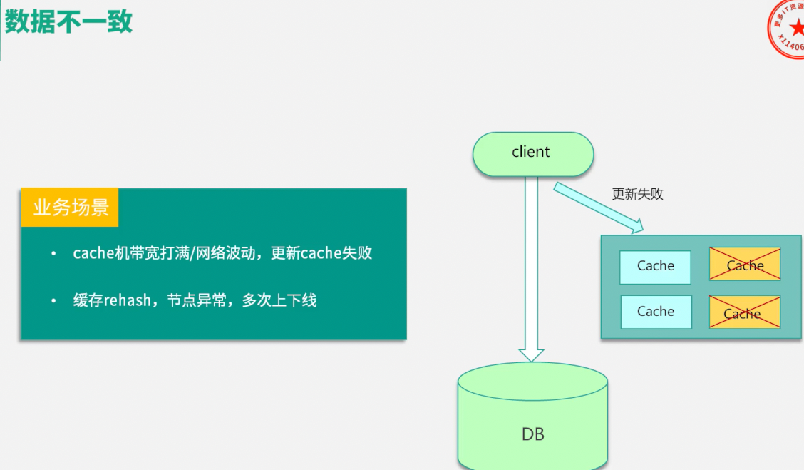

1
00:00:00,000 --> 00:00:02,880
你好,我是你的缓存老师,陈波

2
00:00:02,880 --> 00:00:04,400
欢迎进入第五课室

3
00:00:04,400 --> 00:00:06,600
缓存数据相关的经典问题

4
00:00:06,600 --> 00:00:10,880
七大缓存经典问题中的第四个经典问题

5
00:00:10,880 --> 00:00:12,080
是数据不一致

6
00:00:12,080 --> 00:00:15,880
同一份数据可能同时存在DB和缓存之中

7
00:00:15,880 --> 00:00:19,880
那就有可能发生DB和缓存中的数据不一致

8
00:00:19,880 --> 00:00:21,680
如果缓存有多个副本

9
00:00:21,680 --> 00:00:25,280
多个缓存副本里的数据也可能发生不一致的现象

10
00:00:25,280 --> 00:00:28,480
不一致的问题大多跟缓存更新异常有关

11
00:00:28,480 --> 00:00:31,280
比如更新DB后,写缓存失败

12
00:00:31,280 --> 00:00:34,080
导致缓存中存的是老数据

13
00:00:34,080 --> 00:00:37,080
另外,如果系统采用一致性哈希分布

14
00:00:37,080 --> 00:00:39,480
同时采用Rehash自动漂移策略

15
00:00:39,480 --> 00:00:43,080
在节点多次上下线之后也会产生脏数据

16
00:00:43,080 --> 00:00:46,080
缓存有多个副本时,更新某个副本失败

17
00:00:46,080 --> 00:00:48,680
也会导致这个副本的数据是老数据

18
00:00:48,680 --> 00:00:51,480
导致数据不一致的场景也不少

19
00:00:51,480 --> 00:00:53,880
在缓存机器的带宽被打满

20
00:00:53,880 --> 00:00:56,480
或者机房网络出现波动时

21
00:00:56,480 --> 00:00:59,680
缓存更新失败,新数据没有写入缓存

22
00:00:59,680 --> 00:01:02,880
就会导致缓存和DB的数据不一致

23
00:01:02,880 --> 00:01:06,680
缓存Rehash时,某个缓存机器反复异常

24
00:01:06,680 --> 00:01:10,280
多次上下线,更新请求多次Rehash

25
00:01:10,280 --> 00:01:12,680
这样,一份数据存在多个节点

26
00:01:12,680 --> 00:01:15,480
而且每次Rehash只更新某个节点

27
00:01:15,480 --> 00:01:18,480
也会导致一些缓存节点产生脏数据

28
00:01:18,480 --> 00:01:20,880
要尽量保持数据的一致性

29
00:01:20,880 --> 00:01:23,080
这里我也给出三个方案

30
00:01:23,080 --> 00:01:25,880
你可以根据实际情况进行选择方案

31
00:01:25,880 --> 00:01:27,280
第一个方案

32
00:01:27,280 --> 00:01:30,480
开启更新失败后,可以进行存尸

33
00:01:30,480 --> 00:01:34,480
如果存尸失败,将失败的Key写入堆裂机服务

34
00:01:34,480 --> 00:01:39,080
待缓存防误恢复后,将这些Key从缓存删除

35
00:01:39,080 --> 00:01:42,880
这些Key在再次被查询时,重新从DB加载

36
00:01:42,880 --> 00:01:44,880
从而保证数据的一致性

37
00:01:44,880 --> 00:01:46,080
第二个方案

38
00:01:46,080 --> 00:01:48,080
缓存时间适当调短

39
00:01:48,080 --> 00:01:50,480
让缓存数据及早过期后

40
00:01:50,480 --> 00:01:54,080
从DB重新加载,确保数据的最终一致性

41
00:01:54,080 --> 00:01:55,280
第三个方案

42
00:01:55,280 --> 00:01:57,280
不采用RayHash漂移策略

43
00:01:57,280 --> 00:01:59,480
而采用缓存封存策略

44
00:01:59,480 --> 00:02:01,480
尽量避免脏数据的产生

45
00:02:01,480 --> 00:02:05,480
第五个经典问题是数据并发竞争

46
00:02:05,480 --> 00:02:07,680
互联网系统线上流量较大

47
00:02:07,680 --> 00:02:11,080
缓存防误很容易出现数据并发竞争的现象

48
00:02:11,080 --> 00:02:15,080
数据并发竞争是指在高并发防误的场景

49
00:02:15,080 --> 00:02:17,280
一旦缓存防误没有找到数据

50
00:02:17,280 --> 00:02:19,880
大量请求就会并发查询DB

51
00:02:19,880 --> 00:02:21,880
导致DB压力大增的现象

52
00:02:21,880 --> 00:02:23,280
数据并发竞争

53
00:02:23,280 --> 00:02:25,680
主要是由于多个进程和现程中

54
00:02:25,680 --> 00:02:28,480
有大量并发请求获取相同的数据

55
00:02:28,480 --> 00:02:30,680
而这个数据K正好因为

56
00:02:30,680 --> 00:02:32,880
过期、被剔除等各种原因

57
00:02:32,880 --> 00:02:34,280
在缓存中不存在

58
00:02:34,280 --> 00:02:37,480
这些进程和现程之间没有任何协调

59
00:02:37,480 --> 00:02:39,680
然后一起并发查询DB

60
00:02:39,680 --> 00:02:41,280
请求那个相同的K

61
00:02:41,280 --> 00:02:43,680
最终导致DB压力大增

62
00:02:43,680 --> 00:02:48,480
数据并发竞争在大流量系统中也比较常见

63
00:02:48,480 --> 00:02:49,880
比如车票系统

64
00:02:49,880 --> 00:02:52,480
如果某个车次缓存信息过期

65
00:02:52,480 --> 00:02:56,080
但仍然有大量用户在查询该车次信息

66
00:02:56,080 --> 00:02:57,480
又如微博系统中

67
00:02:57,480 --> 00:03:00,280
如果某条微博正好被缓存淘汰

68
00:03:00,280 --> 00:03:04,080
但这条微博仍然在大量转发、评论、赞

69
00:03:04,080 --> 00:03:07,080
这种情况都会导致该车次信息

70
00:03:07,080 --> 00:03:10,480
该条微博存在并发竞争得取的问题

71
00:03:10,480 --> 00:03:12,480
要解决并发竞争

72
00:03:12,480 --> 00:03:13,880
有两种方案

73
00:03:13,880 --> 00:03:16,480
方案一是使用全局锁

74
00:03:16,480 --> 00:03:18,480
即当缓存请求miss时

75
00:03:18,480 --> 00:03:20,280
先尝试加全局锁

76
00:03:20,280 --> 00:03:22,480
只有加全局锁成功的线程

77
00:03:22,480 --> 00:03:24,680
才可以到DB去加载数据

78
00:03:24,680 --> 00:03:28,280
其他进程和线程在读取缓存数据miss时

79
00:03:28,280 --> 00:03:30,280
如果发现这个可以有全局锁

80
00:03:30,280 --> 00:03:31,480
就进行等待

81
00:03:31,480 --> 00:03:35,080
等之前的线程将数据从DB回收到缓存后

82
00:03:35,080 --> 00:03:36,480
再从缓存获取

83
00:03:36,480 --> 00:03:40,480
方案二是对缓存数据保持多个备份

84
00:03:40,480 --> 00:03:43,880
即便其中一个备份中的数据过期和被剔除

85
00:03:43,880 --> 00:03:45,680
还可以访问其他备份

86
00:03:45,680 --> 00:03:48,480
从而减少数据并发竞争的情况

87
00:03:48,480 --> 00:03:50,680
OK 这期课就讲到这里

88
00:03:50,680 --> 00:03:54,680
下一期课时会分享缓存特殊K相关的经典问题

