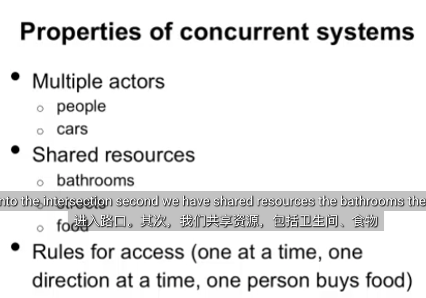
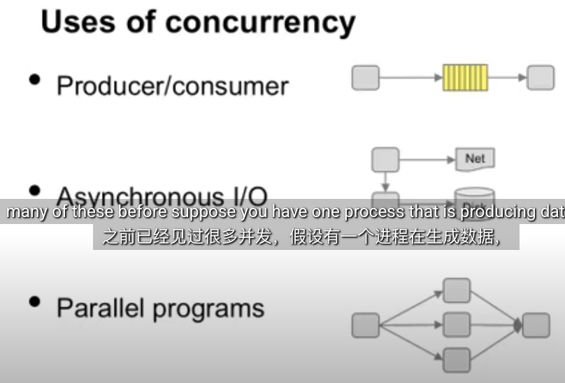
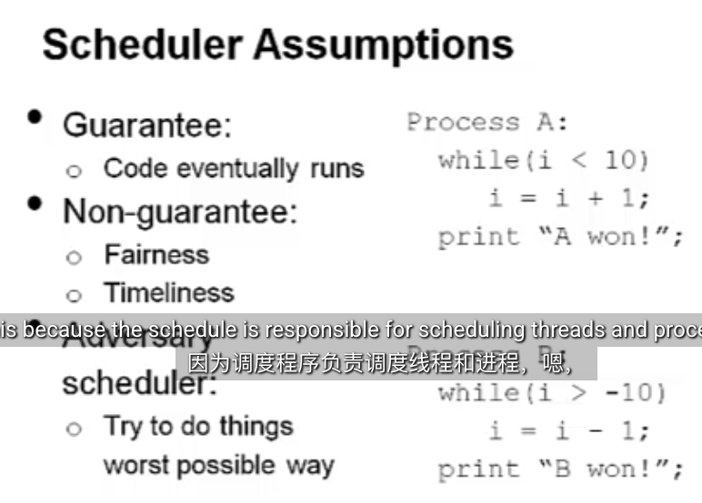
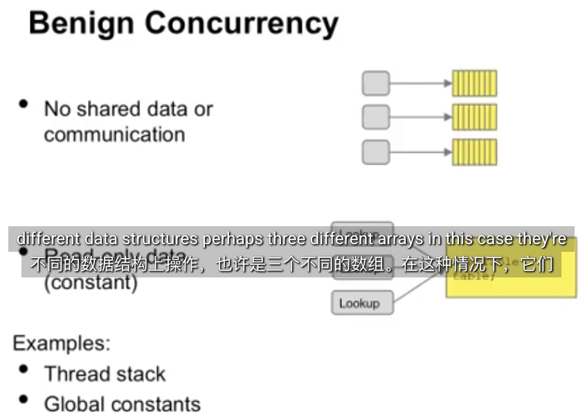
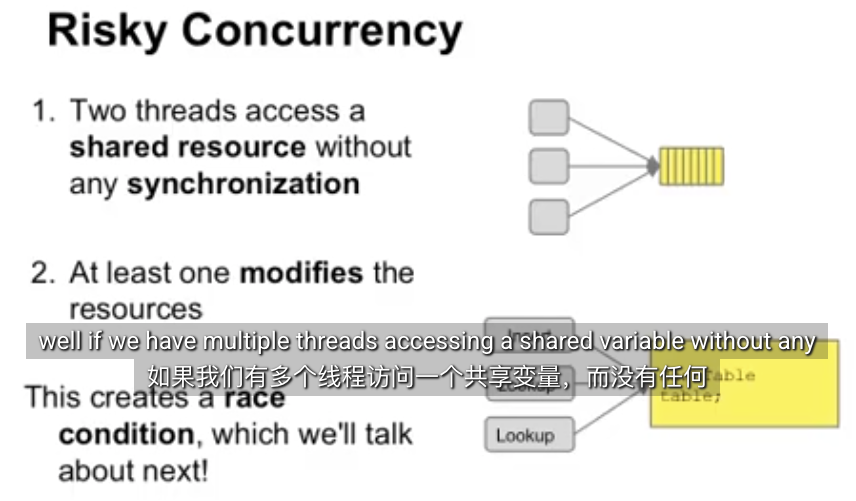
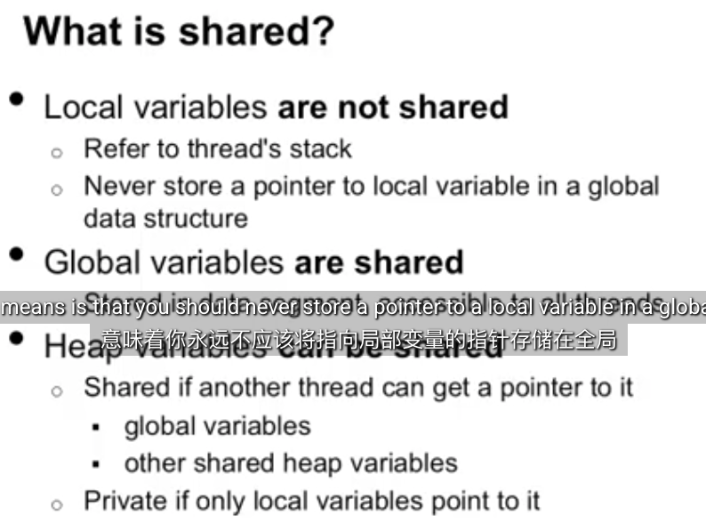

### Managing concurrency
- Synchronizatio mechanisms:  allow programs to write rules for concurrency
- atomicity: ensure no other thread changes data while running
- condition synchronization: ensure code in different threads runs in the correct order

1
00:00:00,880 --> 00:00:04,640
hi Welcome to our concurrency unit and operating systems we're trying something
欢迎来到我们的并发单元和操作系统，我们在这里尝试一些

2
00:00:04,640 --> 00:00:07,560
different here which is have you watch lectures at home and then we'll work out
不同的东西，就是让你在家看讲座，然后我们会

3
00:00:07,560 --> 00:00:12,719
homework style problems in the classroom let's get started we'll start each
在课堂上解决家庭作业式的问题。让我们开始吧，我们将以

4
00:00:12,719 --> 00:00:15,639
lecture with some learning objectives these are the things that you should
一些学习目标开始每节课，这些是你应该

5
00:00:15,639 --> 00:00:20,720
learn from watching this lecture our goal today is to First identify uses of
从观看这节课中学到的东西，我们今天的目标是首先确定

6
00:00:20,720 --> 00:00:24,519
concurrency what is it good for when do we use it identify sources of
并发的用途，它有什么好处，我们什么时候使用它，确定

7
00:00:24,519 --> 00:00:29,000
concurrency where do we have things happening at the same time I want you to
并发的来源，我们在哪里同时发生事情，我希望你

8
00:00:29,000 --> 00:00:32,719
understand the schedu is role in concurrency meaning how does these
理解调度在并发中的作用，这意味着这些

9
00:00:32,719 --> 00:00:37,440
process scheduler which decides what to run next impact concurrency I'd like you
决定下一步运行什么的进程调度程序是如何影响并发的，我希望你

10
00:00:37,440 --> 00:00:42,120
to be able to identify real world examples of concurrency how um we work
能够识别现实世界中并发的例子，我们如何处理

11
00:00:42,120 --> 00:00:45,520
with multiple things happening in the real world and also identify how you
现实世界中发生的多件事，并确定如何

12
00:00:45,520 --> 00:00:48,640
solve these problems in the real world and finally I'd like you to know the
在现实世界中解决这些问题，最后，我希望你知道

13
00:00:48,640 --> 00:00:51,640
difference between benign uses of concurrency that won't cause any
良性并发使用之间的区别，这种并发不会

14
00:00:51,640 --> 00:00:55,879
problems in your code from other kinds of concurrency that really need to be
在你的代码中引起任何问题，而其他类型的并发确实需要

15
00:00:55,879 --> 00:00:59,160
taken care of carefully so let's start off by looking
小心处理，所以让我们先来看看

16
00:00:59,160 --> 00:01:03,160
at concurrency in the Real World what is concurrency it's really whenever you
现实世界中的并发，什么是并发，它实际上是当你

17
00:01:03,160 --> 00:01:07,159
have multiple things happening at the same time that interact some examples
有多个 同时发生的事情会相互作用，例如

18
00:01:07,159 --> 00:01:11,080
are shared bathrooms shared food in an apartment and traffic lights or shared
在公寓里共享浴室、共享食物、交通信号灯或共享

19
00:01:11,080 --> 00:01:15,640
streets so let's look at these in more detail so here's a problem you have a
街道，让我们更详细地了解一下，这里有一个问题，你有一个

20
00:01:15,640 --> 00:01:19,360
bathroom and you would like to make sure that only one person goes at the same
浴室，你想确保只有一个人同时去，

21
00:01:19,360 --> 00:01:23,360
time if two people going at once nobody likes that so how do we deal with this
如果两个人同时去，没有人喜欢这样，那么

22
00:01:23,360 --> 00:01:27,520
in the real world well the answer is we put a lock on the door which somebody
在现实世界中我们该如何处理这个问题呢？答案是，我们在门上装一把锁，

23
00:01:27,520 --> 00:01:31,200
inside can lock when they go in so nobody in the outside can get into it
里面的人进去的时候可以锁上，这样外面的人就进不去了。

24
00:01:31,200 --> 00:01:34,280
the rule is if you go to the bathroom the door is locked you have to wait for
规则是，如果你去洗手间，门是锁着的，你必须等着，

25
00:01:34,280 --> 00:01:38,320
it so the point here is that we have something that's shared which is the
所以这里的重点是，我们有一些共享的东西，那就是

26
00:01:38,320 --> 00:01:43,439
bathroom and we have rules that Express how we share it between people to make
浴室，我们有规则来表达我们如何在人们之间共享它，以

27
00:01:43,439 --> 00:01:46,960
sure that bad things don't happen for our next example let's look at shared
确保不好的事情不会发生。对于我们的下一个例子，让我们看看

28
00:01:46,960 --> 00:01:50,520
food in apartment suppose you share an apartment with someone and you have a
公寓里的共享食物，假设你和某人合租一套公寓，你有一个

29
00:01:50,520 --> 00:01:53,840
problem that you would like to make sure there's always fresh milk how do you
问题，你想确保总是有新鲜的牛奶，你该如何

30
00:01:53,840 --> 00:01:58,960
work this out with your uh apartment mates well one way to do it is to have a
与你的公寓伙伴解决这个问题呢？一种方法是

31
00:01:58,960 --> 00:02:03,119
note on the door that says whether we need to buy milk because you used up the
在门上贴一张纸条，上面写着我们是否需要买牛奶，因为你用过 把

32
00:02:03,119 --> 00:02:06,159
milk and there's none left and then another note to say you're actually
牛奶喝完，牛奶就没了，然后另一张纸条说你实际上是在

33
00:02:06,159 --> 00:02:09,720
buying milk you need the first note to tell the other person there's no milk
买牛奶。你需要第一张纸条告诉对方没有牛奶

34
00:02:09,720 --> 00:02:13,640
available and they need to get it the second note is needed to let them know
了，他们需要去买。第二张纸条是让他们知道

35
00:02:13,640 --> 00:02:16,959
that you buying milk so they won't go and buy milk themselves and leave you
你在买牛奶，这样他们就不会自己去买牛奶，给你留下

36
00:02:16,959 --> 00:02:21,319
with too much milk so the note here is again we have a shared resources which
太多的牛奶。这里的纸条再次表明，我们有一个共享资源，那

37
00:02:21,319 --> 00:02:25,640
is the milk in the apartment and we have rules on how to share it meaning we have
就是公寓里的牛奶，我们有关于如何分享牛奶的规则，也就是说，我们有

38
00:02:25,640 --> 00:02:31,160
rules that say notify somebody when milk is needed so that we don't uh we will go
规则说，当需要牛奶时通知别人，这样我们就不会呃，我们会去买

39
00:02:31,160 --> 00:02:34,720
get more milk and notify somebody when you're buying milk so we don't end up
更多的牛奶，当你买牛奶时通知别人，这样我们就不会剩下

40
00:02:34,720 --> 00:02:38,280
with too much our third example is traffic lights
太多牛奶。第三个例子是交通信号灯

41
00:02:38,280 --> 00:02:41,959
and shared streets again we have a problem that we have a shared resource
和共享街道。我们再次遇到一个问题，我们有一个共享资源，

42
00:02:41,959 --> 00:02:45,319
which is the intersection that cars in both directions want to go through how
那就是双向车辆都想通过的十字路口。

43
00:02:45,319 --> 00:02:50,400
do we make sure that cars don't Collide so again we have rules and we have some
我们如何确保车辆不会相撞。所以我们再次制定了规则，我们有一些

44
00:02:50,400 --> 00:02:55,720
state that help us figure this out so we have a traffic light that tells us which
状态来帮助我们解决这个问题。我们有一个交通信号灯，告诉我们

45
00:02:55,720 --> 00:02:59,480
direction cars are allowed to go and the rule is don't enter the light don't
车辆可以往哪个方向行驶，规则是不要进入交通信号灯。

46
00:02:59,480 --> 00:03:02,760
enter the the intersection if the light is red or yellow and when the light
如果信号灯是红灯，不要进入十字路口。 黄灯亮起，当您

47
00:03:02,760 --> 00:03:06,400
changes to Green in your direction wait for all the cars in the intersection to
所在方向的交通灯变为绿灯时，请等待路口内的所有车辆驶

48
00:03:06,400 --> 00:03:11,040
exit if you follow these rules then it's safe for both directions through the
出。如果您遵守这些规则，则两个方向通过路口都是安全的，

49
00:03:11,040 --> 00:03:14,840
intersection and there won't be any collisions so what have we learn from
不会发生任何碰撞。那么，我们从中学到了什么呢？

50
00:03:14,840 --> 00:03:18,159
this well first of all there are some properties of concurrent systems the
首先，并发系统有一些特性。

51
00:03:18,159 --> 00:03:21,840
first thing is that there's multiple actors involved who can do things in
第一件事是，系统中有多个参与者，他们可以做某事。在

52
00:03:21,840 --> 00:03:24,640
this case it was the multiple people wanting to use the bathroom or there
本例中，多个人想使用卫生间，或者

53
00:03:24,640 --> 00:03:28,040
multiple people living in the apartment or there multiple cars that wanted to go
公寓里住着多个人，或者有多辆车想

54
00:03:28,040 --> 00:03:32,760
into the intersection second we have shared resources the bathrooms the food
进入路口。其次，我们共享资源，包括卫生间、食物

55
00:03:32,760 --> 00:03:37,400
and the street third we need to have some rules that say how do we share
和街道。第三，我们需要制定一些规则，规定如何

56
00:03:37,400 --> 00:03:42,560
these resources safely one person at a time uses the bathroom um one person
安全地共享这些资源。一次只有一个人使用卫生间，嗯，一个人

57
00:03:42,560 --> 00:03:46,879
buys food or Only One Direction uses the traffic light at a
买食物，或者一次只有一个方向使用交通信号灯。

58
00:03:46,879 --> 00:03:51,920
time so how does this apply to computer systems well we have multiple actors
那么，这如何应用于计算机系统呢？

59
00:03:51,920 --> 00:03:55,799
inside an operating system these are processes multiple processes can run at
在一个操作系统中，我们有多个参与者。这些是进程，多个进程可以同时运行，

60
00:03:55,799 --> 00:03:59,799
the same time or we might have multiple threads within a single process that
或者我们可能在一个进程中有多个线程同时

61
00:03:59,799 --> 00:04:04,959
running at the same time so why might you have concurrency well we've seen
运行。那么，为什么会有并发呢？我们

62
00:04:04,959 --> 00:04:09,159
many of these before suppose you have one process that is producing data and
之前已经见过很多并发，假设有一个进程在生成数据，

63
00:04:09,159 --> 00:04:12,640
another process that's consuming it here we want to have the producer and the
另一个进程在消费数据。我们希望生产者和

64
00:04:12,640 --> 00:04:16,519
consumer running at the same time but they both have to access the share data
消费者同时运行，但他们都必须访问共享数据才能进行

65
00:04:16,519 --> 00:04:21,199
for communication a second reason is asynchronous IO for example you might
通信。第二个原因是异步 IO。例如，你可能

66
00:04:21,199 --> 00:04:25,240
want to have a web server that can read data off disk and send it to the network
想要一个 Web 服务器，它可以从磁盘读取数据并将其发送到网络。

67
00:04:25,240 --> 00:04:29,120
the network the disk and the web server All actors the shared resource we're
网络、磁盘和 Web 服务器。所有参与者，我们担心的共享资源

68
00:04:29,120 --> 00:04:32,840
worried about is is the data moving between the network and the disk finally
是数据在网络和磁盘之间移动。最后，

69
00:04:32,840 --> 00:04:37,800
we might have parallel programs where one thread will split the problem into
我们可能会有并行程序，其中一个线程会将问题拆分成

70
00:04:37,800 --> 00:04:41,360
three smaller problems worked on by different threads here the shared data
三个较小的问题，由不同的线程处理。共享数据

71
00:04:41,360 --> 00:04:44,960
is the data for the program the actors are the different threads the reason to
是程序的数据。参与者是不同的线程。

72
00:04:44,960 --> 00:04:49,320
do this is that it makes the program run faster when you have multiple processes
这样做的原因是，当你有多个进程时，它会使程序运行得更快。

73
00:04:49,320 --> 00:04:53,000
similarly for a synchronous IO this can make things faster because we can access
对于同步 IO 来说，这可以使程序运行得更快，因为我们可以

74
00:04:53,000 --> 00:04:56,919
the disk and the net at the same time on different threads producer consumer
在不同的线程上同时访问磁盘和网络。生产者消费者

75
00:04:56,919 --> 00:05:00,680
similarly we can make go faster because we can produce be producing things while
同样可以使程序运行得更快，因为我们可以在消费的同时进行生产。

76
00:05:00,680 --> 00:05:05,280
we're consuming them so the properties we have for
因此，并发

77
00:05:05,280 --> 00:05:08,880
concurrent computer systems are very similar to the concurrent systems we had
计算机系统的属性与现实世界中的并发系统非常相似。

78
00:05:08,880 --> 00:05:13,080
in the real world we have multiple actors in this case multiple threads we
在这种情况下，我们有多个参与者，即多个线程。我们

79
00:05:13,080 --> 00:05:17,240
have shared resources which can be Memory uh heat variables or Global
有共享资源，可以是内存、热变量或全局

80
00:05:17,240 --> 00:05:20,919
variables or devices such as the network or the
变量，也可以是网络或

81
00:05:20,919 --> 00:05:25,479
disk so one thing to worry about is well doesn't the scheduler handle this for
磁盘等设备。 所以需要担心的一件事是，调度程序是否能处理这个问题，

82
00:05:25,479 --> 00:05:29,759
this because the schedule is responsible for scheduling threads and processes um
因为调度程序负责调度线程和进程，嗯，

83
00:05:29,759 --> 00:05:32,759
it is possible the scheduler will help you out and make things run in the right
调度程序可能会帮你解决这个问题，让事情按正确的

84
00:05:32,759 --> 00:05:37,400
order however there's no guarantee this happened in fact the only guarantee the
顺序运行，但是并不能保证这种情况一定会发生，事实上，调度程序唯一能保证的就是

85
00:05:37,400 --> 00:05:40,800
scheduler really makes is there will be no starvation that every threat or
不会出现资源匮乏的情况，每个威胁或

86
00:05:40,800 --> 00:05:45,240
process will eventually run schedulers generally make no guarantee of fairness
进程最终都会运行，调度程序通常不保证公平性，这

87
00:05:45,240 --> 00:05:48,960
meaning that process a and process B will run the same amount of time or
意味着进程 a 和进程 B 的运行时间或

88
00:05:48,960 --> 00:05:52,840
timeliness that process A and B will get to run in some finite bounded amount of
及时性，进程 A 和 B 将在有限的时间内运行，

89
00:05:52,840 --> 00:05:57,319
time such as one second one way to think about this is that when reasoning about
比如一秒钟，思考这个问题的一种方式是，在推理

90
00:05:57,319 --> 00:06:01,360
concurrency we really try to think about the schedu as an adversary it will
并发时，我们实际上会尝试将调度程序视为对手，它会

91
00:06:01,360 --> 00:06:05,280
intentionally switch between processes at the worst possible time to cause the
在最糟糕的时间故意在进程之间切换，导致

92
00:06:05,280 --> 00:06:09,840
worst thing to happen for example suppose we have the code here shown here
最糟糕的事情发生，例如，假设我们有这里的代码，

93
00:06:09,840 --> 00:06:14,880
process a tries to count up to 10 and we'll print A1 when it gets to 10
进程 a 尝试数到 10，当它数到 10 时，我们会打印 A1，

94
00:06:14,880 --> 00:06:19,000
process B will try to count to -10 and we'll print B1 if it gets the negative
进程 B 会尝试数到 -10，如果它得到负 -1，我们会打印 B1，

95
00:06:19,000 --> 00:06:23,199
-1 what could happen here well it's possible if you have a
这里会发生什么，嗯，有可能 如果你有一个

96
00:06:23,199 --> 00:06:27,800
uniprocessor that process a if it starts first will run and win right away or
单处理器，进程 a 如果先启动，就会立即运行并获胜，或者

97
00:06:27,800 --> 00:06:32,120
process B if it starts would run and run and win right away if a and b are
进程 B 如果启动，就会立即运行并获胜。如果 a 和 b

98
00:06:32,120 --> 00:06:35,919
running at the same time then it's possible that they'll sit there forever
同时运行，那么它们可能会永远处于停滞状态，

99
00:06:35,919 --> 00:06:38,960
and neither of them will ever win will ever win because they will take turns
并且永远不会获胜，因为它们会轮流

100
00:06:38,960 --> 00:06:42,560
incrementing and decrementing OD what this means is we really can't count on
增加和减少 OD。这意味着我们不能指望

101
00:06:42,560 --> 00:06:48,000
the scheduler to help us out in these problems so one thing to know is when do
调度程序来帮助我们解决这些问题。所以有一件事需要知道，那就是什么时候

102
00:06:48,000 --> 00:06:51,800
we not have to worry about concurrency when do we have to not have to worry
我们不必担心并发性，什么时候我们不必担心

103
00:06:51,800 --> 00:06:55,599
about multiple threads running at the same time the first case is when there's
多个线程同时运行。第一种情况是当

104
00:06:55,599 --> 00:07:00,280
no shared data or communication suppose to have three threads oper on three
没有共享数据或通信时，假设有三个线程在三个

105
00:07:00,280 --> 00:07:03,759
different data structures perhaps three different arrays in this case they're
不同的数据结构上操作，也许是三个不同的数组。在这种情况下，它们

106
00:07:03,759 --> 00:07:07,560
all working on separate data there's no sharing and no communication so there's
都在处理单独的数据。没有共享也没有通信，所以

107
00:07:07,560 --> 00:07:11,000
no nothing to worry about the concurrency the second time we don't
没有什么可担心的。第二种情况

108
00:07:11,000 --> 00:07:15,360
have to worry about it is when we have readon data meaning that it's constant
是当我们读取数据时，这意味着它是常量，

109
00:07:15,360 --> 00:07:19,759
so even though we have shared data in this example a hash table the threads
所以即使我们在这个例子中有共享数据（哈希表），线程

110
00:07:19,759 --> 00:07:23,199
are only reading it so there's nothing that can go wrong there's no chance that
也只是读取它，所以没有什么不会出错，因为

111
00:07:23,199 --> 00:07:27,039
one thread will modify the data and some other one will see the wrong value
一个线程会修改数据，而其他某个线程会看到错误的值

112
00:07:27,039 --> 00:07:30,080
because the data is constant some examples
数据是常量，所以不会出现一个线程修改数据而另一个线程看到错误值的情况。一些

113
00:07:30,080 --> 00:07:35,599
of um data that is not shared are local variables in your thread stack these are
不共享的数据示例是线程堆栈中的局部变量，它们是

114
00:07:35,599 --> 00:07:39,199
private to the thread and generally not shared an example of read only consant
线程私有的，通常不共享。一个只读常量

115
00:07:39,199 --> 00:07:42,879
data are Global consant that you compile into your
数据示例是全局常量，你会将其编译到

116
00:07:42,879 --> 00:07:47,840
code so what about risky concurrency when do we have to worry about things
代码中。那么，风险并发呢？我们什么时候需要担心呢？

117
00:07:47,840 --> 00:07:51,440
well if we have multiple threads accessing a shared variable without any
如果我们有多个线程访问一个共享变量，而没有任何

118
00:07:51,440 --> 00:07:55,639
kind of rules to access it we have a problem this is like having a shared
访问规则，我们就会遇到一个问题，这就像一个

119
00:07:55,639 --> 00:07:59,840
bathroom with no lock on the door that people can walk in at any time the
没有锁的公共浴室，人们可以随时进入。

120
00:07:59,840 --> 00:08:03,440
second thing we worry about is when at least one thread modifies the resource
我们担心的第二件事是，当至少一个线程修改资源时，

121
00:08:03,440 --> 00:08:07,039
so in our hash table example if one of our threads is inserting into the hash
所以在我们的哈希表示例中，如果我们的一个线程正在向其他线程正在查找的哈希表中插入数据，那么

122
00:08:07,039 --> 00:08:10,840
table where the other ones are looking up it's possible the threads might see
线程可能会

123
00:08:10,840 --> 00:08:14,759
the hash table in the middle of an insert and see a invalid pointer or a
在插入过程中看到哈希表，并看到无效指针或

124
00:08:14,759 --> 00:08:18,680
null pointer in Crash we call this a race
空指针。在崩溃中，我们称之为竞争

125
00:08:18,680 --> 00:08:22,759
condition um which is when we have two threads that are accessing the same data
条件，即当我们有两个线程访问相同的数据而

126
00:08:22,759 --> 00:08:26,720
without any kind of rules for Access and we'll talk about this in the next
没有任何访问规则时，我们将在下一讲中讨论这个问题。

127
00:08:26,720 --> 00:08:31,599
lecture so a standard example of where currency matters is in a bank account
货币在银行账户中扮演着重要的角色，

128
00:08:31,599 --> 00:08:34,760
suppose you have a bank server that is managing an account balance it has one
假设你有一个管理账户余额的银行服务器，它有一个

129
00:08:34,760 --> 00:08:38,559
method a withdraw method that takes an account number or account object and an
方法，一个取款方法，该方法接受一个账号或账户对象以及一个

130
00:08:38,559 --> 00:08:42,360
amount of money to withdraw and we have two people trying to call it at the same
取款金额，有两个人试图同时调用它，

131
00:08:42,360 --> 00:08:46,720
time shown here in pink and green both times the code get called it does the
这里用粉色和绿色表示，两次调用代码时，它都会做

132
00:08:46,720 --> 00:08:51,000
same thing it reads the balance from the account it subtracts the amount of money
同样的事情，从账户中读取余额，从

133
00:08:51,000 --> 00:08:54,080
withdrawn from the balance and then updates the account's balance with the
余额中减去取款金额，然后用新值更新账户余额，

134
00:08:54,080 --> 00:08:58,279
new value and Returns the current balance so this seems like it's fine if
并返回当前余额，所以如果

135
00:08:58,279 --> 00:09:02,079
two people draw at the same time but let's look at what can go wrong suppose
两个人同时取款似乎没问题，但让我们看看哪里可能出错，假设

136
00:09:02,079 --> 00:09:06,320
we start out with $100 now remember these two functions are being called by
我们从 100 美元开始，现在记住这两个函数是由

137
00:09:06,320 --> 00:09:09,640
two different users meaning logically in a computer system they'll run on two
两个不同的用户调用的，这意味着在计算机系统中，逻辑上它们将在两个

138
00:09:09,640 --> 00:09:13,680
different threads the scheduler as I said Can inter leave these two threads
不同的线程上运行，正如我所说的，调度程序可以

139
00:09:13,680 --> 00:09:18,200
in any way we want so suppose we have the inner leaving here where time is
以任何我们想要的方式中断这两个线程，所以假设我们有内部离开这里，时间

140
00:09:18,200 --> 00:09:22,160
starting at the top and going down so we start off with the balance at
从顶部开始向下，所以我们从余额

141
00:09:22,160 --> 00:09:27,320
$100 the first thread to execute is the pink thread and it executes up to the
100 美元开始，第一个要执行的线程是粉色线程，它一直执行到

142
00:09:27,320 --> 00:09:31,760
point where it calculates the new balance and $90 if we now switch and
计算 新的余额和 90 美元如果我们现在切换并

143
00:09:31,760 --> 00:09:36,200
start running the green thread it will try to be removing $20 and it'll execute
开始运行绿色线程，它将尝试取出 20 美元，并一直执行到将

144
00:09:36,200 --> 00:09:40,880
down to the point where to sets the balance to be $80 the pink threads can
余额设置为 80 美元的点，粉色线程可以

145
00:09:40,880 --> 00:09:46,000
start running again at this point and it will save the balance as $90 and
在此时再次开始运行，它将余额保存为 90 美元并

146
00:09:46,000 --> 00:09:50,640
return When the green thread starts up it will save the value as eight of the
返回当绿色线程启动时，它将把值保存为余额的 8，即

147
00:09:50,640 --> 00:09:54,959
balance is $80 and then return the problem here is at the end of this the
80 美元，然后返回这里的问题是，在最后，

148
00:09:54,959 --> 00:10:00,200
account balance is left at $80 even though $30 were removed from the bank
账户余额仍然为 80 美元，即使从银行账户中取出了 30 美元，

149
00:10:00,200 --> 00:10:03,959
account and it began with a balance of $100 the problem here is that we have a
并且开始时余额为100 美元这里的问题是，我们有一个

150
00:10:03,959 --> 00:10:07,680
race condition both threads are modifying shared state which is the bank
竞争条件，两个线程都在修改共享状态，即银行

151
00:10:07,680 --> 00:10:12,000
account balance with no rules about how they should be
账户余额，而没有关于如何

152
00:10:12,000 --> 00:10:15,800
synchronized so remembering why this happens we need to look at what is
同步的规则，所以要记住为什么会发生这种情况，我们需要看看什么是

153
00:10:15,800 --> 00:10:20,040
shared as I said concurrency is benign when we have things that are not shared
共享的，正如我所说，当我们有不共享的东西时，并发是良性的

154
00:10:20,040 --> 00:10:24,120
local variables are not shared because they refer to the thread stack what this
局部变量不共享，因为它们引用线程堆栈这

155
00:10:24,120 --> 00:10:27,279
means is that you should never store a pointer to a local variable in a global
意味着你永远不应该将指向局部变量的指针存储在全局

156
00:10:27,279 --> 00:10:32,000
structure or else that thread stack may become shared Global variables are
结构中，否则线程堆栈可能会被共享，但是全局变量是

157
00:10:32,000 --> 00:10:35,079
however shared because they're stored in the data segment that's accessible to
共享的，因为它们存储在数据段中

158
00:10:35,079 --> 00:10:39,079
all threads through the name of the global variable Heap variables may or
所有线程都可以通过全局变量的名称访问堆变量

159
00:10:39,079 --> 00:10:42,800
may not be shared when Heap variables are first initialized through the malet
在第一次通过 malet 调用初始化堆变量时可能会共享，也可能不会共享。

160
00:10:42,800 --> 00:10:47,920
call only one thread has access to that data however if another thread can get a
但是，如果另一个线程可以获取指向该数据的

161
00:10:47,920 --> 00:10:51,920
pointer to it for example you store a pointer in a global variable or you
指针，例如，您将指针存储在全局变量中，或者将

162
00:10:51,920 --> 00:10:56,680
store a pointer in another variable that is already shared then that data becomes
指针存储在另一个已经共享的变量中，那么该数据就会被

163
00:10:56,680 --> 00:11:02,079
shared this means that Heap dat Ables are only private are private if only
共享，这意味着堆数据只有在只有

164
00:11:02,079 --> 00:11:07,040
local variables can point to it so how can we manage concurrency well
局部变量可以指向它的情况下才是私有的。那么，我们如何才能很好地管理并发呢？

165
00:11:07,040 --> 00:11:09,880
there's a couple of techniques that computer scientists have developed over
在

166
00:11:09,880 --> 00:11:13,760
the past 50 years for this problem the first is a set of synchronization
过去的 50 年里，计算机科学家已经为这个问题开发了一些技术。首先是一组同步

167
00:11:13,760 --> 00:11:17,639
mechanisms that allow programmers to write rules on how to manage concurrency
机制，允许程序员编写关于如何管理并发的规则，

168
00:11:17,639 --> 00:11:21,880
just like the lock on the bathroom door one of these is atomicity this is
就像浴室门上的锁一样，其中之一就是原子性，这

169
00:11:21,880 --> 00:11:26,000
basically make sure that while one thread is modifying data no other
基本上是确保当一个线程正在修改数据时，没有其他

170
00:11:26,000 --> 00:11:29,000
threads can change that data this is similar to when you're in the bathroom
线程可以更改该数据。这类似于当你在浴室时，

171
00:11:29,000 --> 00:11:33,360
you make sure nobody else can come in the bathroom the other major technique
你要确保没有其他人可以进入浴室。另一个主要技术

172
00:11:33,360 --> 00:11:37,040
is conditional synchronization these allows code in different threads to run
是条件同步，这允许不同线程中的代码

173
00:11:37,040 --> 00:11:41,200
in the correct order suppose for example you want to make sure that code that
以正确的顺序运行。假设你想确保

174
00:11:41,200 --> 00:11:44,200
withdraws from a bank account Waits until there's enough money in the
从 银行账户等待，直到账户中有足够的钱

175
00:11:44,200 --> 00:11:47,519
account to withdraw conditional synchronization would allow one thread
才能提取条件同步将允许一个线程

176
00:11:47,519 --> 00:11:51,880
to wait until the bank balance is high enough before the withdraw
等到银行余额足够高后再进行提取

177
00:11:51,880 --> 00:11:56,120
runs this is the end of the first lecture in concurrency please take the
这是并发第一讲的结束，请在

178
00:11:56,120 --> 00:12:01,240
quiz on concurrency before watching the next lecture
观看下一讲之前参加并发测验

