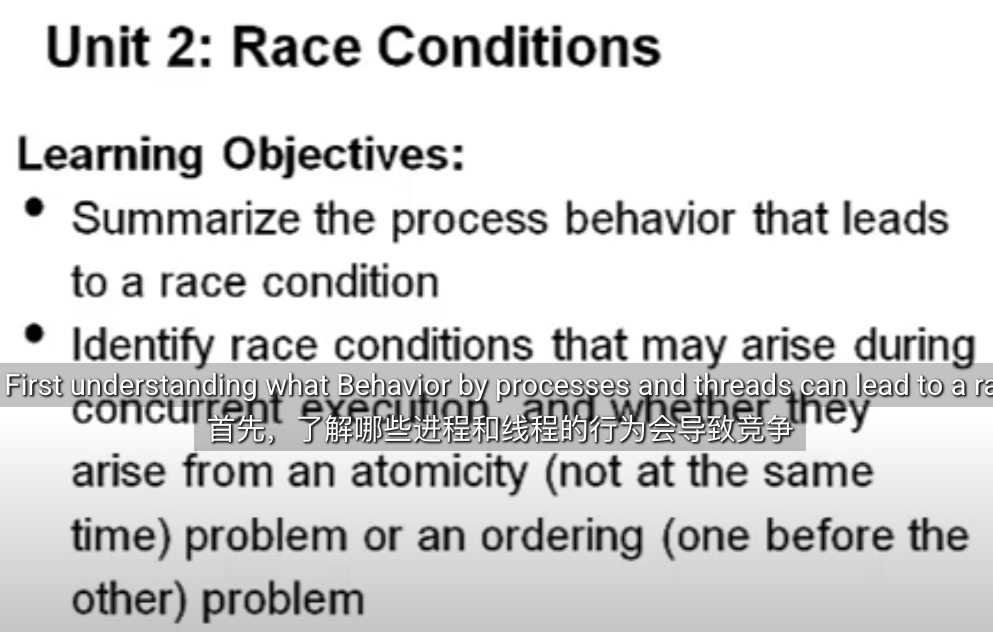

00:00:00,599 --> 00:00:04,319
welcome to part two of the lecture on synchronization this part we'll be
欢迎来到同步讲座的第二部分，本部分我们将

2
00:00:04,319 --> 00:00:08,000
talking about a race condition the learning objectives for this piece are
讨论竞争条件。本部分的学习目标是：

3
00:00:08,000 --> 00:00:13,200
to First understanding what Behavior by processes and threads can lead to a race
首先，了解哪些进程和线程的行为会导致竞争

4
00:00:13,200 --> 00:00:18,439
condition second identify when race conditions can arise during execution
条件。其次，确定竞争条件在执行过程中何时会出现，

5
00:00:18,439 --> 00:00:22,640
and whether they arise from an atomicity problem or an ordering
以及它们是由原子性问题还是顺序

6
00:00:22,640 --> 00:00:27,359
problem so let's first talk about a race condition a race condition occurs when
问题引起的。因此，我们首先来谈谈竞争条件。当

7
00:00:27,359 --> 00:00:31,119
the output of a sequence of code is dependent on the The Ordering of
代码序列的输出取决于

8
00:00:31,119 --> 00:00:34,680
different threads or the timing of uncontrolled events for example if you
不同线程的顺序或不受控制的事件的时序时，就会发生竞争条件。例如，如果

9
00:00:34,680 --> 00:00:38,399
have code that two threads can execute at the same time and the order in which
两个线程可以同时执行代码，并且

10
00:00:38,399 --> 00:00:43,239
they run makes a difference in the output that's called a race
它们运行的​​顺序会对输出产生影响，这称为竞争

11
00:00:43,840 --> 00:00:48,199
condition for example consider the case of the bank account we looked at in the
条件。例如，考虑一下我们在上一讲中讨论的银行账户的情况。

12
00:00:48,199 --> 00:00:53,600
last lecture in that case we showed that if both threads ran at the same time the
在这种情况下，我们表明，如果两个线程同时运行，

13
00:00:53,600 --> 00:00:58,680
output of the the output of the code could leave the balance at $80 which is
代码输出的余额可能会保持在 80 美元，这是

14
00:00:58,680 --> 00:01:03,039
incorrect however a different possible inter leaving can lead a different
不正确的。然而，不同的可能的输出可能会导致不同的

15
00:01:03,039 --> 00:01:07,240
result in this case the first thread runs up to the point where it updates
结果。在这种情况下，第一个线程运行到将

16
00:01:07,240 --> 00:01:11,479
the balance field of the bank account to
银行账户的余额字段更新为

17
00:01:11,520 --> 00:01:16,240
$90 in this case when the second thread runs it sees the first thread is already
90 美元。在这种情况下，当第二个线程运行时，它会看到第一个线程已经将

18
00:01:16,240 --> 00:01:20,920
reduced the balance to $90 and then takes out an additional $20 this leaves
余额减少到 90 美元，然后再取出 20 美元，这样

19
00:01:20,920 --> 00:01:23,520
the bank account balance at the correct value of
银行账户余额就是

20
00:01:23,520 --> 00:01:27,520
$70 what we see here is that we have a race condition because the ordering in
70 美元。我们在这里看到的是，我们有一个竞争条件，因为

21
00:01:27,520 --> 00:01:31,520
which the two threads inter leave affects the outcome $80 in one case and
两个线程的退出顺序会影响结果，一个是 80 美元，

22
00:01:31,520 --> 00:01:36,479
$70 in the other so this result is indeterminate
另一个是 70 美元。所以这个结果是不确定的，

23
00:01:36,479 --> 00:01:39,840
and it makes it very difficult to debug your code because depending on when
这使得调试代码变得非常困难，因为根据

24
00:01:39,840 --> 00:01:43,479
threads run and what they do you get different results in contrast the
线程运行的时间和它们执行的操作，你会得到不同的结果。相比之下，

25
00:01:43,479 --> 00:01:47,200
terministic cont computation would produce the same result every time it's
术语 cont 计算每次运行时都会产生相同的结果，

26
00:01:47,200 --> 00:01:50,920
run and is much easier to understand this is what we want to achieve through
而且更容易理解。这就是我们希望通过同步机制实现的

27
00:01:50,920 --> 00:01:53,840
our concurrency through our synchronization
并发性，

28
00:01:53,840 --> 00:01:57,840
mechanisms so what can we do about race conditions we need some way for
那么我们该如何应对竞争条件呢？我们需要某种方法让

29
00:01:57,840 --> 00:02:02,200
programmers to control access to shared resources when there's
程序员在并发时控制对共享资源的访问，

30
00:02:02,200 --> 00:02:05,680
concurrency this allows them to reason about the order in which different
这允许他们推断

31
00:02:05,680 --> 00:02:09,919
pieces of the program will run and effectively reintroduces determinism by
程序不同部分的运行顺序，并通过确保始终发生正确的事情来有效地重新引入确定性。

32
00:02:09,919 --> 00:02:13,920
making sure that the right thing always happens what this means is that some
这意味着

33
00:02:13,920 --> 00:02:17,400
kind of synchronization mechanism is necessary for every shared data
每个共享数据

34
00:02:17,400 --> 00:02:20,879
structure where at least some thread is modifying that data
结构都需要某种同步机制，其中至少有一些线程正在修改该数据

35
00:02:20,879 --> 00:02:26,760
structure so the basic some basic definitions a critical section is a
结构。所以基本的一些基本定义：临界区是

36
00:02:26,760 --> 00:02:30,920
piece of code that accesses a shared resource
一段访问 共享资源

37
00:02:30,920 --> 00:02:35,400
um we want critical sections to run with what we call Mutual exclusion to
嗯，我们希望临界区以所谓的互斥方式运行，以便

38
00:02:35,400 --> 00:02:39,680
synchronize its execution with other threads Mutual exclusion means that only
与其他线程同步执行互斥意味着一次只有

39
00:02:39,680 --> 00:02:44,080
one thread can run in the critical section at a time Mutual meaning um
一个线程可以在临界区中运行互斥意味着嗯

40
00:02:44,080 --> 00:02:49,200
related to others and exclusion meaning one thread will exclude others so
与其他线程相关，而排斥意味着一个线程将排除其他线程，因此

41
00:02:49,200 --> 00:02:53,200
suppose we have this code with the bank account balance what code do we want to
假设我们有这个带有银行账户余额的代码，我们希望

42
00:02:53,200 --> 00:02:55,599
have here that should be within the critical
这里的代码应该在临界

43
00:02:55,599 --> 00:03:00,519
section here we want to have the code that reads the old balance updates the
区内，我们希望读取旧余额、更新

44
00:03:00,519 --> 00:03:04,480
balance and writes it back to be part of the critical section we really want to
余额并将其写回的代码成为临界区的一部分，我们真正想要

45
00:03:04,480 --> 00:03:07,640
make sure that the balance of the account doesn't change between the time
确保账户余额在

46
00:03:07,640 --> 00:03:10,959
when we read the balance and we write the New Balance back because if the
我们读取余额和写回新余额之间不会发生变化，因为如果

47
00:03:10,959 --> 00:03:14,799
balance did change we would write back the wrong balance therefore the code
余额确实发生了变化，我们会写回错误的余额，因此执行

48
00:03:14,799 --> 00:03:19,760
that does sort of a read update modify and then write the value back we need
读取、更新、修改然后写回值的代码我们需要将其

49
00:03:19,760 --> 00:03:23,080
that to go in the critical section the code that Returns the New Balance
放入临界区，

50
00:03:23,080 --> 00:03:26,040
however does not need to be in the critical section because it's returning
但是返回新余额的代码不需要在临界区中，因为它在

51
00:03:26,040 --> 00:03:30,400
a thread local variable here um and it doesn't matter if the threads start
这里返回一个线程局部变量嗯，线程是否

52
00:03:30,400 --> 00:03:35,319
running at this point so to implement critical sections properly there's some
从此时开始运行并不重要，因此为了正确实现临界区，

53
00:03:35,319 --> 00:03:39,640
properties we'd like our solutions to have one is mutual exclusion this is the
我们希望我们的解决方案具有一些属性 一是互斥，这是

54
00:03:39,640 --> 00:03:43,200
most important property and make sure that only one thread executes in a
最重要的属性，确保

55
00:03:43,200 --> 00:03:48,280
critical section of code at a time this makes sure that other threads aren't
一次只有一个线程在代码的临界区中执行，这确保其他线程在

56
00:03:48,280 --> 00:03:52,519
modifying data while it runs second we'd like to have a guarantee of progress
运行时不会修改数据。其次，我们希望有一个进度保证，

57
00:03:52,519 --> 00:03:55,720
which means that a thread outside a critical section can't stop another
这意味着临界区之外的线程无法阻止另一个

58
00:03:55,720 --> 00:04:00,280
thread from entering this means that once threads exit the inter once threads
线程进入，这意味着一旦线程退出

59
00:04:00,280 --> 00:04:04,640
exit a critical section other threads can keep going so even if that thread
临界区，其他线程就可以继续运行，所以即使

60
00:04:04,640 --> 00:04:08,280
outside the critical section starts waiting on iO or something like that
临界区之外的线程开始等待 iO 或类似的东西，其他线程也可以

61
00:04:08,280 --> 00:04:12,519
other threads keep going we would also like bounded waiting which means that
继续运行。我们还希望有界等待，这意味着

62
00:04:12,519 --> 00:04:15,360
when a thread is waiting to enter a critical section it will eventually
当一个线程等待进入临界区时，它最终会

63
00:04:15,360 --> 00:04:19,680
enter it won't starve and sit there forever this also requires though that
进入，它不会饿死并永远坐在那里，但这也要求

64
00:04:19,680 --> 00:04:23,880
threads that are in the critical section eventually leave and release Mutual
临界区中的线程最终离开并释放

65
00:04:23,880 --> 00:04:27,440
exclusion if a thread can stay in the critical section forever other threads
互斥，如果一个线程可以永远留在临界区中，其他线程

66
00:04:27,440 --> 00:04:31,400
will wait forever we would like to solutions that are high performance so
将永远等待，我们希望解决方案具有高性能，因此

67
00:04:31,400 --> 00:04:35,600
the overhead of entering and exiting the critical section are small particularly
进入和退出临界区的开销很小，特别是

68
00:04:35,600 --> 00:04:38,800
compared to the amount of work doing in there so we don't slow programs down a
与在那里进行的工作量相比，因此我们不会

69
00:04:38,800 --> 00:04:43,039
lot by using critical sections finally we'd like the solution to be fair
通过使用临界区来减慢程序的速度。最后，我们希望解决方案是公平的，这

70
00:04:43,039 --> 00:04:46,360
meaning that we don't want to make some threads wait much longer than other
意味着我们不想 有些线程等待的时间比其他线程长得多，

71
00:04:46,360 --> 00:04:51,919
threads because um this would lead to programs that run
因为这会导致程序运行

72
00:04:51,919 --> 00:04:56,720
incorrectly so there are two major top ways to do synchronization which we
不正确，所以有两种主要的同步方法，我们

73
00:04:56,720 --> 00:05:00,520
mentioned in the last lecture the first is atomicity make making sure that we
在上一节课中提到过，第一种是原子性，确保我们

74
00:05:00,520 --> 00:05:03,800
have mutual exclusion and the second is conditional synchronization which
有互斥；第二种是条件同步，它

75
00:05:03,800 --> 00:05:09,000
provides ordering making sure that one thread runs before another
提供排序，确保一个线程在另一个线程之前运行，

76
00:05:09,000 --> 00:05:14,199
thread so let's look at how atomicity solves our problem here we'll look at an
所以让我们看看原子性是如何解决我们的问题的，我们来看一个

77
00:05:14,199 --> 00:05:18,440
example from the real world suppose that person A and B are working together on a
现实世界的例子，假设人 A 和 B 正在合作写一篇

78
00:05:18,440 --> 00:05:22,520
paper and they're both writing the paper at the same time what they need here is
论文，他们同时写论文，他们需要

79
00:05:22,520 --> 00:05:25,600
to make sure that while they're working they don't edit the same section at the
确保在工作时不会同时编辑同一部分，

80
00:05:25,600 --> 00:05:29,319
same time they need to make sure that when they edit they are the only person
他们需要确保在编辑时，他们是唯一

81
00:05:29,319 --> 00:05:33,360
editing that section and if they read a section and then modify it there won't
编辑该部分的人，如果他们阅读某个部分然后进行修改，则不会受到

82
00:05:33,360 --> 00:05:36,759
be modifications from the other person this is called atomicity because they
其他人的修改，这称为原子性，因为他们

83
00:05:36,759 --> 00:05:40,840
want to make sure that they read and write the same version of the paper
希望确保他们阅读和编写的是同一版本的论文，

84
00:05:40,840 --> 00:05:44,360
another way to solve this is using conditional synchronization again
另一种解决方法是再次使用条件同步，

85
00:05:44,360 --> 00:05:48,560
suppose we have two people working together on a paper the solution here is
假设我们有两个人一起写一篇论文，这里的解决方案是

86
00:05:48,560 --> 00:05:51,880
person a is going to write a rough draft of the paper and then person B does the
人 A 将撰写论文的草稿， 然后由 B 进行

87
00:05:51,880 --> 00:05:55,759
final edits in this case we don't have to worry about A and B writing at the
最后的编辑。在这种情况下，我们不必担心 A 和 B 同时写作，

88
00:05:55,759 --> 00:06:00,199
same time because they're working on different versions of the paper we do
因为他们在处理论文的不同版本。

89
00:06:00,199 --> 00:06:04,400
however have to make sure that person a completes writing before person B begins
但是，我们必须确保 A 在B 开始之前完成写作，

90
00:06:04,400 --> 00:06:09,000
so person B isn't overwriting what person a has done so the difference here
这样 B 就不会覆盖 A 所做的工作。所以这里的区别在于，

91
00:06:09,000 --> 00:06:14,120
is we care that the order of the tooth people B goes after a not whether A and
我们关心的是 B 的写作顺序，而不是 A 和

92
00:06:14,120 --> 00:06:18,000
B are editing the same code so there's a number of different
B 是否在编辑相同的代码。因此，

93
00:06:18,000 --> 00:06:21,680
methods for be in critical sections we'll look at in future lectures next
在临界区中，有很多不同的方法。我们将在以后的课程中讨论。接下来，

94
00:06:21,680 --> 00:06:25,240
we'll talk about locks which are very primitive and just provide Mutual
我们将讨论锁，它们非常原始，只提供互斥

95
00:06:25,240 --> 00:06:28,560
exclusion but they're useful as a building block for other kinds of
功能，但它们可用作其他

96
00:06:28,560 --> 00:06:32,280
synchronization mechanism we'll then talk about semaphor which are
同步机制的构建块。然后，我们将讨论信号量，它们是

97
00:06:32,280 --> 00:06:37,280
a very basic mechanism and very powerful but can be difficult to program with
一种非常基本的机制，功能非常强大，但编程起来可能很困难。

98
00:06:37,280 --> 00:06:41,919
we'll also look at monitors which are a highlevel approach to for specifically
我们还将讨论监视器，它是一种高级方法，专门用于

99
00:06:41,919 --> 00:06:46,560
for providing uh both atomicity and conditional synchronization this is
提供原子性和条件同步。这是

100
00:06:46,560 --> 00:06:51,560
built into Java with its synchronized methods and a final method we won't talk
Java 内置的同步方法。最后一种方法，我们不会讨论，那

101
00:06:51,560 --> 00:06:55,440
about is to write all your code using messages to send messages back and forth
就是使用消息来来回回发送消息，

102
00:06:55,440 --> 00:07:00,280
instead of having shared data this is the end of part two on Race
而不是使用 共享数据这是关于竞争条件的第二部分的结尾，

103
00:07:00,280 --> 00:07:03,440
conditions please take the quiz on Race conditions before watching the next
请在观看下一讲之前完成关于竞争条件的测验

104
00:07:03,440 --> 00:07:06,400
lecture
讲座

