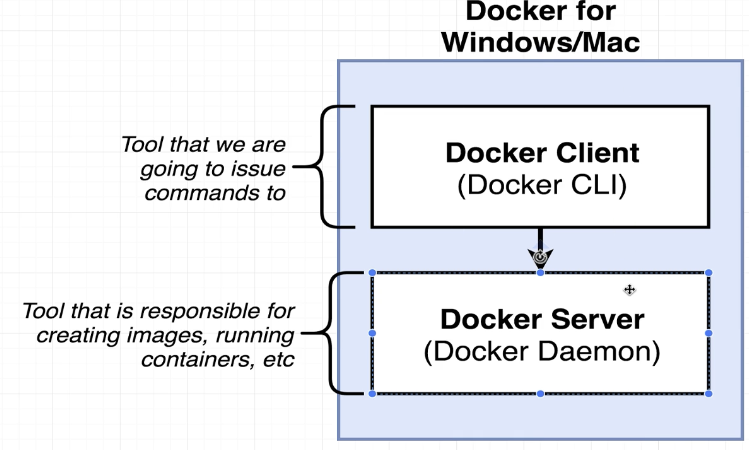

-: In the last section we tried to answer the question, -: 在上一节我们试图回答这个问题，

what is Docker? 什么是 Docker？

But we didn't really get a great explanation. 但我们并没有真正给出一个很好的解释。

We said, okay, it's a reference to a bunch of products. 我们说，好吧，这是对一堆产品的引用。

We then started to talk about something called an image 然后我们开始讨论一个叫做 image 的东西

and something called a container. 以及一个叫做 container 的东西。

At this point, we need to install 此时，我们需要安装

some more software onto our machine 更多软件到我们的机器上

so that you and I can work directly 以便你和我可以直接工作

with images and containers 带着镜像和容器

so that we can get a better idea of how they work. 以便我们能更好地了解它们的工作原理。

So here's what you and I are going to do. 那么我们要做的就是这些。

We're going to be installing a piece of software 我们要安装一款软件

called Docker for Windows, or Docker for Mac 叫做 Docker for Windows 或 Docker for Mac

depending upon your operating system. 具体取决于你的操作系统。

Inside of this program are two very important tools 在这个程序中有两个非常重要的工具

that we're going to be making use of throughout this course. 我们将在本课程中持续使用它们。

The first tool that's inside this package 这个包中包含的第一个工具

is something called the Docker client. 有一个东西叫做 Docker client。

The Docker client, also known as the Docker CLI Docker client，也称为 Docker CLI

is a program that you and I 是你和我都会使用的一个程序

are going to interact with quite a bit from our terminal. 将会在终端中频繁交互的内容。

We're going to enter in commands to our terminal, 我们将向终端输入命令，

issue them to Docker client. 并将这些命令发送给 Docker 客户端。

It's gonna take our commands 它会接受我们的命令

and figure out what to do with them. 并确定如何处理这些命令。

Now the Docker client itself 现在 Docker 客户端本身

doesn't actually do anything with containers or images. 实际上并不会对容器或镜像做任何操作。

Instead, the Docker client is really just a tool 相反，Docker 客户端实际上只是一个工具

or a portal of sorts to help us interact 或者说是一个门户，帮助我们进行交互

with another piece of software 与另一个软件组件

that is included in this Docker for Windows or Mac package 该组件包含在这个 Docker for Windows 或 Mac 包中

called the Docker server. 称为 Docker server。

This is also frequently called the Docker Damon. 这也常被称为 Docker Daemon。

This program right here is the actual tool 这个程序就是实际的工具

or the actual piece of software 或者实际的软件组件

that is responsible for creating containers, images, 负责创建容器、镜像的组件，

maintaining containers, uploading images, 维护容器、上传镜像的操作，

and doing just about everything you can possibly imagine 以及几乎你能想象到的所有其他事情

around the world of Docker. 围绕 Docker 的世界。

So it's the Docker client that you and I issue commands to. 因此它是你和我用来发送命令的 Docker 客户端。

It's a thing that we interact with. 它是我们与之交互的一个实体。

And behind the scenes, 而在幕后，

this client is interacting with the Docker server. 这个客户端正在与 Docker 服务器交互。

You and I are never going to really reach directly 你和我永远不会真正直接接触

out to this docker server. 连接到这个 docker 服务器。

It's something that's just kind of running it 它只是某种在后台运行的东西

behind the scenes. 在幕后。

So again, we're gonna take a quick break right now. 所以我们现在再次短暂休息一下。

We're gonna come back to the next section 我们将在下一部分回来

and we're going to start installing this package 然后我们将开始安装这个包

so that we can get a better sense 这样我们就能更好地了解情况

of how to work with images and containers. 关于如何处理镜像和容器。

So quick break and I'll see you in just a minute. 所以短暂休息一下，一分钟后见。