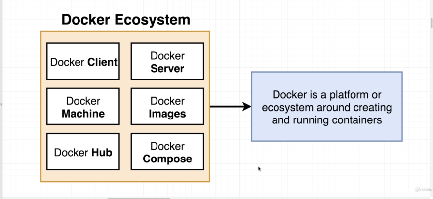
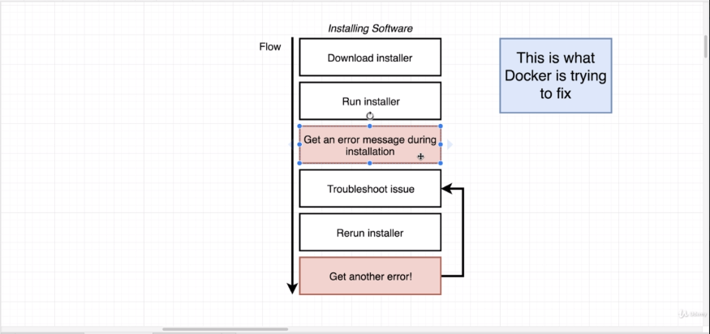
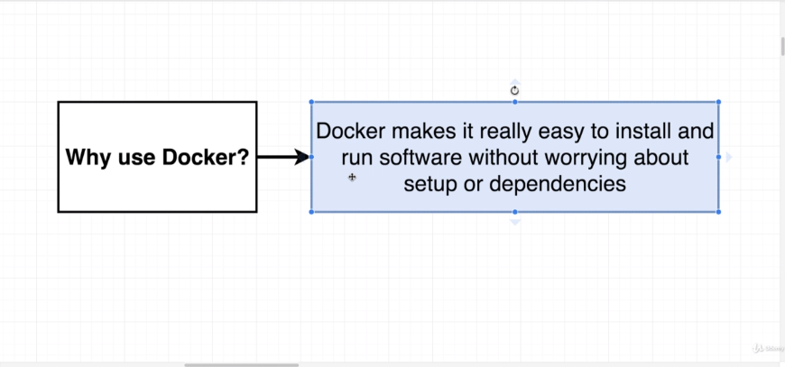

what is docker:  docker is a platform or ecosystem around creating and running containers

why use docker: docker wants to make it really easy and straight forward for run software or install in any computer as in webserer as well without worring about all bunch of setup or dependencies



-: Hello and welcome. -: 你好，欢迎。

In this section, I wanna start to tackle two 在本节中，我想开始着手解决两个

very important questions that we're going to be answering 我们将要回答的非常重要的问题

throughout this entire course. 在整个课程中。
贯穿整个课程。在整个课程中。

The two important questions are, what is Docker? 两个重要的问题是，什么是 Docker？
两个重要的问题是：什么是 Docker？

And secondly, why do we use Docker? 其次，我们为什么使用 Docker？

We're gonna first tackle why we use Docker 我们将先解决为什么使用 Docker 的问题

by going through a quick little demo right now. 通过现在进行一个简短的小演示来说明。

Now I'm gonna show you a little flow diagram 现在我要给你展示一个小流程图

and this is a flow of probably a process 这是一个可能的流程

you've gone through at least once in your life before. 你至少在人生中经历过一次。

It's a flow 这是一个流程

of installing software on your personal computer 在你的个人电脑上安装软件

and I bet at least once for you, this is what has happened. 我敢打赌你至少有一次遇到过这样的情况。

Maybe you have downloaded some installer, 也许你下载过某个安装程序，

you run that installer, and then inevitably 你运行那个安装程序，接着不可避免地

at some point in time 在某个时间点

you end up getting an error message during installation. 在安装过程中你最终会收到一条错误信息。

So what do you do? 那你做什么呢？

Well, you probably troubleshoot the issue 嗯，你大概会通过 Google 查找来排查问题

by looking on Google. ```text by looking on Google. ```

You try to find a solution, you eventually solve that issue. 你尝试寻找解决方案，最终解决了该问题。

You then rerun the installer only to find, 然后你重新运行安装程序，却发现，

hey, ta-da, 嘿，瞧， ta-da，  嘿，嗨，瞧，嗨，ta-da，

you have some other error appearing, and then you have to go 你会遇到其他错误，然后你必须
你遇到其他错误，然后你必须

through this entire troubleshooting process again. 再次经历整个故障排除过程。

So this is at its core what Docker is trying to fix. 这基本上就是 Docker 试图解决的问题。
这基本上就是 Docker 试图解决的问题。

Docker wants to make it really easy Docker 想要让在任何计算机上安装并运行软件变得非常简单

and really straightforward for you to install 并且真正直观地为你提供安装方法
并且对你来说安装非常简单、直观

and run software on any given computer. 以及在任何给定计算机上运行软件。

Not just your computer, not just your personal laptop, 不只是你的电脑，不只是你的个人笔记本，

your personal desktop, but on web servers as well 你的个人台式机，也同样适用于 Web 服务器

or any cloud based computing platform. 或任何基于云的计算平台。

I wanna give you a very quick demonstration 我想给你做一个非常简短的演示

of this flow right here in action, 展示这个流程在实际中的运行情况，

and then show you how quickly I can solve 然后向你展示我能有多快地解决问题

installing a problem whereas me installing 在我安装时出现了一个问题，而我正在安装

a piece of software by making use of Docker. 通过使用 Docker 安装一段软件。
通过使用 Docker 部署一段软件。

So I'm gonna very quickly go through the flow 所以我将非常快速地浏览这个流程

of installing a piece of software called Reddis. 安装一个名为 Reddis 的软件。
安装一个名为 Redis 的软件。

Reddis is an in-memory data store. Reddis 是一个内存数据存储。

We're going to be using it quite a bit 我们将会大量使用它

throughout this course, but for right now 在本课程中会一直用到它，但现在先这样

I just wanna give you a quick demo 我只想给你做一个快速演示

of how it can be a little bit challenging to get installed 说明一下它有时会有点难安装
说明它有时可能会有点难以安装。

on your own computer. 在你自己的电脑上。

So I'm just gonna go 所以我现在就要

through the installation steps here very quickly. 非常迅速地走一遍这里的安装步骤。

So this is the Reddis homepage. 所以这是 Redis 的首页。
所以这是 Redis 的首页。

This is the official download page. 这是官方的下载页面。

In theory, I could use the documentation here 理论上，我可以在这里使用文档。

to install Reddis on my local machine. 在我的本地机器上安装 Redis。

I'm gonna go down to the installation section 我要去安装部分  

and it very proudly says, 它非常自豪地写着，  

"Oh yeah just run these four commands right here, “哦，就是在这里运行这四条命令，

and boom that's pretty much it. 然后就这么搞定了。

You can then run Reddis." 接着你就可以运行 Reddis 了。”

So I'm gonna grab the first command right here. 我现在要复制第一个命令。

I'm gonna copy it 我会把它复制下来

and then I'm going to run it inside my terminal. 然后我会在终端里运行它。

So I'll paste, there's the same exact command. 我会粘贴，相同的命令。  

I'm gonna run it, and sure enough, yep 我要运行它，然后果然，是的

I get an error message. 我收到了一条错误信息。

Now in this case, the error message 现在在这种情况下，错误消息

is a little bit predictable. 有点可以预料。  

It's complaining about a program that is just 它在抱怨一个程序只是  

not installed on my local machine. 未安装在我的本地机器上。

Now, I could definitely go and troubleshoot this 现在，我当然可以去排查这个问题

install that program, and then try installing Reddis again, 安装那个程序，然后再尝试重新安装 Reddis，

but that's the whole point. 但这正是重点。  

You kinda get into this endless cycle 你会陷入这种无尽的循环

of trying to do all this troubleshooting 试图做所有这些故障排除

as you are installing and running software. 当你安装和运行软件时。  

So let me now show you how easy it is to run Reddis, 现在让我向你展示使用 Docker 时运行 Redis 是多么简单，

if you are making use of Docker instead. 如果你改为使用 Docker。  

I'm gonna go back over to my command line 我要回到我的命令行  

and I'm gonna run one single command. 然后我要运行一个命令。

I'll say Docker run, dash it, Reddis, like so. 我会输入 Docker run，后面跟 -it，Redis，就像这样。  

I'll hit enter, and then 我按回车，然后

after a very brief pause, almost instantaneously 几乎瞬间，在非常短的延迟后

I have an instance of Reddis up and running on my computer. 我的电脑上就有一个正在运行的 Redis 实例。

And that's pretty much it. 大致就是这样。  

That is Docker in a nutshell, 这就是 Docker 的精髓，
这就是 Docker 的精髓，

that is how easy it is to run software 运行软件就是这么简单
这就是使用 Docker 运行软件的简单程度

when you're making use of Docker. 当你在使用 Docker 时。
当你使用 Docker 时，就是这么容易。

So to answer the question very directly 所以，为了非常直接地回答这个问题

of why we use Docker, well, 关于我们为什么使用 Docker，好，

we make use of it because it makes life really easy 我们使用它是因为它让生活变得非常简单

for installing and running software without having to go 用于安装和运行软件，而不必去

through a whole bunch of setup 进行一大堆设置  

or installation of dependencies. 或安装依赖项。  

Now, we're gonna learn many more reasons 现在，我们将在本课程中学习更多我们使用 Docker 的原因

throughout this course of why we use Docker 贯穿整个课程，了解我们使用 Docker 的诸多原因

but I wanted to give you a very quick demo 但我想给你做一个非常简短的演示

and show you how easy it can be to get up and running 并向你展示在使用 Docker 时启动并运行一些新软件是多么容易

with some new piece of software when you are using Docker. 当你使用 Docker 时安装并运行一些新的软件组件会是多么简单

Let's take a quick pause right here. 我们在这里先稍作暂停。

We're gonna come back to the next section 我们将在下一部分回来  

and start trying to answer the question of what Docker is. 并开始尝试回答“什么是 Docker”这个问题。

So I'll see you in just a minute. 那么我一分钟后见