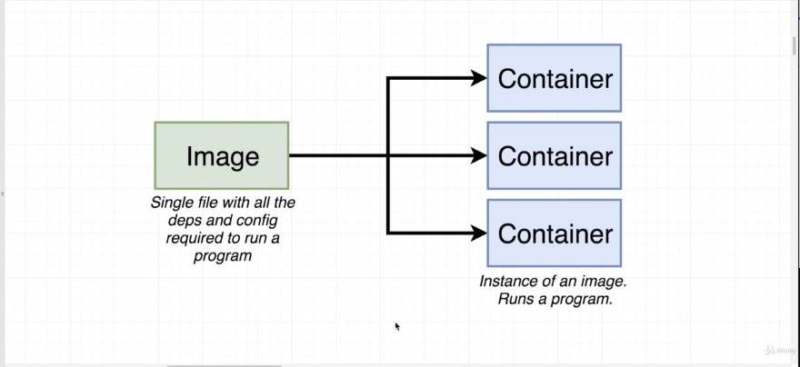

What is an Image in Docker?
Single file with all the dependencies and config or setup required to run a very specific program.

for example a NODEJS, NGINX, or REDIS etc

-: In the last section, -: 在上一节中，

we tried to answer the question of why use Docker? 我们尝试回答“为什么使用 Docker？”这个问题。

And we eventually said that we use Docker 最后我们得出的结论是我们使用 Docker

because it makes it really easy to install 因为它让在我们的电脑上安装变得非常容易

and run new software on our computer. 并运行新软件也很方便。

We're not gonna try to answer the other big question here, 我们不会在这里尝试回答另一个大问题，

which is, what is Docker? 那就是，什么是 Docker？

Well, this question is a lot more challenging to answer. 嗯，这个问题要难回答得多。

Anytime you see someone refer to Docker 每当你看到有人提到 Docker

in a blog post or an article 在博客文章或文章中

or a forum or wherever it might be, 或在论坛或其他任何地方，

they're kind of making reference to an entire ecosystem 他们在某种程度上是指整个生态系统

of different projects, tools, and pieces of software. 不同的项目、工具和软件组件。

So if someone says, "oh yeah, I use Docker on my project" 所以如果有人说，“哦，是的，我在我的项目中使用 Docker”

they might be referring to Docker client or a Docker server. 他们可能指的是 Docker 客户端或 Docker 服务器。

They might be referring to Docker hub or Docker Compose. 他们可能指的是 Docker Hub 或 Docker Compose。

Again, these are all projects, tools, pieces of software 同样，这些都是项目、工具、软件组件

that come together to form a platform or ecosystem 它们共同构成了一个平台或生态系统

around creating and running something called containers. 关于创建和运行称为容器的东西。

And so your immediate question might be, 所以你可能会立刻问，

Okay well what's a container? 好吧，那什么是容器？

That's a good question 这是个好问题

and that's a question 这确实是一个问题

that we're going to be trying to answer 我们将尝试去回答这个问题

throughout this entire course. 在整个课程中。

Just a moment ago, when I ran that command at my terminal 就在刚才，当我在终端运行那个命令时

of Docker run Redis, docker run redis，

it went through a little series of actions behind the scenes 它在后台执行了一系列小操作

and we're going to examine that entire series of actions 然后我们会检查那整套动作序列

very closely over time. 随着时间推移非常仔细地观察它。

But for right now, 但现在，

let me give you two important pieces of terminology. 让我给你两个重要的术语。

When I ran that command, 当我运行那个命令时，

something called the Docker CLI reached out 一个名为 Docker CLI 的东西发出了请求

to something called the Docker hub 到一个叫 Docker Hub 的东西

and it downloaded a single file called an image. 然后它下载了一个叫做 image 的单个文件。

An image is a single file containing all the dependencies image 是包含所有依赖项的单个文件

and all the configuration required 以及所有所需的配置

to run a very specific program. 以运行一个非常特定的程序。

For example, Redis, which is what the image 例如，Redis，这就是该镜像

that I just downloaded was supposed to run. 我刚下载的那个本该能运行。

This is a single file that gets stored on your hard drive. 这是一个会存储在你硬盘上的单个文件。

And at some point in time, 在某个时候，

you can use this image to create 你可以使用这个镜像来创建

something called a container. 称为容器的东西。

A container is an instance of an image 容器是镜像的一个实例

and you can kind of think of it 你可以把它想象成

as being like a running program. 像一个正在运行的程序。

We're gonna go into great detail over time, 我们会随着时间深入详解，

over behind to learn exactly how a container works exactly. 深入了解容器到底如何工作的后面部分。

But right now, all we really need to understand 但现在，我们真正需要理解的

is that a container is a program 是容器就是一个程序

with its own isolated set of hardware resources. 拥有自己隔离的一套硬件资源。

So it kind of has its own little set 所以它有点像拥有自己的一小套

or its own little space of memory, 或者它自己的一小片内存空间，

has its own little space of networking technology 有它自己的一小块网络技术空间

and its own little space of hard drive space as well. 以及自己的一小块硬盘空间。

Okay, so I didn't really answer the question here 好吧，所以我实际上并没有真正回答这个问题

of what Docker is, 关于 Docker 是什么，

but we did learn at least that a reference to Docker 但我们至少学到，提到 Docker

is really talking about a whole collection 实际上是在谈论一个完整的集合

of different projects and tools, 不同的项目和工具，

and we also picked up two important pieces of terminology, 我们还学到了两个重要的术语，

a docker image and a container. docker image 和 container。

Now these images and containers 现在这些镜像和容器

are the absolute backbone 是绝对的支柱

of what you and I are going to working with 我们将要一起处理的内容

throughout the rest of this course. 在本课程的其余部分。

So let's take a quick pause right now. 所以我们现在先稍作停顿。

We're gonna come back to the next section 我们将在下一部分回来

and we're gonna start talking a little bit more 然后我们将开始更多地讨论一些内容

about how we work with images and containers. 关于我们如何处理镜像和容器。

So quick break and I'll see you in just a minute. 所以短暂休息一下，一分钟后见。

