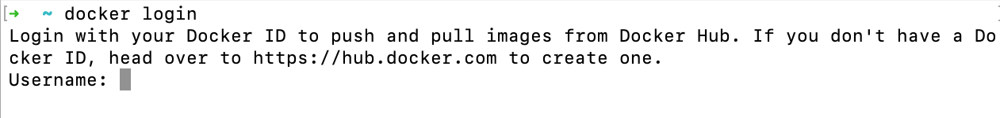

Installing Docker on macOS
在 macOS 上安装 Docker
This note will provide detailed steps and instructions to install Docker and signup for a DockerHub account on macOS. We will need a DockerHub account so that we can pull images and push the images we will build.
本文将提供在 macOS 上安装 Docker 并注册 DockerHub 帐户的详细步骤和说明。我们需要一个 DockerHub 帐户，以便拉取镜像并推送我们将构建的镜像。

Register for a DockerHub account
注册 DockerHub 帐户

Visit the link below to register for a DockerHub account (this is free)
访问以下链接注册 DockerHub 帐户（免费）

https://hub.docker.com/signup

Navigate to the Docker Desktop installation page
转到 Docker Desktop 安装页面

https://www.docker.com/products/docker-desktop/

Select your Chip  选择你的芯片

Click the button that corresponds with the chip of your computer. If you have an M1 or M2 machine, you will need to click the Mac with Apple Chip button. Everyone else will need to click the Mac with Intel Chip button.
点击与您电脑芯片相对应的按钮。如果您使用的是 M1 或 M2 机器，则需要点击“带 Apple 芯片的 Mac”按钮。其他人则需要点击“带 Intel 芯片的 Mac”按钮。

Double-click the Docker.dmg file in your Downloads
在“下载”中双击 Docker.dmg 文件

Drag and drop the Docker icon to the Applications folder
将 Docker 图标拖放到 Applications 文件夹中

Go to Applications and double-click click the Docker icon:
打开“应用程序”，双击 Docker 图标：

Select "Open" in the "Are you Sure you want to open it" prompt
在“您确定要打开它吗”提示中选择“打开”

Click "Accept" to the Service Agreement
点击“接受”服务协议

Click "OK" to "Docker Desktop needs privileged access" prompt
在“Docker Desktop 需要特权访问”提示上点击“确定”

Enter your computer's username and password to install the helper
输入你的电脑用户名和密码以安装辅助工具

Docker Desktop will launch for the first time
Docker Desktop 将首次启动

If the installation was successful, Docker Desktop will launch and present you with a tutorial. You are free to skip this.
如果安装成功，Docker Desktop 会启动并向你展示一个入门教程。你可以选择跳过该教程。

Check that Docker is working
检查 Docker 是否正常运行

Open your Terminal application and run the docker command. If all is well you should see some helpful instructions in the output similar to below. 
打开终端应用并运行 docker 命令。如果一切正常，你应该在输出中看到类似下面的一些有用说明。

Log in to Docker  登录 Docker

Using your Terminal Application run the docker login command. You will be prompted to enter the Username and password (or your Personal Access Token) you created in step #1 when registering for a DockerHub account.
在你的终端应用中运行 docker login 命令。系统会提示你输入在第 1 步注册 DockerHub 账户时创建的用户名和密码（或你的个人访问令牌）。

Once you see Login Succeeded, the setup is complete and you are free to continue to the next lecture.
一旦看到 Login Succeeded，说明设置完成，你可以继续下一节课程。
