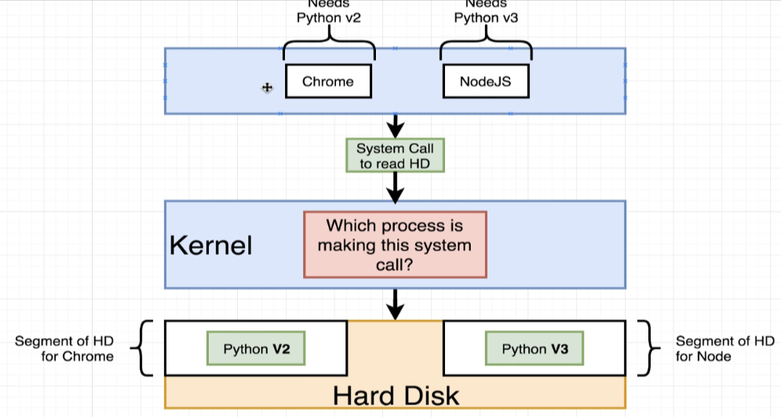

-: In the last section, -: 在上一节中，

we continue to talk a little bit about images 我们继续稍微聊一下镜像

but we're still surprising light 但我们仍然对容器到底是什么的某些细节讲得比较简略

on some of the details around exactly what a container is. 关于容器究竟是什么的一些具体细节我们仍然讲得比较轻略

So, in this section, 那么，在本节中，

I'm gonna give you a behind the scenes look 我要带你看一看幕后，

at what a container is, 容器到底是什么，

and how it is created on your machine. 以及它在你的机器上是如何创建的。

Now, to understand the container, 现在，为了理解容器，

you first need to have a little bit of background 你首先需要有一些背景知识

on exactly how your operating system runs on your computer. 关于你的操作系统在你的计算机上究竟如何运行的详细信息。

So, I'm gonna first give you a quick overview 所以，我先给你一个快速概览

of your operating system. 关于你的操作系统。

Okay, so this is a quick overview 好，那么这是一个快速概览

of the operating system on your computer. 关于你电脑上的操作系统。

Most operating systems have something called a kernel. 大多数操作系统都有一个称为内核的东西。

This kernel is a running software process 这个内核是一个正在运行的软件进程

that governs access between all the programs 它管理着你电脑上所有正在运行的程序之间的访问

that are running on your computer 这些程序正在你的电脑上运行

and all the physical hardware 以及所有连接到你计算机的物理硬件

that is connected to your computer as well. 也连接到你的计算机。

So, up here at the top of this diagram, 所以，在这个图的顶部，

We have different programs that your computer is running 我们有不同的程序在你的计算机上运行

such as Chrome, or Terminal, Spotify, or Node.js. 比如 Chrome、Terminal、Spotify，或者 Node.js。

If you've ever made use of Node.js before 如果你以前用过 Node.js

and you've written a file to the hard drive, 并且你已经将一个文件写入了硬盘，

it's technically not Node.jS 从技术上讲这不是 Node.js

that is speaking directly to the physical device. 直接与物理设备通信。

Instead, Node.js says to your kernel, 相反，Node.js 会对内核说，

"Hey, I want to write a file to the hard drive." “嘿，我想把一个文件写到硬盘上。”

The kernel then takes that information 然后内核接收该信息

and eventually persist it to the hard disc. 并最终将其持久化到硬盘。

So, the kernel is always kind of this intermediate layer 因此，内核总是某种中间层

that governs access between these programs 负责管理这些程序之间的访问权限

and your actual hard drive. 以及你的实际硬盘。

The other important thing to understand here 这里需要理解的另一件重要事情是

is that these running programs interact with the kernel 这些正在运行的程序与内核进行交互。

through things called system calls. 通过称为系统调用的东西。

These are essentially like function invocations. 这些本质上就像函数调用。

The kernel exposes different endpoints to say, 内核公开不同的端点来表示，

"Hey, if you want to write a file to the hard drive, “嘿，如果你想把文件写入硬盘，

call this endpoint or this function right here." 调用这个端点或这个函数就行了。”

It takes some amount of information 它需要一定量的信息

and then that information will be eventually written 然后这些信息最终会被写入

to the hard disc, or memory, or whatever else is required. 硬盘、内存或其他任何所需的地方。

Now, thinking about this entire system right here, 现在，考虑一下整个这个系统，

I wanna post a kind of hypothetical situation to you. 我想向你提出一种假设性的情境。

I want you to imagine for just a second 我希望你能想象一下，就一会儿而已

that you and I have two programs running on our computer. 你我在电脑上各自运行着两个程序。

Maybe one of them is Chrome, like Chrome the web browser 也许其中一个是 Chrome，比如网页浏览器 Chrome

and the other is Node.js, 另一个是 Node.js，

the JavaScript Service-side run time. 即 JavaScript 的服务端运行时。

I want you to imagine that we're in a crazy world 我想让你想象我们身处一个疯狂的世界

where Chrome, in order to work properly, 其中 Chrome 为了正常工作，

has to have Python version 2 installed 必须安装 Python 2 版本

and Node.js has to have version 3 installed. 并且 Node.js 必须安装版本 3。

However, on our hard disc, 然而，在我们的硬盘上，

we only have access to Python version 2. 我们只能使用到 Python 版本 2。

And for whatever crazy reason, 而出于某种奇怪的原因，

we are not allowed to have two identical installations 我们不被允许同时存在两个完全相同的 Python 安装

of Python at the same time. 。

So, as it stands right now, Chrome would work properly 所以，照目前的情况来看，Chrome 会正常工作

because it has access to version 2, 因为它可以访问版本 2，

but Node.js would not 但 Node.js 不会

because we do not have a version or a copy 因为我们没有这个版本或副本

of Python version 3. Python 3 版本。

Again, this is a completely make belief situation. 再次声明，这是一个完全虚构的情境。

I just want you to kind of consider this for a second 我只是想让你考虑一下这个问题

'cause this is kind of leading into what a container is. 因为这有点引出什么是容器。

So, how could we solve this issue? 那么，我们怎样才能解决这个问题呢？

Well, one way to do it would be used 嗯，一种方法是使用

to make use of a operating system feature 利用操作系统的一项特性

known as namespacing. 称为命名空间（namespacing）。

With namespacing, 使用命名空间时，

we can look at all of the different hardware resources 我们可以查看所有不同的硬件资源

connected to our computer 已连接到我们的计算机

and we can essentially segment out portions 并且我们基本上可以分割出这些资源的部分

of those resources. 那些资源的部分。

So, we could create a segment of our hard disc 所以，我们可以在我们的硬盘上创建一个分区

specifically dedicated to housing Python version 2. 专门用于托管 Python 2 版本。

And we could make a second segment 我们可以再创建第二个段

specifically dedicated to a housing Python version 3. 专门用于托管 Python 3 版本。

Then, to make sure that Chrome has access 然后，为确保 Chrome 能够访问

to this segment over here 到这部分这边

and Node.js has access to this segment over here, 并且 Node.js 可以访问这里的这个段。

anytime that either of them issues a system call 任何一方发出系统调用的任何时候

to read information off the hard drive, 从硬盘读取信息时，

the kernel will look at that incoming system call 内核会查看该传入的系统调用

and try to figure out which process it is coming from. 并试着找出这是哪个进程发出来的。

So, the kernel could say, 所以，内核可能会说，

"Okay, if Chrome is trying to read some information “好吧，如果 Chrome 试图读取一些信息

off the hard drive, I'm gonna direct that call 从硬盘上，我会把那个调用

over to this little segment of the hard disc over here, 转到这小段硬盘区域，

the segment that has Python version 2 and Node.js." 也就是包含 Python 2 和 Node.js 的那段。

Anytime that makes a system call to read the hard drive, 任何时候进行系统调用以读取硬盘时，

the kernel can redirect that over to this segment 内核可以将其重定向到这个段

for Python version 3. 用于 Python 版本 3。

And so by making use of this kind of namespacing 因此，通过使用这种命名空间

or segmenting feature, 或分段功能，

we can have the ability to make sure that Chrome 我们就能够确保 Chrome

and Node.js are able to work on the same machine. 并且 Node.js 能在同一台机器上运行。

Now again, in reality, 现在再次强调，实际上，

neither of these actually needed installation of Python. 这两者都不需要安装 Python。

This is just a quick example. 这只是一个快速示例。

So, this entire process of kind of segmenting a hard, 所以，这整个将一个硬件资源基于进程进行划分的过程，

excuse me, a hardware resource based on the process 抱歉，我的意思是，基于进程对硬件资源进行划分的过程。

that is asking for it is known as namespacing. 这被称为命名空间。

With name spacing, we are allowed to isolate resources 通过命名空间，我们可以隔离资源

per a process or a group of processes, 针对某个进程或一组进程，

and we're essentially saying that anytime 以及我们的基本意思是，每当

this particular process asks for a resource, 这个特定进程请求某个资源时，

we're gonna direct it to this one little specific area 我们都会把它引导到这一小块特定区域

of the given piece of hardware. 给定硬件部分。

Now, namespacing is not only used for hardware, 现在，命名空间不仅用于硬件，

it can be also used for software elements as well. 它也可以用于软件元素。

So for example, we can namespace a process 例如，我们可以为一个进程设置命名空间

to restrict the area of a hard drive that'd be available, 以限制其可访问的硬盘区域，

or the network devices that are available, 或可用的网络设备，

or the ability to talk to in other processes, 或在其他进程中通信的能力，

or the ability to see other processes. 或查看其他进程的能力。

These are all things that we can use namespacing 这些都是我们可以使用命名空间的情况

for to essentially limit the resources 用于本质上限制资源

or kind of redirect request for resource 或在某种程度上重定向对资源的请求

from a particular process. 来自特定进程。

Very closely related to this idea of namespacing 与命名空间这一概念密切相关的

is another feature called control groups. 是另一个称为控制组的功能。

A control group can be used to limit the amount 控制组可用于限制资源使用量，例如 CPU、内存、磁盘 I/O 等。

of resources that a particular process can use. 某个进程可以使用的资源集合。

So, namespacing is for saying, 因此，命名空间的作用是表明，

"Hey, this area of the hard drive is for this process." “嘿，这块硬盘区域是给这个进程用的。”

A control group can be used to limit the amount of memory 可以使用控制组限制进程可使用的内存量

that a process can use, the amount of CPU, 可使用的 CPU 量，

the amount of hard drive input, input. 以及硬盘输入/输出量。

Or excuse me, input output, 或者抱歉，输入输出，

and the amount of network bandwidth as well. 以及网络带宽的数量。

So, these two features put together can be used 因此，这两个功能结合起来可以用于

to really kind of isolate a single process 真正做到隔离单个进程

and limit the amount of resources it can talk to, 并限制它可以访问的资源量，

and the amount of bandwidth essentially, 以及基本上的带宽量，

that it can make use of. 它可以利用。

Now, as you might imagine, 现在，正如你可能想象的，

this entire kind of little section right here, 这一整小节就在这里，

this entire vertical of a running process, 这个正在运行的进程的整个纵向空间，

plus this little segment of a resource that it can talk to 加上它可以访问的这个小片段的资源

is what we refer to as a container. 就是我们所说的容器。

And so, when people say, 所以，当人们说，

"Oh yeah, I have a Docker Container." “哦，是的，我有一个 Docker 容器。”

You really should not think of these 你真的不应该把这些想象成这些

as being like a physical construct 被描述为像一个物理结构

that exists inside of your computer. 存在于你的计算机内部。

Instead, a container is really a process 相反，容器实际上只是一个进程

or a set of processes that have a grouping of resources 或一组拥有资源分组的进程

specifically assigned to it. 专门分配给它。

And so, this is the diagram 因此，这是该图示

that we're gonna be looking at quite a bit 我们会频繁查看的内容

anytime that we think about a container. 每当我们考虑容器时。

We've got some running process 我们有一些正在运行的进程

that sends a system call to a kernel. 它向内核发送了一个系统调用。

The kernel is going to look at that incoming system call 内核会查看该传入的系统调用

and direct it to a very specific portion of the hard drive, 并将其指向硬盘的一个非常特定的部分，

the RAM, CPU or whatever else it might need. 所需的内存、CPU 或其他任何资源。

And a portion of each of these resources 以及这些资源的其中一部分

is made available to that singular process. 会被分配给那个单独的进程。

Now, the last question you might have here is, 现在，你可能最后一个问题是，

"Okay. Well, I get what a container is, “好吧，我明白容器是什么，

but with that in mind, 但考虑到这一点，

what is the real relation between one of those containers 那些容器中的一个之间的真实关系是什么

or that kind of singular process 或者那种单一进程

and grouping of resources to an image? 与将资源分组到镜像之间的关系是什么？

How is that single file eventually create this container?" 那个单一文件最终如何创建出这个容器？

That's a good question. 这是个好问题。

One more quick diagram. 再来一个简短的图示。

Anytime that we talk about an image, 每当我们谈论镜像时，

we're really talking about a file system snapshot. 实际上我们是在谈论文件系统的快照。

So, this is essentially kind of like a copy paste 所以，这本质上有点像复制粘贴

of a very specific set of directories or files. 一组非常特定的目录或文件。

And so we might have an image 因此我们可能会有一个镜像

that contains just Chrome and Python. 其中只包含 Chrome 和 Python。

An image will also contain a specific startup command. 镜像还会包含一个特定的启动命令。

So, here's what happens behind the scenes 那么，幕后发生的就是这样

when we take an image and turn it into a container. 当我们拿一个镜像并把它变成容器时。

First off, 首先，

the kernel is going to isolate a little section 内核将隔离硬盘的一小部分

of the hard drive ----

and make it available to just this container. 并且只对这个容器可用。

And so we can kind of imagine 所以我们可以有点想象

that after that little subset is created, 在那个小子集创建之后，

the file snapshot inside the image is taken 镜像内的文件快照被捕获

and placed into that little segment of the hard drive. 并放置到那小段硬盘里。

And so, now, 所以，现在，

inside of this very specific grouping of resources, 在这个非常特定的资源分组内部，

we've got a little section of the hard drive 我们有硬盘上的一小部分

that has just Chrome and Python installed 上面只安装了 Chrome 和 Python

and essentially, nothing else. 并且，本质上，别无其他。

The startup command is then executed 然后执行启动命令

which we can kind of imagine 我们可以某种程度上想象出这一步骤

this case is like startup Chrome, 这个情况就像启动 Chrome，

just Chrome for me. 只是为我启动的 Chrome。

And so Chrome is invoked, 于是 Chrome 被调用，

we created a new instance of that process 我们创建了该进程的一个新实例

and that created process is then isolated 然后该创建的进程就被隔离

to this set of resources inside the container. 到容器内部的这组资源中。

So, that's pretty much it. 就这些了。

That is the relationship between a container and an image, 这就是容器与镜像之间的关系，

and it's how an image is eventually taken 以及镜像最终如何被拿来

and turned into a running container. 并转换成正在运行的容器。

Now, there's still a tremendous amount more to learn 现在，还有大量内容需要学习

about containers and images. 关于容器和镜像。

So, let's take a quick break 所以，我们来稍作休息

and continue in the next section. 并在下一部分继续。