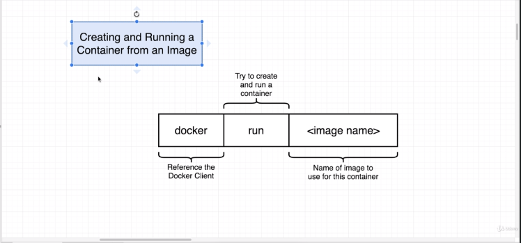
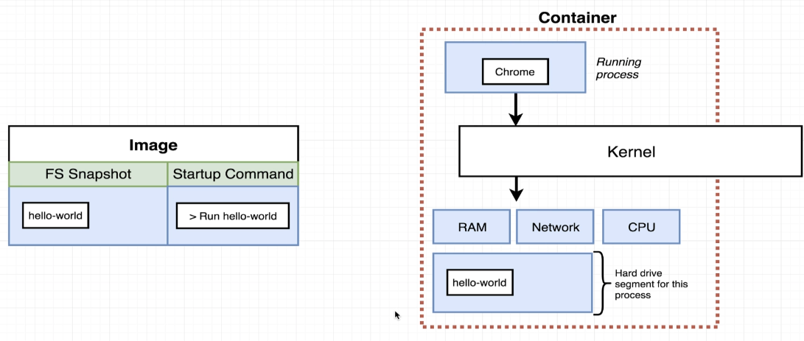
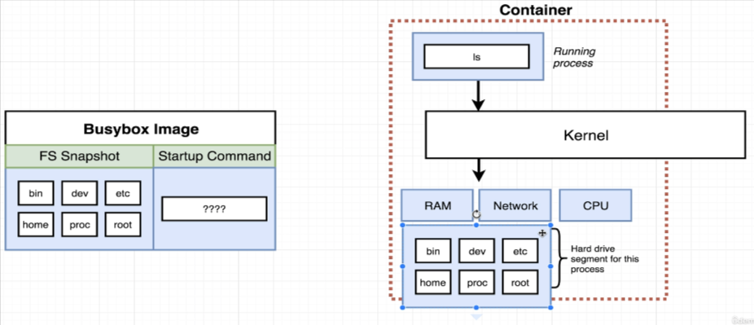
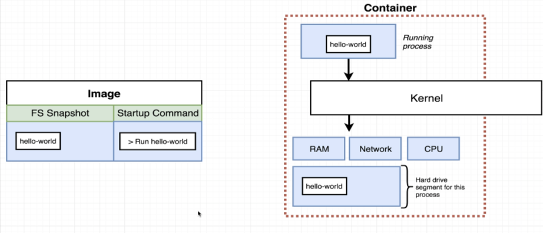

-: Starting this section and the next couple, -: 开始本节以及接下来的几节，

we're gonna start to look at 我们将开始查看

the Docker client or Docker CLI Docker client 或 Docker CLI

inside of our terminal a little bit more 在我们的终端里多操作一点

and learn about some of the very basic commands 并了解一些我们用来与 Docker 容器和镜像交互的非常基础的命令

that we used to interact with Docker containers and images. 这些命令是我们用来与 Docker 容器和镜像交互的。

Now, fair warning here, some of these sections 现在，先提醒一下，这里有些章节

are gonna be a little bit boring 会有点无聊

cause we're essentially just gonna be typing in commands 因为我们基本上只是要输入命令

and looking at the output that comes. 并查看产生的输出。

But I'm gonna do my best to make sure 但我会尽最大努力确保

to share a lot of interesting information 分享大量有趣的信息

with you along the way. 一路与你同行。

So let's get to it. 那我们开始吧。

The first command that we're gonna look at 我们要看的第一个命令

is one that we ran very briefly before, 是我们之前非常短暂运行过的那个，

is the command that we're going to use to run, excuse me, 是我们将用来运行的命令，抱歉，

to create and run a container using an image. 用来基于镜像创建并运行一个容器。

So at the command line, we're going to execute docker, run, 所以在命令行中，我们将执行 docker run，

and then the name of the image that we want to use 然后是我们要使用的镜像名称

as the basis for this container. 作为此容器的基础。

Now, we've already gone through this process once before. 现在，我们之前已经经历过一次这个过程。

At the command line, we ran Docker, run, Hello Dash world 在命令行中，我们运行了 Docker run hello-world

and then we saw that message appear on the screen. 然后我们看到那条消息出现在屏幕上。

Now, using the knowledge that you now have 现在，利用你目前所掌握的知识

about what a Docker container really is, 关于 Docker 容器到底是什么，

I want you to think about what probably just occurred 我希望你思考一下刚刚很可能发生了什么

when we ran that command. 当我们运行那个命令时。

Chances are that somewhere on our hard disc 很可能在我们的硬盘某个地方

is an image that has that file system snapshot 有一个包含该文件系统快照的镜像

with one single program inside of it. 里面只有一个程序。

Maybe that thing is called, I don't know, Hello world. 也许那个东西叫，我不知道，Hello world。

Who knows what it's really called. 谁知道它真正叫啥。

So when we executed Docker Run Hello World, 所以当我们执行 Docker Run Hello World 的时候，

we took that little snapshot of the hard drive. 我们截取了硬盘的那个小快照。

We stuck it into this little container thing 我们把它塞进这个小容器东西里

or this kind of grouping of resources, 或者这种资源分组，

and then we executed the command run Hello World. 然后我们执行了命令 run Hello World。

And so the running process up here was Hello world. 所以上面正在运行的进程是 Hello world。

That thing ran and then eventually exited. 那个东西运行了一会儿，然后最终退出了。

So that's what is happening behind the scenes 所以这就是幕后发生的情况

when you execute that command. 当你执行那个命令时。

Now there's a lot of variations on this Docker run command 现在对这个 Docker run 命令有很多变体

and a lot of very small subtleties around it. 并且围绕它有许多非常细微的差别。

So let's take a quick pause. 所以我们先短暂停一下。

We're gonna come back to the next section. 我们将在下一节回过头来。

We're gonna start looking at 我们将开始查看

some of the interesting features around the run command. 关于 run 命令的一些有趣特性。

So I'll see you in just a minute. 那么我一分钟后见。

