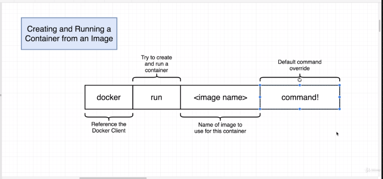

```
docker run busybox echo hello world!
```

-: In this section, we're going to continue looking -: 在本节中，我们将继续查看

at the docker run command or some slight variations of it. docker run 命令及其一些稍微不同的变体。

Now, before I show you the next kind of variations command 现在，在我展示下一类变体命令之前

that we're gonna look at, 我们要看的是，

I wanna give you one quick reminder. 我想先给你一个简短的提醒。

Remember, any time that we execute docker run with an image, 记住，每当我们用一个镜像执行 docker run 时，

we not only get that file system snapshot, 我们不仅得到了那个文件系统快照，

but we also get this default command 而且我们还得到了这个默认命令

that is supposed to be executed 它应该被执行

after the container is created. 在容器创建之后。

So, the variation on docker run that we're gonna look at 所以，我们将要看的 docker run 变体

is gonna give you a way to override 将为你提供一种覆盖的方式

this default startup command. 这个默认的启动命令。

Here's how we do it. 下面是我们的操作方法。

We'll execute docker run, the image name, 我们将执行 docker run，镜像名称，

just like we did before, 就像我们之前那样，

and then after that we'll supply a alternate command 然后在那之后我们会提供一个备用命令

to be executed inside the container after it starts up. 在容器启动后在其中执行。

This is an override. 这是一个覆盖（override）。

So, whatever default command is included inside of the image 所以，镜像内包含的任何默认命令

is not going to be executed. 都不会被执行。

Let's try this out right now and just see how it works. 现在就试一试，看看它是如何工作的。

All right, so I'm going to find my terminal 好，我要去打开我的终端

and I'm gonna execute docker run, 然后我要执行 docker run，

and now I'm going to specify my image. 现在我要指定我的镜像。

We're gonna use a different image than what we used before. 我们将使用与之前不同的镜像。

We're gonna use an image called busybox, 我们将使用一个名为 busybox 的镜像，

and I'll tell you why in just a moment. 稍后我会告诉你原因。

After that, we'll list out the alternate command 在那之后，我们将列出替代命令

to execute inside the container after it is created. 用于在容器创建后在其中执行。

And so, I'm gonna say that I want to run a command, 所以，我要说我想运行一个命令，

echo hi there. echo hi there.

So, this right here is the override. 所以，这里就是覆盖（override）。

This is a command that we executed inside that container. 这是我们在该容器内部执行的一个命令。

The echo command is going to print out echo 命令会在我的终端中打印出

"hi there" inside my terminal. "hi there"

So, if this works the way we would expect 所以，如果这按我们预期的那样工作

I'll see the text "hi there" appear. 我会看到文本“hi there”出现。

So, I'm gonna run that and sure enough, yep, we see that. 所以，我要运行它，果然，没错，我们看到了。

We can change the text provided here 我们可以更改此处提供的文本

to the echo command as much as we please. 到 echo 命令，随意修改。

So I could say, "bye there," or I could say, "how are you?" 所以我可以说，“拜了”，也可以说，“你好吗？”

You get the idea. 你明白了。

Now, I wanna show you a small variation on that command, 现在，我想给你展示该命令的一个小变体，

and this is going to start to make things 这将开始让事情

a little bit more interesting 稍微有意思一点

than just kind of echoing text back over to you. 而不仅仅是把文本回显给你。

I want you to run docker run, busybox, 我想让你运行 docker run busybox

and then the override command that we're gonna use this time 然后这次我们要使用的 override 命令

is going to be ls. 将会是 ls。

If you've never used ls before, 如果你以前从未使用过 ls，

it's gonna print out all the files and folders 它会打印出所有文件和文件夹

inside of a given directory. 给定目录中的内容。

So, let's try running this and see what happens. 好了，我们来运行看看会发生什么。

So, according to our docker container, 因此，根据我们的 docker 容器，

when we print out our files and folders, 当我们打印出我们的文件和文件夹时，

we have bin at C, dev, home, proc, root, 我们在 C 处有 bin、dev、home、proc、root，

system, user and var. system、user 和 var。

These are all folders right here. 这些都是这里的文件夹。

And, if you are on, say, a Windows machine right here, 而且，如果你在这里使用的是一台 Windows 机器，

these folders might look very strange to you 这些文件夹看起来可能非常奇怪

and very unfamiliar. 并且非常陌生。

So, in fact, these are folders that are being printed out 所以，实际上，这些是正在被打印出来的文件夹

that are not belonging to you on your computer. 不属于你但存在于你电脑上的那些。

These are folders that exist solely inside that container. 这些文件夹仅存在于该容器内部。

I wanna remind you about exactly what happens 我想提醒你确切会发生什么

when we create a container out of an image. 当我们从镜像创建容器时。

So, over here we've got the busybox image, 所以，在这里我们有 busybox 镜像，

it has some default file system snapshot 它有一些默认的文件系统快照

and some presumably default command. 还有一些大概是默认的命令。

You know, who knows what it is off top of my head 你知道的，我也不确定它到底是什么

but it definitely has this default file system snapshot. 但它肯定有这个默认的文件系统快照。

The busybox image has default folders busybox 镜像有默认的文件夹

of bin, dev, at C, home, proc, root, and so on. 包括 bin、dev、etc、home、proc、root 等等。

All the ones that you see listed right here. 就是你在这里看到列出的所有那些。

So, when we create a new container out of that image, 所以，当我们用那个镜像创建一个新容器时，

we take this file system snapshot, 我们会获取这个文件系统快照，

we stick it in as the folder for that container, 把它作为该容器的文件夹放进去，

and then the command that we execute is ls. 然后我们执行的命令是 ls。

So we list out all the files and folders 所以我们列出所有的文件和文件夹

inside of our hard drive, 在我们的硬盘中，

which then prints out bin, dev, at C home, proc and route. 然后它会打印出 bin、dev、at C home、proc 和 route。

So, that's pretty much it. 就这些了。

Now, one thing you might be a little bit curious about 现在，有一件事你可能有点好奇

is why we chose to use the busybox image here 那就是我们为什么在这里选择使用 busybox 镜像

as opposed to the hello world one that we were using before. 而不是我们之前使用的 hello world 镜像。

Well, let's go back over to our terminal really quickly 好，我们现在快速回到终端

and we're gonna try running hello world with the ls command. 我们要尝试用 ls 命令运行 hello world。

So I'll do a docker run, hello dash world, 所以我会运行 docker run hello-world，

and I'll do ls right here. 然后我就在这里执行 ls。

And you're gonna very quickly 你会很快地...

see that we get a kind of nasty error message. 看到我们会得到一种讨厌的错误信息。

Well, let's try doing the echo command and see what happens. 好了，我们试着执行 echo 命令看看会发生什么。

I'll do docker run, hello world, echo hi there, 我将运行 docker run hello world echo hi there

and we get a very similar error message here as well. 并且我们在这里也得到了非常相似的错误信息。

So, what's going on? 那么，发生了什么？

Well, here's the issue. 好吧，问题在这里。

When we run the alternate commands or those alternate echo 当我们运行替代命令或那些替代的 echo

and ls commands with busybox, 以及带有 busybox 的 ls 命令时，

those commands work 这些命令都能正常工作

because ls and echo are two programs that exist 因为 ls 和 echo 是两个存在的程序

inside of the busybox file system image. 在 busybox 文件系统镜像内部。

Somewhere inside of this folder system right here 就在这个文件夹系统的某个地方这里

is a ls command or an actual ls executable 是一个 ls 命令还是一个实际的 ls 可执行文件

and a echo executable as well. 以及一个 echo 可执行文件。

And so we can safely execute those commands with busybox 因此我们可以安全地使用 busybox 来执行这些命令

because those are programs 因为那些是程序

that exist inside this file system. 它们存在于这个文件系统内。

However, with our hello world program over here, 然而，对于我们这里的 hello world 程序，

the only thing that exists inside this file system snapshot 此文件系统快照中唯一存在的东西

is a single program, like one single file 是一个单一的程序，就一个单独的文件

and all that thing does is echo out 而那东西所做的就是输出（echo）

or kind of print out that singular message 或以某种方式打印出那条单一消息

that we saw when we ran that container. 就是我们运行该容器时看到的那条消息。

So, these startup commands that we are executing 因此，我们正在执行的这些启动命令

are being based upon the file system 基于文件系统

included with the image. 随镜像一起包含。

And if we try to execute a command inside the container 如果我们尝试在容器内执行命令

that uses a program that is not contained 使用一个不在此文件系统内的程序

within this file system, we're going to see that air. 我们将看到那种情况。

Okay, so a little bit more on docker run command. 好，那么再多说一点关于 docker run 命令。

Let's take another quick break right now 我们现在再快速休息一下

and continue in the next section. 并在下一部分继续。


