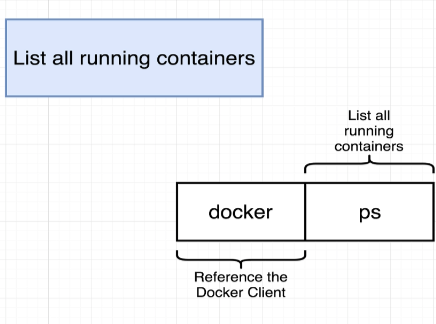

```
docker ps

#or

docker ps --all

```

-: In this section, we're gonna take another look at -: 在本节中，我们将再次回顾

a very commonly used command. 一个非常常用的命令。

So the command that we're gonna look at is Docker PS. 所以我们要看的命令是 Docker PS。

This command will list all 此命令将列出所有

the different running containers that are 正在运行的不同容器

currently on your machine. 当前在你的机器上。

Let's try running it right now and just seeing what happens. 让我们现在就试着运行它，看看会发生什么。

I'll flip on over to my terminal 我切换到我的终端

and I'll run Docker PS. 然后我运行 Docker PS。

When I run this command 当我运行这个命令

you're gonna see some headers for a table. 你会看到一些表格的表头。

At present we have no containers running our machine, 目前我们机器上没有正在运行的容器，

so we have no entries inside this table. 所以这个表里没有任何条目。

At this point, we've only been running images 到目前为止，我们只运行过镜像

or creating containers that run very quickly 或者创建那些运行得很快的容器

and then immediately close down. 然后立即关闭。

So for example, when we were running Docker run BusyBox 例如，当我们运行 Docker run BusyBox

and Echo High there, that container starts up 以及那里 Echo High 时，那个容器就会启动。

and then almost immediately exits us back to 然后几乎立即将我们带回到

the command line. 命令行。

So if we want Docker PS to be meaningful at all, 因此，如果我们希望 Docker PS 有任何意义，

we have to have some container that is running for 我们必须让某个容器保持运行状态

some longer amount of time. 运行更长一段时间。

In order to get a container running a little bit longer 为了让容器运行得稍微久一些

we could substitute the command that is executed when 我们可以替换在

that container starts up. 该容器启动时执行的命令。

So rather than running Echo High there, 所以不是在那里运行 Echo High，

I'll try Docker run BusyBox, 我会尝试运行 Docker run BusyBox，

and then I'll do Ping Google.com. 然后我会执行 Ping Google.com。

This is a command that's going to attempt to 这是一个将尝试执行的命令

ping Google servers and measure the amount of latency. ping Google 服务器并测量延迟量。

It's a command that's going to continue running 这是一个会持续运行的命令

for a quite a long time. 会运行相当长的一段时间。

So here it is running right here, and as you can see 所以它就运行在这里，如你所见

it takes about two or three milliseconds 大约需要两到三毫秒

for me to ping Google and get a response back. 让我能够 ping Google 并收到回应。

This command is going to continue running 此命令将继续运行

so we can now run Docker PS in a second window 所以我们现在可以在第二个窗口运行 Docker PS

and we should see this container up here in the listing. 我们应该在列表中看到这个容器在上方运行。

I'm gonna open up a second terminal window 我要打开第二个终端窗口

and then I'll execute Docker PS. 然后我会执行 Docker PS。

And when I do so, I'll then see that running container. 当我这么做时，就会看到正在运行的容器。

I'm gonna get this on one line really quickly. 我会很快把它放到一行上。

There we go. 好了。

So this is a print up for the container that is 所以这是这个容器的打印输出，接着是

currently running that was issued the command of 当前正在运行并接收了该命令的容器

ping google.com. ping google.com。

We also see the container's ID, 我们还看到了该容器的 ID，

which we can use for a lot of other operations that 我们可以用来执行许多其他操作的

we'll look into later on. 我们稍后会再来看。

We'll see the image that was used for the container. 我们将看到用于该容器的镜像。

We can see how long ago it was created. 我们可以看到它是多早之前创建的。

We get a status, currently it's been up for 24 seconds. 我们得到一个状态，目前它已经运行了 24 秒。

We'll see a listing of any ports that have been 我们将会看到任何已开放端口的列表

opened for outside access, 已对外开放访问，

and we're gonna talk a lot about 我们将在本课程的后面大量讨论

ports later on inside this course. 端口。

And at the very end, we'll also see 最后，我们还会看到

a randomly generated name to identify this container. 一个随机生成的名称来标识这个容器。

In my case, the randomly generated name was Epic Corey. 在我的例子中，随机生成的名称是 Epic Corey。

If I now flip back over to that running ping process 如果我现在再切回到那个正在运行的 ping 进程

I can press control C on my keyboard to stop it. 我可以按键盘上的 Ctrl+C 来停止它。

So I'll press control C right now and 所以我现在就按下 Ctrl+C，然后

I get kicked back to my command line. 我又被踢回到命令行。

As you might expect, if I then run Docker PS a second time 正如你可能预期的，如果我随后第二次运行 Docker PS

I would not see that container anymore. 我将不再看到那个容器。

So Docker PS specifically shows running containers. 所以 Docker PS 专门显示正在运行的容器。

We can modify the Docker PS command just a little bit 我们可以稍微修改一下 Docker PS 命令

to show all containers that have ever been created 以显示所有曾经被创建过的容器

on our machine. 在我们的机器上。

To do so, we can execute Docker PS, dash, dash all. 为此，我们可以执行 Docker PS，dash，dash all。

Oh, just two dashes, there we go. 哦，只有两个破折号，就是这样。

When we execute that command, we'll see a listing of 当我们执行该命令时，我们会看到一个列出

all the containers that we have ever created. 我们曾经创建过的所有容器的清单。

And so I'm gonna zoom out again here really quickly 所以我现在要再快速缩小视图一些

just so I can see this table. 只是为了我能看到这个表格。

There we go. 好了。

So for every one of these containers, 所以对于每一个这些容器，

these have all been containers 这些都一直是容器

that we have started up and then have either been shut down 我们已经启动，然后又已被关闭

on our behalf or shut down naturally. 代表我们关闭或自然关闭。

So for each one of them, we'll see the container ID, 所以对于每一个，我们都会看到容器 ID，

image, command, when it was created, 镜像、命令、创建时间，

its current status, in this case they're all exited, 以及它当前的状态，在这个例子中它们都已退出，

any ports that have been opened up. 任何已打开的端口。

Again, we'll talk about those later. 我们稍后会再讨论这些。

And the randomly generated name for each one. 以及为每个容器随机生成的名称。

So in practice, we're going to end up using 所以在实际操作中，我们会大量使用

the Docker PS command quite a bit to see Docker PS 命令来查看

what containers are currently running on our machine. 当前在我们机器上运行的容器有哪些。

One of the most common uses of Docker PS is Docker PS 最常见的用途之一是

not only to see what's running, 不仅用于查看正在运行的内容，

but also to get the ID of a running container, 还用于获取正在运行的容器的 ID，

because like I said, 因为就像我说的，

we very frequently want to issue commands 我们非常经常需要对一个非常具体的容器发出命令，

on a very specific container, and for that we need its ID. 为此我们需要它的 ID。

All right, so that's the Docker PS command. 好了，这就是 Docker PS 命令。

Let's take a quick pause right here and 我们在这里稍作停顿

continue in the next section. 下一节继续。