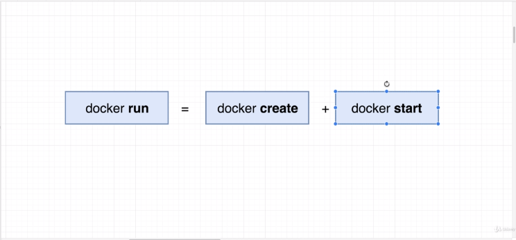
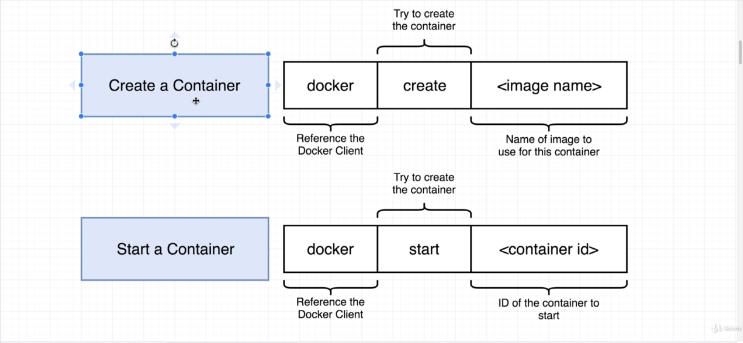
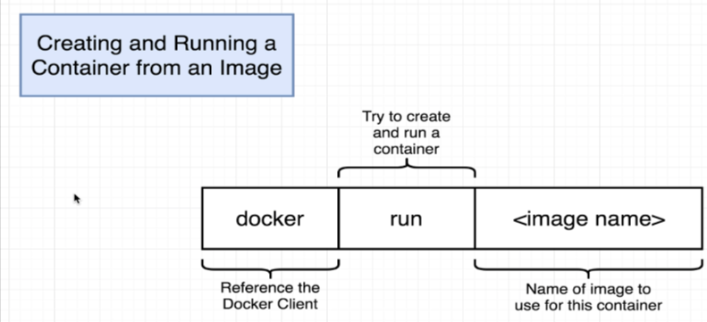
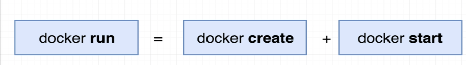
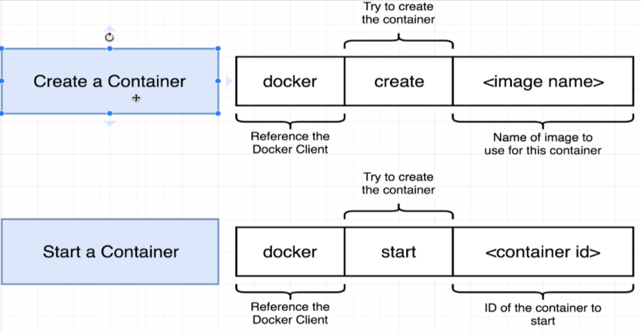

```
# create a container

  docker create redis

# start a container

  docker start 4b263884282
```

-: In the last section -: 在上一部分

we ran the Docker PS command 我们运行了 Docker PS 命令

and we saw one variation of it, 并且我们看到了它的一种变体，

which was Docker PS dash, dash all. which was Docker PS dash, dash all.

When we ran dash dash all on here, 当我们在这里运行 dash dash all 时，

we saw that we got a print-up 我们看到输出显示我们得到了一个 print-up

of all the containers 我们在机器上启动过的所有容器

we'd ever started up on our machine, 这是我们曾经在机器上启动过的，

which was kind of interesting 这有点有趣

'cause it kind of begs the question 因为这有点引出一个问题

"When does a container like really get shut down? “容器究竟什么时候真正被关闭？

Why does it get shut down?" 它为什么会被关闭？”

And "what happens when it gets shut down?" 那“当它被关闭时会发生什么？”

So starting this section, 那么从本节开始，

I wanna start to show you a little bit around the life cycle 我想开始给你展示一些关于生命周期的内容

of a container, which is gonna give you a better idea 容器的架构，这会让你更清楚地理解

of what's going on behind the scenes. 幕后发生了什么。

Now, before first investigating 现在，在第一次深入研究之前

or just jumping to the end, 或者直接跳到结尾，

like figuring out what happens 比如弄清楚会发生什么

when a container gets shut down. 当一个容器被关闭时。

I want to kind of go all the way 我想（有点）彻底做到这一点

to the start and really figure out 到开始处并真正弄清楚

what happens when a container is first created. 容器首次创建时会发生什么。

Now we've learned at this point 现在到此为止我们已经学到

that to start up a new container from an image 要从镜像启动一个新容器

we use the Docker run command. 我们使用 Docker run 命令。

But when we looked at this diagram, 但是当我们看这个图的时候，

remember we looked at this diagram 记得我们在两三节之前看过这个图

like two or three sections ago. 。

You'll notice 你会注意到

that I had put some very particular terminology here. 我在这里使用了一些非常特定的术语。

I said creating and running a container. 我说的是创建并运行一个容器。

Creating a container, and actually starting it up, 创建容器和实际启动它，

are actually two separate processes. 实际上是两个独立的过程。

So there's actually two additional commands 所以实际上有另外两个命令

in addition to Docker run 除了 Docker run

that we can use to start up a new container. 我们可以用来启动一个新容器的。

Docker run. Docker run。

Running that at your command line 在你的命令行运行它

is identical to running two other commands together. 等同于把另外两个命令串在一起运行。

First Docker create and then Docker start. 先运行 Docker create，然后运行 Docker start。

As you might guess, 正如你可能猜到的，

the Docker create commands is used to create a container Docker create 命令用于从镜像创建容器

out of an image

and then start is used to actually start an image. 然后使用 start 来实际启动一个镜像。

But at this point you might be a little bit curious of, 但此刻你可能会有一点好奇，

"Hey, what's the distinction between creating a container “嘿，创建一个容器和什么之间的区别是什么？”

and actually starting a container?" 并且真正启动一个容器？

Let's look at a diagram that's gonna help you 让我们看一张图表，能帮助你

understand the differences between the two. 理解两者之间的差别。

So we've looked at a diagram like this several times before. 所以我们之前已经多次看过像这样的图表。

Remember on our image over here 记得在我们这边的镜像上

we've got that kind of file-system snapshot of sorts 我们有那种文件系统快照之类的东西

and we've also got a startup command. 并且我们还有一个启动命令。

The process of creating a container 创建容器的过程

is where we kind of take the file system in here 就是我们在这里把文件系统拿进来。

and kind of prep it for use in this new container. 并为在这个新容器中使用做好准备。

When we create the container, 当我们创建容器时，

we're just talking about kind of prepping 我们只是说在做某种准备工作

or setting-up this file-system snapshot to be used 或将此文件系统快照设置为可用

to create the container. 用于创建容器。

To actually start the container, 要实际启动容器，

that's when we actually execute this startup command 那就是我们实际执行这个启动命令的时候

that might start up the process of like "Hello world". 那可能会启动类似 “Hello world” 的进程。

Or in the case of that BusyBox one that we used 或者在我们之前使用的那个 BusyBox 的情况下

the echo "high there" echo "high there"

or whatever process is supposed to be executed 或容器内应该执行的任何其他进程

inside the container. 容器内部。

So again, creating a container 所以，创建容器

is about the file system. 是关于文件系统的。

Starting it is about actually executing the startup command. 启动容器则是关于实际执行启动命令的。

So with that mind, 考虑到这一点，

let's try flipping over to our command line really quickly 我们快速切换到命令行试一试

and we're gonna start to investigate the differences 并且我们将开始研究这些差异

between creating a container and starting a container. 在创建容器和启动容器之间。

Over at my command line 在我的命令行那边

I'm gonna first try running the Docker create 我将首先尝试运行 Docker create

and start commands with the "hello world" image. 并用“hello world”镜像来启动命令。

So I will first do Docker create "Hello" dash "world". 所以我会首先运行 Docker create "Hello" dash "world"。

When I run that command 当我运行该命令时

I get this long string of characters printed out. 我得到了一串很长的字符被打印出来。

This is the ID of the container that was just created. 这是刚创建的容器的 ID。

I can now actually execute the "hello world" command 我现在可以实际执行 "hello world" 命令了

inside of this container by running Docker start. 在这个容器内部通过运行 Docker start 来启动。

And then I'm gonna add on a little argument here. 然后我会加上一个小参数。

I'm gonna say dash a, 我要输入 -a，

we'll talk about what that is in just a second, 我们马上就会讲到那是什么，

and then I'm gonna paste the ID 然后我会粘贴 ID

that was just emitted right here. 那正好就在这里发出来。

So I'm gonna paste in that really long series of characters 所以我要粘贴那串非常长的字符

and then when I run this command 然后当我运行这个命令时

we'll see that familiar welcome message up here. 我们会在上面看到熟悉的欢迎信息。

So what happened here? 那么这里发生了什么？

Well again, first off, 好吧，再次说明一下，首先，

we kind of prepped the container 我们有点准备了容器

by getting that file system ready. 通过准备好那个文件系统。

Then after that we actually executed 然后在此之后我们实际上执行了

the primary startup command in there with Docker start. 里面的主启动命令，使用 Docker start。

Now, what was with the dash A right there? 现在，那里的 -A 是什么作用？

Well, to show you what's going on with that 好，为了向你展示那背后的情况

let's try running Docker start again 我们再试着运行一次 docker start

but without the dash A. 但不要带连字符 A。

So I'm gonna run Docker start 所以我要运行 Docker start

and then I'm going to again paste in. 然后我将再次粘贴进去。

Oops, I lost the thing. 哎呀，我把东西弄丢了。

I gotta do the create again very quickly. 我得很快再做一次 create。

So there's my ID and I'll do Docker start 所以这是我的 ID，我要运行 Docker start

but without the dash A this time. 但这次没有连字符 A。

So when I run Docker start, 所以当我运行 Docker start 时，

you'll notice that I just see the ID. 你会注意到我只看到 ID。

The dash A command -dash A 命令

is what's going to make Docker 将使 Docker

actually watch for output from the container 实际监视来自容器的输出

and print it out to your terminal. 并把它打印到你的终端。

So the dash a specifically means "hey 所以 -a 特别表示“嘿

kind of attached to the container", so to speak 有点附属于容器”，可以这么说

and "watch for output coming from it and print 并“监听其输出并打印”

it out at my terminal". 在我的终端里运行它。

So when I put on Docker start dash a, that means 所以当我执行 docker start -a 的时候，那意味着

give "me any output that is coming from that thing". 给“那个东西输出的任何内容”。

And when I run that, boom, there it is. 当我运行它时，砰，就出现了。

So you'll notice that's a very small difference 所以你会注意到这是一个非常小的差别

between Docker run and Docker start. 在 Docker run 和 Docker start 之间。

By default, 默认情况下，

Docker run is going to show you all the logs Docker run 会向你显示所有日志

or all the information coming outta the container. 或从容器输出的所有信息。

By default, Docker start is the opposite. 默认情况下，Docker start 则相反。

Docker start is not gonna show you Docker start 不会向你显示

information coming outta the terminal. 来自终端的信息。

All right. 好了。

So that's the differences between Docker run 这就是 Docker run

and Docker start and Docker create. 与 Docker start 和 Docker create 之间的区别。

Let's take a quick pause right here. 我们在这里先稍作暂停。

We're gonna come back to the next section 我们将在下一部分回来

and we'll talk a little bit more about 我们会再多谈一点

exactly what it meant 确切地是什么意思

when we saw with the Docker PS All that exited status. 当我们在 Docker PS 中看到 All that exited 状态时。

So quick break and I'll see you in just a minute. 所以短暂休息一下，一分钟后见。
