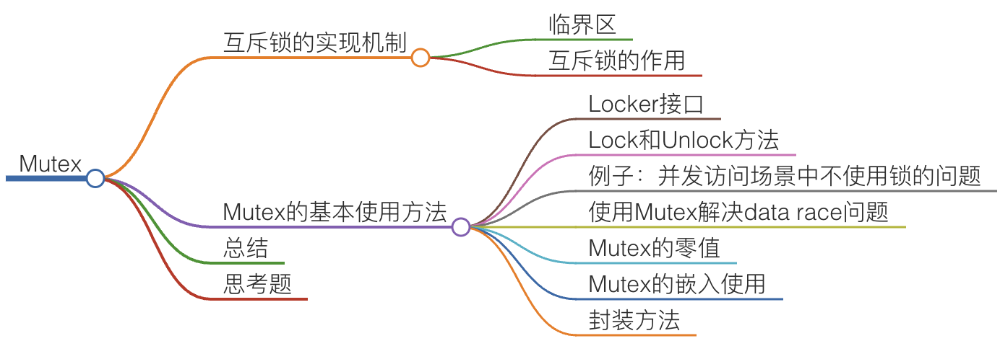

Mutex基本使用


package sync提供锁相关的一系列同步原语, 这个package定义了一个Locker接口,Mutex实现了Locker接口

```go
type Locker interface {
    Locker()
    Unlock()
}

func (m *Mutex) Lock()
func (m *Mutex) Unlock()

```


```go


package main


    import (
        "fmt"
        "sync"
    )


    func main() {
        // 互斥锁保护计数器
        var mu sync.Mutex
        // 计数器的值
        var count = 0
        
        // 辅助变量，用来确认所有的goroutine都完成
        var wg sync.WaitGroup
        wg.Add(10)

        // 启动10个gourontine
        for i := 0; i < 10; i++ {
            go func() {
                defer wg.Done()
                // 累加10万次
                for j := 0; j < 100000; j++ {
                    mu.Lock()
                    count++
                    mu.Unlock()
                }
            }()
        }
        wg.Wait()
        fmt.Println(count)
    }
    ```