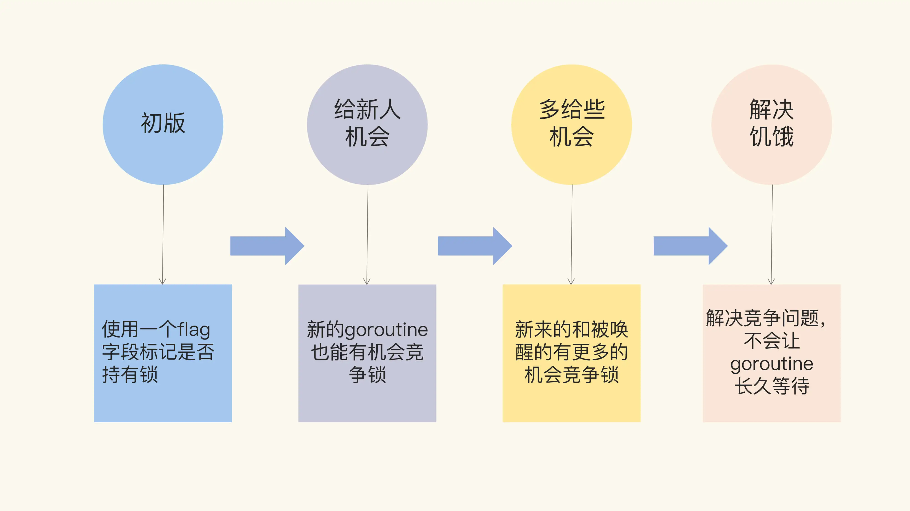

把 Mutex 的架构演进分成了四个阶段，下面给你画了一张图来说明。“初版”的 Mutex 使用一个 flag 来表示锁是否被持有，实现比较简单；后来照顾到新来的 goroutine，所以会让新的 goroutine 也尽可能地先获取到锁，这是第二个阶段，我把它叫作“给新人机会”；那么，接下来就是第三阶段“多给些机会”，照顾新来的和被唤醒的 goroutine；但是这样会带来饥饿问题，所以目前又加入了饥饿的解决方案，也就是第四阶段“解决饥饿”。




#### 初版的互斥锁

我们先来看怎么实现一个最简单的互斥锁。在开始之前，你可以先想一想，如果是你，你会怎么设计呢？你可能会想到，可以通过一个 flag 变量，标记当前的锁是否被某个 goroutine 持有。如果这个 flag 的值是 1，就代表锁已经被持有，那么，其它竞争的 goroutine 只能等待；如果这个 flag 的值是 0，就可以通过 CAS（compare-and-swap，或者 compare-and-set）将这个 flag 设置为 1，标识锁被当前的这个 goroutine 持有了。实际上，Russ Cox 在 2008 年提交的第一版 Mutex 就是这样实现的。

```go
   // CAS操作，当时还没有抽象出atomic包
    func cas(val *int32, old, new int32) bool
    func semacquire(*int32)
    func semrelease(*int32)
    // 互斥锁的结构，包含两个字段
    type Mutex struct {
        key  int32 // 锁是否被持有的标识
        sema int32 // 信号量专用，用以阻塞/唤醒goroutine
    }
    
    // 保证成功在val上增加delta的值
    func xadd(val *int32, delta int32) (new int32) {
        for {
            v := *val
            if cas(val, v, v+delta) {
                return v + delta
            }
        }
        panic("unreached")
    }
    
    // 请求锁
    func (m *Mutex) Lock() {
        if xadd(&m.key, 1) == 1 { //标识加1，如果等于1，成功获取到锁
            return
        }
        semacquire(&m.sema) // 否则阻塞等待
    }
    
    func (m *Mutex) Unlock() {
        if xadd(&m.key, -1) == 0 { // 将标识减去1，如果等于0，则没有其它等待者
            return
        }
        semrelease(&m.sema) // 唤醒其它阻塞的goroutine
    }    

```