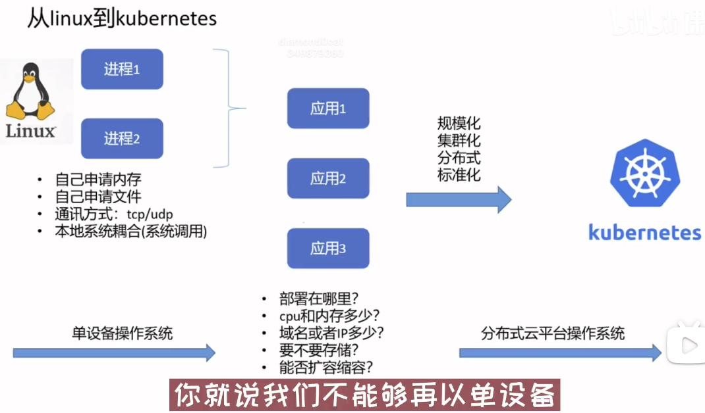
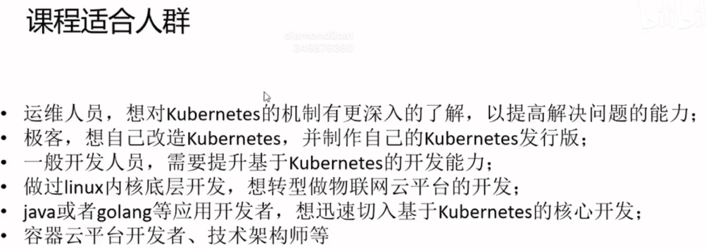
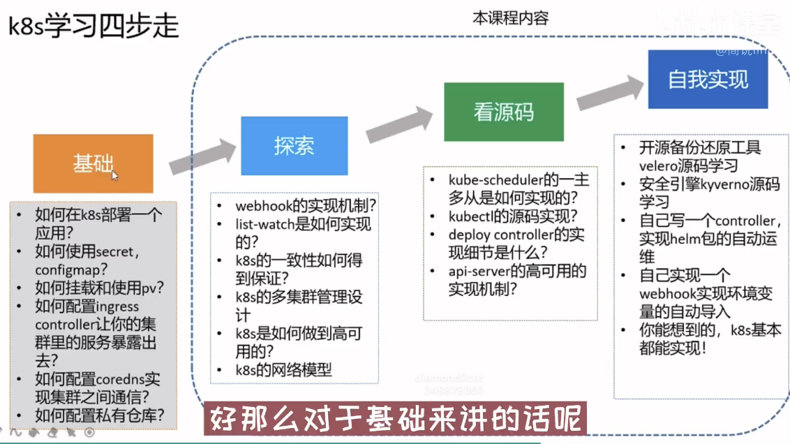
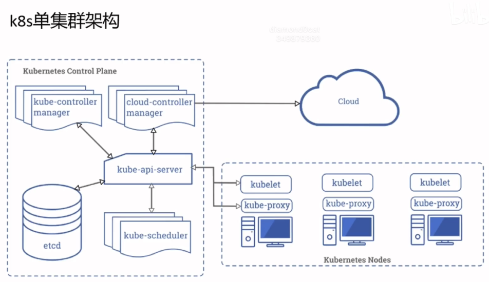

呃大家好
这章的话呢我们主要讲一下K8S的这个架构
我会从以下三个维度来讲
首先是K8S当集群架构
然后是K8S多集群架构
然后呢是K8S的这个云平台架构
那希望的话那我讲完这章以后呢
大家能够对K8S他最后能做什么
做出来是什么样子呢
能有一个清晰的一个了解和认识
好我们首先来看一下K8S当集群架构
这个是K8S的单集群架构
一个最简单的K8S呢
它是由两个这个主机或者节点组成的
一个叫master节点
一个叫slave节点
master节点的话呢
它上面有四个核心组件
分别是APISLOVER呃
Cooper schedule
cooper control manager和这个ETCD
而这个slave节点上呢它运行的是cooperate
cooper process和我们的这个容器引擎
一般来讲的话呢
我们用的是多er好
那我们再来看一下这个K8S的这个master
节点上的这个核心
这四个核心组件它分别是像什么功能好
第一个是p server
p server呢是整个K8S集群的一个前端接口
也是这个集群对外开放的这个呃系统调用
对我们一般来讲
我们在呃提到这个LINUX的时候呢
我们会提到系统调用
但是呢其实这个K8S的p server呢
有点像是系统调用
它是由它是被外面的组件或者
K8S内部的组件来使用的
那么我们通过PSL的话呢
就可以操作和使用我们K8S里边的整个资源
我们说的资源一般来讲指的是CRD资源
比如说像pd service
还有PB等
这些虽然说在K8S里面叫这个名字
但是它其实最终落到基础设施里边的时候呢
它都是资源
代表的是存储资源以及CPU内存资源等等
好那讲完了APISL呢
我们来看一下cp cooper control
cooper control呢其实它是这个control control
也就是说在K8S启动的时候呢
它会启动一个control manager
然后呢这个control manager呢
他会去启动集群里边不同的control manager
比如说我们所熟悉的这个K8S的资源
比如说像破的service department
demon set等等这些资源
它能够实现在K8S里面的这个声明是调用
那么最终原因就在于说
在K8S里面
有他们每个资源对应的这个control在运作
所以呢K8S里面的control呢
是K8S的核心和它的一个动力源
正是因为有了这些control
那么我们针对K8S的这个声明式的一个
设计和使用才能够成为现实
接着是cuber schedule
Cooper
schedule的话呢
他的目标很清晰
他做的事情也很简单
就是把某个pod来调度到某个节点上去执行
它会监听时刻监听API server
如果发现有破的被创建
那么它就会通过它里边自己的一套调度系统呢
把这个pd呢调度的某一个节点上去执行
最后是ETCD
ETCD呢是整个K8S里边的一个存储单元
这个里边存的就是我们的这个最终的这个
cad资源
比如说像por service
他们最后也是存在了ECCD里边
通过这个架构图我们可以看出来哈
整个K8S组件里面只有p server会跟ETCD打交道
而其他组件呢都是通过跟AP
通过跟API打交道来间接的跟ETCD来打交道
而其他的组件呢
它通过list watch功能呢
来高效的和PSL来进行通讯
关于list watch呢我们后面会有专门的章节来讲解啊
这个我们就不再赘述了
那这四个组件呢是运行在K8s master节点上的
这个核心组件
好
我们再来看一下
运行在K8S节点上的这三个组件
分别是cooperate
cooperate呢
它通过监听p storm呢
来根据监听的结果来动态的去创建或者删除
对应的这个破的
而cop process呢
它根据cooperate的创建或删除的行为的话
来设置当前的计算节点上的这个网络路由规则
从而实现破的或者service的这个
网络流量的这个流转规则
然后呢最后是这个容器引擎
目前比较流行的容器引擎
包括docker container d等等这些
那这些的话呢跟K8S基本上是解耦的
K8S通过CLI的接口呢
来跟这些运行时的这个引擎呢来打交道
这个就是K8S的一个单集群架构
接下来我们来对比LINUX
来更加深我们的一个理解哈
左边这个是我们LINUX里边的一个架构
右边的是K8S的一个架构
首先中间醒目的这个API就是我们K8S的API server
它其实跟LINUX里边的系统调用非常的类似
那么上面的这些应用的话呢
都是通过p server来跟K8S来打交道的
然后这里边control有点像是我们的LINUX
里边的这个进程
在LINUX里边不同的进程呢实现不同的这个功能
而在K8S里面
不同的control呢它会监听不同的资源
并且实现这些资源的这个一致性
所以这个control其实是K8S里面的这个核心
然后呢CHEDULE呢
它有点像是我们LINUX里面的这个盖住
目的都是用来做调度
只是调度的纬度不一样
LINUX里边呢这个schedule呢
它是用来调度进程执行的
而K8S里边呢
因为K8S里面它会有很多这个设备组成
而每一个设备上呢其实都会运行操作系统啊
所以K8S里面这个死盖住的话呢
其实它的这个层级呢更高一点哈
它用来调度破的
他把pd呢调度的不同的这个节点上去执行好
然后的话呢这个底下是CPU跟内存啊
这些的话呢其实也是有一些类似的地方的
大家可以根据这个图呢做一个比较
跟这个认知对比啊
希望通过这个图的话呢
大家对K8S和LINUX的这个区别和共同点呢
有一个清晰的一个了解啊
好那我们这节课呢就先这样好
谢谢大家