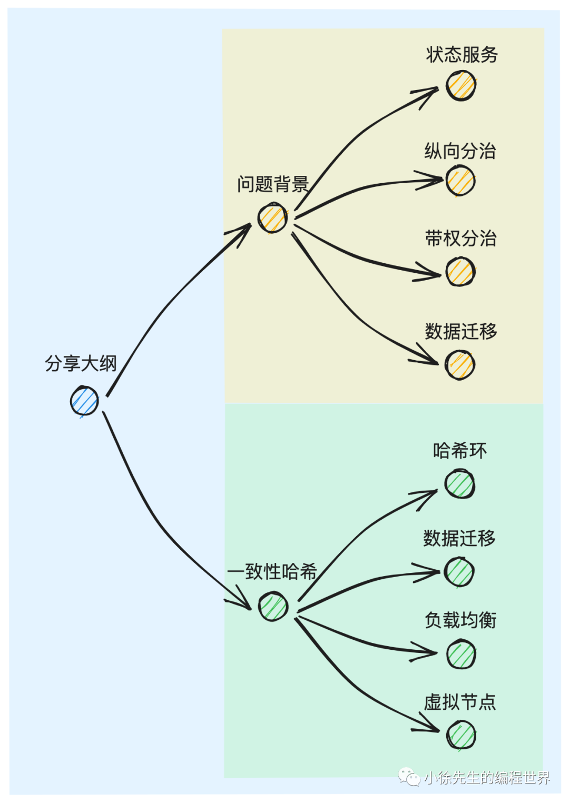
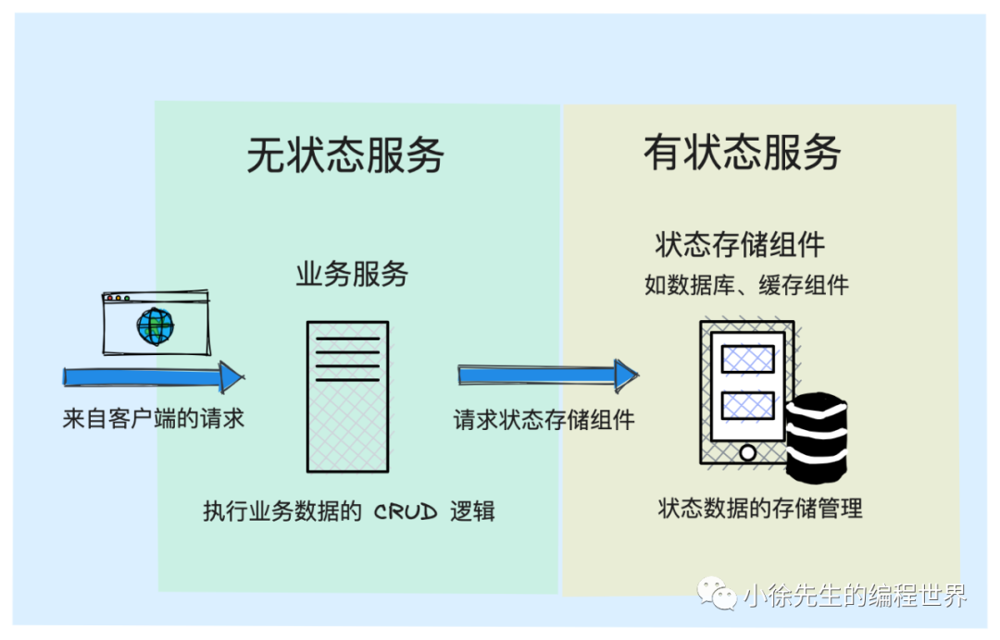
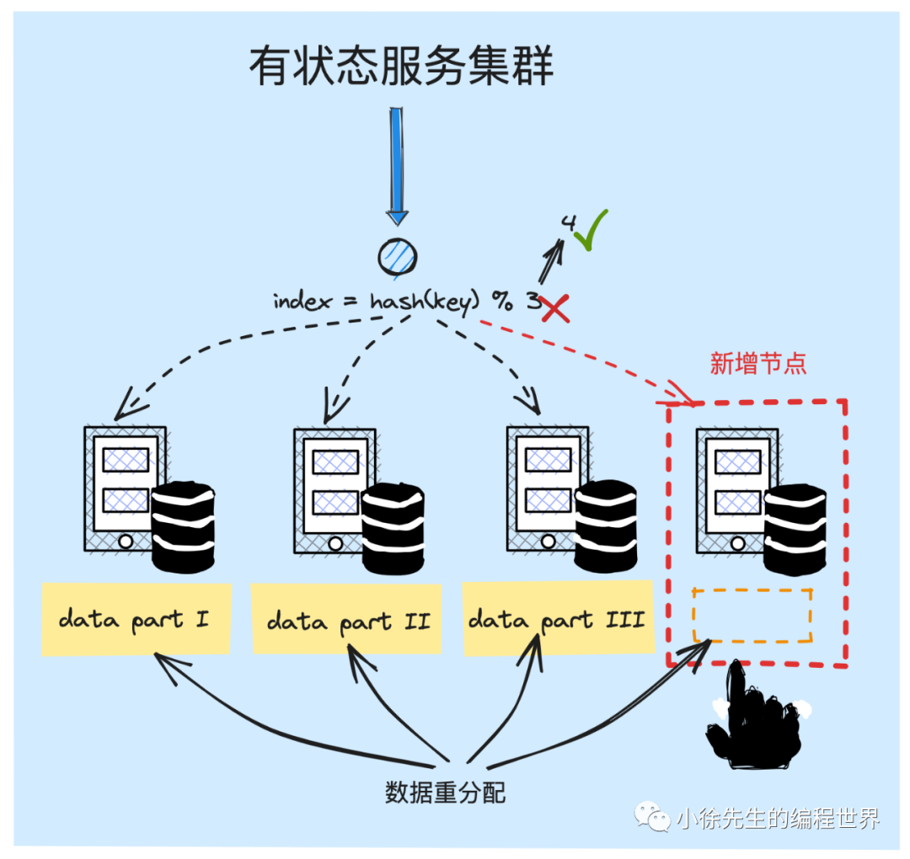

一致性哈希算法原理解析

本期和大家一起分享一个设计思路非常巧妙的负载均衡策略——一致性哈希算法.

本系列分为理论篇和实战篇两部分：

• 本篇是理论篇，和大家一起探讨一致性哈希算法的技术原理

• 下周推出实战篇，届时我会基于 Golang 手写实现出一个分布式版本的一致性哈希 lib 库，并会把相应的内容开源挂载在 github 上.

本期理论篇的分享大纲如下：

 
1.  问题背景
在正式开讲一致性哈希算法之前，我们先从一个场景问题开始切入.

1.1  状态服务
首先，我们需要先理清楚两个概念——何谓 ”有状态服务“，何谓”无状态服务“？

 

• 无状态服务： 指的是一类无需负责存储状态数据、仅需要内聚业务执行逻辑的服务. 比如我们日常维护的后台系统，服务只需要负责执行 CRUD 逻辑，真正的状态数据是托管于第三方组件中进行存储管理，比如关系型数据库或者 NOSQL 缓存组件之类.

对于这类无状态服务而言，一笔请求被分发到哪个节点并不重要，因为执行逻辑都是相同的. 因此无状态服务集群倘若需要执行横向扩缩容操作，是很灵活自由的.

 
 

• 有状态服务： 指的是一类本身需要通过内存或磁盘实现状态数据存储的服务. 比如数据库、消息队列等组件都属于有状态服务.

针对于这类服务，由于其存储了状态数据，因此在对集群进行横向分治（为防止单点故障而对数据进行冗余备份）时，需要考虑数据的一致性问题；在对集群进行纵向分治（为提高集群整体性能上限，不同节点各自分担部分数据存储工作，共同构成全集）时，需要明确数据与所从属节点之间的映射关系.

针对于无状态服务，对应的负载均衡流程是要简单很多的. 比如我们可以采用轮询算法（RR，Round Robin）、加权轮询算法（WRR，Weighted Round Robin）、平滑加权轮询算法（SWRR，Smoth Round Robin）实现集群内各节点对请求流量的平均分配.

然而对于有状态服务而言，倘若存在纵向分治策略，那么我们就需要维护好状态数据与所从属之间的映射关系. 一旦集群发生扩缩容，节点数量发生变更，对应的映射关系就需要发生变化，对应的状态数据就要发生迁移，这会是一个很复杂且笨重的流程. 而咱们今天所探讨的一致性哈希算法，且核心价值正是为了有效地降低有状态服务集群扩缩容流程的数据迁移成本.

有关于这一点，我们下面先从普通的负载均衡策略开始探讨，理清其中存在的局限性后，再引入一致性哈希算法进行对比分析.

 

1.2 纵向分治
我们来聊一聊有关”纵向分治“的问题.

我们知道，对于单个服务节点而言，受限于自身的硬件条件，会存在对应于某个水平的性能瓶颈. 倘若完全局限于单兵作战的思路，那么这个节点本身的瓶颈就会成为整个系统的天花板.

但是倘若我们引入了纵向分治的策略，那么这块天花板就还能有提高的空间.

打个比方，已知总工作量为 100，倘若我们只让一个人参与工作，那么这个人需要承担的工作量就是 100；倘若我们让 10 个人参与协作，对工作进行平均拆分，每个人负责其中的一小部分，那么每个人需要承担的工作量就大约是 100/10 = 10.

当然，在真实场景中，这种纵向分治的策略无法在性能上带来这种线性的提升效率，因为在多人协作时，难免在边界分配、交接工作、结果聚合等环节会存在效率的损耗. 但即便如此，这种纵向扩容分治的思路也能在很大程度上减轻每个独立节点所需要承担的工作强度，因此能够提高整个系统的性能上限.

我们可以通过哈希散列的方式实现数据的纵向分治，基于哈希函数的离散性，保证每个节点分配的数据量均可能趋于平均：

• 在写数据的 set 流程中：

    • 根据数据的 key 取 hash 值

    • hash 值对节点数量取模，得到其所属的节点 index

    • 将数据写入到对应 index 的节点中

• 在读数据的 get 流程中：

    • 根据数据的 key 取 hash 值

    • hash 值对节点数量取模，得到其所属的节点 index

    • 从 index 对应的节点中读取数据

Image

 

1.3 带权分治
在实际场景中，不同节点的性能可能存在差距. 我们希望做到能者多劳，让性能好的节点多完成一些任务，性能差的节点少承担一些工作. 此时，我们可以给每个节点设置一个权重值，用于反映其性能水平的强弱.

接下来我们可以设置一条水平轴，每个节点根据其权重值大小在轴上占据对应的比例分区. 接下来每当有数据到来，我们都会根据数据的 key 取得 hash 值并对水平轴的总长度取模，找到其在水平轴上的刻度位置，再根据该刻度所从属的分区，推断出这笔数据应该从属于哪一个节点.

Image

 

1.4 数据迁移
下面我们来聊一聊，有状态服务所存在的痛点问题：集群扩缩容时存在的数据迁移流程.

通过 1.2 小节介绍的纵向分治流程，我们明白每条数据和所从属的节点之间会一个明确且稳定的映射关系. 以我们通常采用的哈希散列的方案为例，数据所从属的节点 index 会与集群节点的总数有关（ 节点 index = 数据 hash 值 % 节点个数），所以这个映射关系能生效的前提是，集群节点的数量需要维持不变.

换言之，一旦集群需要执行扩缩容流程，集群节点数量变更后，原有的映射关系就会被破坏. 为了继续维护这份映射规则，我们需要执行数据迁移操作，将旧数据迁移到能够满足新映射关系的对应位置. 这必然会是一个很重的迁移流程，涉及影响的范围是全量的旧节点.

Image

 

2 一致性哈希
梳理完传统负载均衡方案的流程以及存在的痛点后，下面引入我们今天的主题——一致性哈希算法.

 

2.1 哈希环
2.1.1 哈希环构造
现在，我们需要打破固有的数据与节点之间的点对点映射关系.

我们首先构造出一个哈希环（Hash Ring）：

• 哈希环是一个首尾衔接的环

• 起点位置数值为 0

• 终点位置数值为 2^32，与 0 重合

• 环上每个刻度对应一个 0~2^32 - 1 之间的数值

哈希环的构造图如下所示：

Image

 

2.1.2 节点入环
接下来，每个节点需要在哈希环中找到找到属于自己的位置. 入环的方式是，针对于节点的标识键 index 取 hash 值，然后使用该 hash 值对 2^32 取模，最后得到的结果就是该节点在哈希环上对应的位置.

遵循上述流程，我们可以依次把集群中的各个节点加入哈希环中.

 

2.1.3 数据出/入环
在读数据与写数据的流程中，核心是要找到与这笔数据所归属的节点 index，这里我们采取的方式是：

• 对数据的 key 取哈希值

• 哈希值对哈希环长度（2^32） 取模，找到在哈希环上的位置

• 接下来一步是关键. 我们会沿着节点在哈希环上的位置顺时针往下（包括位置本身），找到第一个节点，作为数据所归属的节点

这里需要注意的是，哈希环是首尾相连的，因此倘若来到 2^32 - 1 的位置都没找到目标节点，则需要从 0（2^32）开始接着向后检索.

按照上述流程，只要在哈希环中至少存在一个节点，难么就一定能为每笔数据找到在哈希环中所应从属的节点.

Image

 

2.2 数据迁移
引入哈希环之后，在数据与节点映射规则上没有传统方案来得那么直观，但是在数据迁移流程中，这种环状结构的优势就能体现出来了.

2.2.1 新增节点
以下图对应的新增节点的场景为例，我们对集群扩容的流程加以梳理：

背景： 原本集群存在存在 A、B、C、D、E、F 六个节点，已分别添加到哈希换中，位置如下图所示.

变量： 此时需要新增一个节点 G，经过哈希散列和取模运算后，节点 G 在哈希环上的位置位于 B 与 C 之间，我们把位置关系记为 B-G-C

下面是对新增节点流程的梳理：

• 找到节点 G 顺时针往下的第一个节点 C

• 检索节点 C 中的数据，将从属于 (B,G] 范围的这部分数据摘出来，迁移到节点 G

• 节点 G 添加入环

至此，新增节点场景下的数据迁移动作完成.

Image

 

2.2.2 删除节点
删除节点时的处理思路与新增节点流程相类似，我们也梳理一下：

背景： 原本集群中存在 A、B、C、D、E、F、G 七个节点，均已添加到哈希环中

变量： 现在需要删除其中的节点 G，且节点 G 在哈希环上位于节点 B、C 之间.

下面是删除节点的执行流程：

• 找到 G 顺时针向下的第一个节点 C

• 将 G 中的全量数据迁移至节点 C

• 从哈希环中移除节点 G

至此，删除节点场景下的数据迁移操作完成.

Image

 

我们将 2.2 小节中一致性哈希算法下的数据迁移操作与 1.4 小节中的方案就行对比，可以很直观地感受到前者的核心优势，这本质上是因为这种环状结构加 ceiling（向上开放寻址） 的方式，使得数据所从属的节点 index 不再与集群的节点总数强相关，而仅仅取决于数据与节点在哈希环上的拓扑结构，最终因节点变更而引起数据迁移时，也仅仅需要对局部位置进行变更即可，而不需要将影响面放大到全局.

 

2.3 负载均衡
那么聊到这里方案是否就已经严丝合缝，不存在任何问题了呢？答案是否定的.

在 2.1 小节中我们提到，每个节点进入哈希环时，所属的位置是根据节点 index 取哈希，并进一步对哈希环长度（2^32） 取模后得到的.

我们知道，哈希具有离散的性质，能保证在输入内容不同时，输出结果会均匀地散布在输出域范围之内. 然而这种所谓的“离散”和“均匀”是建立在数据样本足够大的情况下，倘若集群节点数量很少，那么就很可能出现节点位置分布不均匀的情况.

如下图所示，倘若在哈希环中仅存在 A、B、C 三个节点，其中 A-B、C-A 的相对距离都很短，但是 B-C 的相对距离则很远. 在这种情况下就会导致，在节点 A 和节点 B 中只能分配到少陵的数据，而绝大部分的数据都会被集中分配到节点 C 中.

产生上述问题的根本原因在于，各个节点分配到的数据量，其实取决于其和上一个节点之间相对距离的长短.

Image

 

2.4 虚拟节点
2.4.1 误差弥合
针对于 2.3 小节中提出的负载均衡问题，在一致性哈希算法中给出的应对策略是虚拟节点路由的方案.

前面我们提到，哈希散列本身是具有离散性的，节点数据分配不均的问题通常只会发生在集群节点数量较少的情况下. 那么，倘若我们采用某种手段，将节点数量放大，那么更大的数据样本就自然而然地能够弥合或者缩小这部分误差所产生的影响，进一步突显出哈希函数的离散性质.

虚拟节点策略正是这样来做的：

• 我们定义出“真实节点”和“虚拟节点”两个概念：

    • 真实节点：集群中的各个节点，是物理意义上存在的服务器节点

    • 虚拟节点：真实节点进入哈希环时使用的一系列代理节点，是逻辑意义上的代理节点

• 对于各个真实节点，我们指定一个策略，确定其虚拟节点的个数，比如放大一定的倍数. 需要注意的是，虚拟节点越多，那么未来可能抢占到的数据量就越大

• 我们需要维护好一个路由表，建立好每个虚拟节点与真实节点的映射关系

• 我们使用虚拟节点作为真实节点的代理，将所有虚拟节点添加到哈希环中

• 在数据出、入哈希环时，使用虚拟节点进行数据的抢占和关联，流程同 2.1.3 小节

• 每当找到一笔数据所从属的虚拟节点时，通过路由表，找到其所映射的真实节点，然后返回真实节点的 index

 

基于以上流程，只要我们合理设置好真实节点到虚拟节点之间数量的放大倍数，那么最终位于哈希环上的代理节点的数量就会足够多，这一系列节点在哈希环上的位置就会越均匀，负载均衡的效果就会越好.

Image

 

2.4.2 带权分治
此外，这种虚拟节点的技术方案还存在另一个优势，就是能够支持 1.3 小节中所提到的带权分治的诉求.

我们可以根据各个节点的性能水平，为其设置一个不同的权重值，最终这个权重值会作用在真实节点与虚拟节点之间的数量放大过程中，这样我们就能保证性能强的节点拥有更高数量的虚拟节点，未来就有能力抢占到更多的数据.

 

3 总结
本期和大家一起探讨了一致性哈希的技术原理，涉及的技术要点如下

• 一致性哈希算法是一种适用于有状态服务的负载均衡策略

• 一致性哈希算法数据结构由一个首尾衔接的哈希环组成：

• 节点入环时，通过取哈希并对环长度取模，确定节点所在的位置

• 数据入环时，通过取哈希并对环长度取模，然后找到顺时针往下的第一个节点，作为操作的目标节点

• 一致性哈希最大的优势是，在集群节点数量发生变更时，只需要承担局部小范围的数据迁移成本

• 一致性哈希中可以通过虚拟节点路由的方式，提高负载均衡程度，并能很好地支持带权分治的诉求